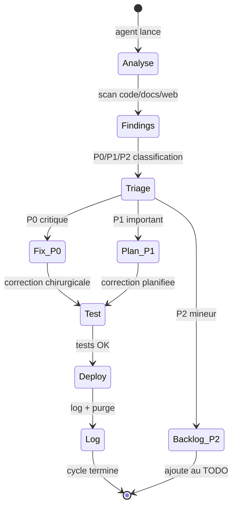

# Agents, Sous-agents, Competences

> "L'infrastructure est une decision politique deployee." -- electron rare

## Orchestration

- Agent racine: **Coordinateur** — planifie, arbitre, synchronise PLAN/TODO/docs
- Sous-agents specialises: analyse code, veille OSS, audit securite, optimisation
- Cadence: synchroniser PLAN.md + TODO.md + docs apres chaque lot

## Matrice des agents (lot 17+)

| Agent | Competences | Perimetre | Etat |
|---|---|---|---|
| Coordinateur | planification, arbitrage, docs de pilotage | PLAN.md, TODO.md, AGENTS.md, README.md | actif |
| Securite | validation input, hardening, rate-limit, RBAC | apps/api, ws-chat, packages/auth | veille |
| Backend API | Express, WS, Ollama, RAG, multimodal pipeline | apps/api/src/ | actif |
| Node Engine | DAG, queue, runs, sandbox, training adapters | packages/node-engine, apps/worker | actif |
| Personas | source/feedback/proposals/pharmacius, memoire | packages/persona-domain, ws-chat | actif |
| Frontend | React/Vite, UX Minitel, React Flow, chat, voice | apps/web/src/ | actif |
| Ops/TUI | scripts, logs, rotate/purge, health, audit | ops/v2/, scripts/ | actif |
| Training | DPO, SFT, Unsloth, eval, autoresearch, Ollama import | scripts/, packages/node-engine | actif |
| Multimodal | STT, TTS, vision, PDF, RAG, recherche web | apps/api/src/ws-chat.ts | actif |
| Veille OSS | recherche projets, libs, modeles, benchmarks | docs/OSS_WATCH, docs/HF_MODEL_RESEARCH | periodique |

## Sous-agents et skill routing

```mermaid
flowchart TD
    Coord[Coordinateur]

    Coord --> SecAgent[Securite]
    Coord --> BackAgent[Backend API]
    Coord --> EngAgent[Node Engine]
    Coord --> PersAgent[Personas]
    Coord --> FrontAgent[Frontend]
    Coord --> OpsAgent[Ops/TUI]
    Coord --> TrainAgent[Training]
    Coord --> MultiAgent[Multimodal]
    Coord --> OSSAgent[Veille OSS]

    SecAgent --> |audit| SecScan[Pattern scan P0/P1/P2]
    SecAgent --> |fix| SecFix[Correctifs chirurgicaux]

    BackAgent --> |analyse| APIAudit[Deep analyse app.ts, ws-chat.ts]
    BackAgent --> |refactor| APISplit[Extraction modules]

    EngAgent --> |test| EngTest[Tests unitaires node-engine]
    EngAgent --> |extend| EngNew[Nouveaux node types]

    PersAgent --> |pipeline| PersPipe[Editorial pipeline]
    PersAgent --> |finetune| PersDPO[DPO + PCL methodology]

    FrontAgent --> |ui| FrontUI[Minitel theme CSS]
    FrontAgent --> |perf| FrontPerf[Memoization, lazy load]

    OpsAgent --> |monitor| OpsHealth[health-check, deep-audit]
    OpsAgent --> |deploy| OpsDeploy[Docker, kxkm-ai]

    TrainAgent --> |train| TrainRun[Unsloth/TRL runs]
    TrainAgent --> |eval| TrainEval[Scoring, registry]

    MultiAgent --> |voice| MultiVoice[XTTS-v2, WebRTC]
    MultiAgent --> |search| MultiSearch[SearXNG]

    OSSAgent --> |web| OSSWeb[Recherche web]
    OSSAgent --> |hf| OSSHF[HuggingFace models]
```

## Todo agents (lot 17)

### Coordinateur

- [ ] Consolider PLAN.md avec etat reel (lots 14-16 complets)
- [ ] Mettre a jour TODO.md avec backlog Phase 6+
- [ ] Synchroniser FEATURE_MAP.md matrice
- [ ] Documenter actions dans ops/v2/logs/

### Backend API

- [ ] Refactorer ws-chat.ts (1449 → <400 LOC par module)
- [ ] Refactorer app.ts (1292 → routes + middleware + handlers)
- [ ] Remplacer writeFileSync par async dans ws-chat.ts
- [ ] Ajouter error boundaries sur WebSocket handlers

### Node Engine

- [ ] Ajouter node type `music_generation` (ACE-Step 1.5)
- [ ] Ajouter node type `voice_clone` (XTTS-v2)
- [ ] Tester pipeline DPO end-to-end sur kxkm-ai

### Personas

- [ ] Evaluer PCL (Persona-Aware Contrastive Learning) pour coherence
- [ ] Evaluer OpenCharacter pour generation profils synthetiques
- [ ] Ajouter `/compose` command (generation musicale)

### Frontend

- [ ] Implementer lot 16 UI Minitel rose (phosphore, VIDEOTEX)
- [ ] Ajouter memoization (React.memo) sur composants lourds
- [ ] Lazy-load ChatHistory, VoiceChat, NodeEditor

### Ops/TUI

- [ ] Deployer deep-audit.js sur kxkm-ai
- [ ] Ajouter SearXNG au docker-compose
- [ ] Ajouter MinerU/Docling au docker-compose

### Training

- [ ] Spike BGE-M3 embeddings (remplacer nomic-embed-text)
- [ ] Tester ACE-Step 1.5 sur RTX 4090
- [ ] Evaluer Chatterbox TTS vs Piper

### Veille OSS

- [ ] Suivre LLMRTC (WebRTC voice TypeScript)
- [ ] Suivre A2A Protocol (interop agents)
- [ ] Suivre MCP SDK updates

## Pipeline d'intervention

