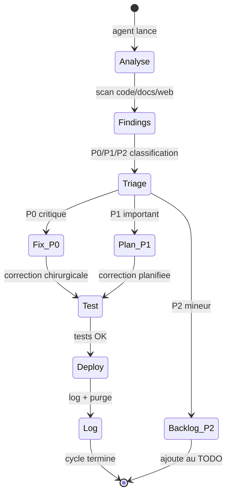

# Agents, Sous-agents, Competences

> "L'infrastructure est une decision politique deployee." -- electron rare

## Orchestration

- Agent racine: **Coordinateur** — planifie, arbitre, synchronise PLAN/TODO/docs
- Sous-agents specialises: analyse code, veille OSS, audit securite, optimisation
- Cadence: synchroniser PLAN.md + TODO.md + docs apres chaque lot

## Matrice des agents (lot 17+)

| Agent | Competences | Perimetre | Etat |
|---|---|---|---|
| Coordinateur | planification, arbitrage, docs de pilotage | PLAN.md, TODO.md, AGENTS.md, README.md | actif |
| Securite | validation input, hardening, rate-limit, RBAC | apps/api, ws-chat, packages/auth | veille |
| Backend API | Express, WS, Ollama, RAG, multimodal pipeline | apps/api/src/ | actif |
| Node Engine | DAG, queue, runs, sandbox, training adapters | packages/node-engine, apps/worker | actif |
| Personas | source/feedback/proposals/pharmacius, memoire | packages/persona-domain, ws-chat | actif |
| Frontend | React/Vite, UX Minitel, React Flow, chat, voice | apps/web/src/ | actif |
| Ops/TUI | scripts, logs, rotate/purge, health, audit | ops/v2/, scripts/ | actif |
| Training | DPO, SFT, Unsloth, eval, autoresearch, Ollama import | scripts/, packages/node-engine | actif |
| Multimodal | STT, TTS, vision, PDF, RAG, recherche web | apps/api/src/ws-chat.ts | actif |
| Veille OSS | recherche projets, libs, modeles, benchmarks | docs/OSS_WATCH, docs/HF_MODEL_RESEARCH | periodique |

## Sous-agents et skill routing

```mermaid
flowchart TD
    Coord[Coordinateur]

    Coord --> SecAgent[Securite]
    Coord --> BackAgent[Backend API]
    Coord --> EngAgent[Node Engine]
    Coord --> PersAgent[Personas]
    Coord --> FrontAgent[Frontend]
    Coord --> OpsAgent[Ops/TUI]
    Coord --> TrainAgent[Training]
    Coord --> MultiAgent[Multimodal]
    Coord --> OSSAgent[Veille OSS]

    SecAgent --> |audit| SecScan[Pattern scan P0/P1/P2]
    SecAgent --> |fix| SecFix[Correctifs chirurgicaux]

    BackAgent --> |analyse| APIAudit[Deep analyse app.ts, ws-chat.ts]
    BackAgent --> |refactor| APISplit[Extraction modules]

    EngAgent --> |test| EngTest[Tests unitaires node-engine]
    EngAgent --> |extend| EngNew[Nouveaux node types]

    PersAgent --> |pipeline| PersPipe[Editorial pipeline]
    PersAgent --> |finetune| PersDPO[DPO + PCL methodology]

    FrontAgent --> |ui| FrontUI[Minitel theme CSS]
    FrontAgent --> |perf| FrontPerf[Memoization, lazy load]

    OpsAgent --> |monitor| OpsHealth[health-check, deep-audit]
    OpsAgent --> |deploy| OpsDeploy[Docker, kxkm-ai]

    TrainAgent --> |train| TrainRun[Unsloth/TRL runs]
    TrainAgent --> |eval| TrainEval[Scoring, registry]

    MultiAgent --> |voice| MultiVoice[XTTS-v2, WebRTC]
    MultiAgent --> |search| MultiSearch[SearXNG]

    OSSAgent --> |web| OSSWeb[Recherche web]
    OSSAgent --> |hf| OSSHF[HuggingFace models]
```

## Todo agents (lot 17+ — mis a jour 2026-03-19)

### Coordinateur

- [x] Consolider PLAN.md avec etat reel (lots 14-16 complets)
- [x] Synchroniser FEATURE_MAP.md matrice
- [ ] Mettre a jour TODO.md avec backlog Phase 7+
- [ ] Documenter actions dans ops/v2/logs/

### Backend API

- [x] Extraire app-bootstrap.ts et app-middleware.ts de app.ts
- [x] Extraire ws-conversation-router.ts de ws-chat.ts
- [ ] Refactorer ws-chat.ts residuel (<400 LOC cible)
- [ ] Remplacer writeFileSync par async dans ws-chat.ts
- [ ] Ajouter error boundaries sur WebSocket handlers
- [ ] Scinder tests storage volumineux (storage-test-split)
- [ ] Decouper Chat.tsx en seams transport/liste/composer/media

### Node Engine

- [x] Extraire registry.ts du hotspot node-engine
- [ ] Ajouter node type `music_generation` (ACE-Step 1.5)
- [ ] Ajouter node type `voice_clone` (Chatterbox)
- [ ] Tester pipeline DPO end-to-end sur kxkm-ai

### Personas

- [ ] Evaluer PCL (Persona-Aware Contrastive Learning) pour coherence
- [ ] Evaluer OpenCharacter pour generation profils synthetiques
- [x] Ajouter `/compose` command (generation musicale)

### Frontend

- [x] Implementer lot 16 UI Minitel rose (phosphore, VIDEOTEX)
- [x] VoiceChat push-to-talk + level meter + silence auto
- [x] Player audio + viewer image plein ecran
- [x] Mediatheque gallery/playlist
- [x] Progress bars animees Compose/Imagine
- [ ] Ajouter memoization (React.memo) sur composants lourds
- [ ] Lazy-load ChatHistory, VoiceChat, NodeEditor
- [ ] vault66-crt-effect (React CRT WebGL)

### Ops/TUI

- [x] Deployer deep-audit.js sur kxkm-ai
- [x] Ajouter SearXNG au docker-compose
- [x] TTS sidecar HTTP (tts-server.py :9100, dual Chatterbox/Piper)
- [x] deploy.sh tmux (build + deploy automatise)
- [ ] Ajouter MinerU/Docling au docker-compose
- [ ] Fix Docker transformers (rebuild propre avec torch)

### Training

- [x] Spike BGE-M3 (resultat negatif sur Apple/Metal, baseline maintenue)
- [x] TTS dual backend Chatterbox/Piper valide
- [ ] Tester ACE-Step 1.5 sur RTX 4090
- [ ] LightRAG graph RAG (personas/lore)

### Veille OSS

- [x] Veille mars 2026 complete (40+ projets analyses, top 10 recommandations)
- [ ] Suivre LLMRTC (WebRTC voice TypeScript)
- [ ] Suivre A2A Protocol (interop agents)
- [ ] Suivre MCP SDK updates
- [ ] Evaluer Kokoro TTS (82M params, ultra-leger)

## Pipeline d'intervention

## Affectations en cours (2026-03-17)

### Mission globale
- Deep analyse continue du code, optimisation chirurgicale, et synchronisation documentaire apres chaque lot.
- Priorite execution: P1 fiabilite, puis dette perf/complexite, puis features lot 18-19.

### Assignations agents -> sous-agents -> competences

| Agent | Sous-agent | Competences principales | Taches assignees immediates |
|---|---|---|---|
| Coordinateur | Planner/Docs | triage, synchronisation, runbook | Maintenir PLAN/TODO, chainer les lots, tracer actions |
| Backend API | WS/HTTP surgeon | websocket, express, validation input | Extraire `ws-chat.ts` en modules, reduire logs, limiter hot paths |
| Node Engine | DAG runtime | graph validation, queue, state machine | Ajouter nodes `music_generation`, `voice_clone`, `document_extraction` |
| Ops/TUI | Audit operator | TUI scripts, logs, rotation, cron | Rendre `deep-audit` zero faux positif critique, pipeline logs + purge |
| Veille OSS | Scout | benchmark OSS, licences, interop | Evaluer Open WebUI, LibreChat, LangGraph, SearXNG, Docling |

### Workflow d'enchainement
1. Executer audit + tests
2. Corriger de maniere chirurgicale
3. Re-executer audit + tests
4. Mettre a jour docs de pilotage
5. Alimenter TODO suivant avec ordre d'execution

### Regles d'operation
- Interroger le user uniquement en cas de blocage reel (acces, choix irreversibles, secrets).
- Privilegier TUI et scripts avec logs lisibles, puis purge des logs obsoletes.
- Conserver la V1 comme reference comportementale, V2 comme cible active.

### Etat de cycle (2026-03-19)

- Audit/tests: en cours de verification.
- Lots 0-4, 12-14, 16 complets. Lot 15 en cours (2/4 done).
- TTS dual backend (Chatterbox/Piper) deploye avec deploy.sh tmux.
- 33 personas (qwen3:8b x21, mistral:7b x7, gemma3:4b x4).
- Veille OSS mars 2026: 40+ projets analyses.
- Deep audit: 7 bugs HIGH/MEDIUM identifies, 6 corriges.

### Micro-missions lot 15 restantes

1. Backend API: scinder tests storage volumineux (storage-test-split).
2. Frontend: decouper Chat.tsx en seams transport/liste/composer/media.
3. Coordinateur: synchroniser PLAN/TODO/state apres cloture lot 15.
