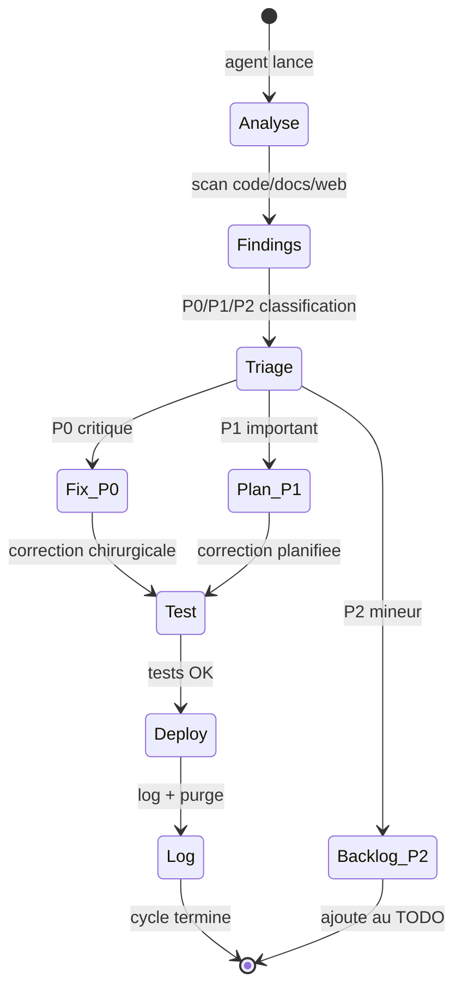

# Agents, Sous-agents, Competences

> "L'infrastructure est une decision politique deployee." -- electron rare

## Orchestration

- Agent racine: **Coordinateur** — planifie, arbitre, synchronise PLAN/TODO/docs
- Sous-agents specialises: analyse code, veille OSS, audit securite, optimisation
- Cadence: synchroniser PLAN.md + TODO.md + docs apres chaque lot

## Matrice des agents (lot 17+)

| Agent | Competences | Perimetre | Etat |
|---|---|---|---|
| Coordinateur | planification, arbitrage, docs de pilotage | PLAN.md, TODO.md, AGENTS.md, README.md | actif |
| Securite | validation input, hardening, rate-limit, RBAC | apps/api, ws-chat, packages/auth | veille |
| Backend API | Express, WS, Ollama, RAG, multimodal pipeline | apps/api/src/ | actif |
| Node Engine | DAG, queue, runs, sandbox, training adapters | packages/node-engine, apps/worker | actif |
| Personas | source/feedback/proposals/pharmacius, memoire | packages/persona-domain, ws-chat | actif |
| Frontend | React/Vite, UX Minitel, React Flow, chat, voice | apps/web/src/ | actif |
| Ops/TUI | scripts, logs, rotate/purge, health, audit | ops/v2/, scripts/ | actif |
| Training | DPO, SFT, Unsloth, eval, autoresearch, Ollama import | scripts/, packages/node-engine | actif |
| Multimodal | STT, TTS, vision, PDF, RAG, recherche web | apps/api/src/ws-chat.ts | actif |
| Veille OSS | recherche projets, libs, modeles, benchmarks | docs/OSS_WATCH, docs/HF_MODEL_RESEARCH | periodique |

## Sous-agents et skill routing

```mermaid
flowchart TD
    Coord[Coordinateur]

    Coord --> SecAgent[Securite]
    Coord --> BackAgent[Backend API]
    Coord --> EngAgent[Node Engine]
    Coord --> PersAgent[Personas]
    Coord --> FrontAgent[Frontend]
    Coord --> OpsAgent[Ops/TUI]
    Coord --> TrainAgent[Training]
    Coord --> MultiAgent[Multimodal]
    Coord --> OSSAgent[Veille OSS]

    SecAgent --> |audit| SecScan[Pattern scan P0/P1/P2]
    SecAgent --> |fix| SecFix[Correctifs chirurgicaux]

    BackAgent --> |analyse| APIAudit[Deep analyse app.ts, ws-chat.ts]
    BackAgent --> |refactor| APISplit[Extraction modules]

    EngAgent --> |test| EngTest[Tests unitaires node-engine]
    EngAgent --> |extend| EngNew[Nouveaux node types]

    PersAgent --> |pipeline| PersPipe[Editorial pipeline]
    PersAgent --> |finetune| PersDPO[DPO + PCL methodology]

    FrontAgent --> |ui| FrontUI[Minitel theme CSS]
    FrontAgent --> |perf| FrontPerf[Memoization, lazy load]

    OpsAgent --> |monitor| OpsHealth[health-check, deep-audit]
    OpsAgent --> |deploy| OpsDeploy[Docker, kxkm-ai]

    TrainAgent --> |train| TrainRun[Unsloth/TRL runs]
    TrainAgent --> |eval| TrainEval[Scoring, registry]

    MultiAgent --> |voice| MultiVoice[XTTS-v2, WebRTC]
    MultiAgent --> |search| MultiSearch[SearXNG]

    OSSAgent --> |web| OSSWeb[Recherche web]
    OSSAgent --> |hf| OSSHF[HuggingFace models]
```

## Todo agents (lot 17+ — mis a jour 2026-03-20)

### Coordinateur

- [x] Consolider PLAN.md avec etat reel (lots 0-94 complets)
- [x] Synchroniser FEATURE_MAP.md matrice
- [x] Mettre a jour TODO.md avec backlog Phase session 2026-03-19/20
- [x] Documenter actions dans ops/v2/logs/
- [ ] lot-95: Coordonner E2E Playwright test plan
- [ ] lot-100: Design public demo mode access control

### Backend API

- [x] Extraire app-bootstrap.ts et app-middleware.ts de app.ts
- [x] Extraire ws-conversation-router.ts de ws-chat.ts
- [x] ws-chat.ts modularized (425 to 335 LOC, 3 modules extracted)
- [x] app.ts extraction (540 to 131 LOC, create-repos.ts extracted)
- [x] Zod validation on all 19 API route schemas
- [x] Error telemetry (16 labels)
- [x] Perf instrumentation (6 labels, p50/p95/p99)
- [x] Smart routing (5 topic domains)
- [x] Dynamic context window (4k-32k)
- [ ] lot-97: Multi-channel support (create/join channels)
- [ ] lot-100: Public demo mode read-only routes

### Node Engine

- [x] Extraire registry.ts du hotspot node-engine
- [ ] Ajouter node type `music_generation` (ACE-Step 1.5)
- [ ] Ajouter node type `voice_clone` (Chatterbox)
- [ ] lot-96: Automated DPO pipeline (feedback → pairs → training trigger)

### Personas

- [ ] Evaluer PCL (Persona-Aware Contrastive Learning) pour coherence
- [ ] Evaluer OpenCharacter pour generation profils synthetiques
- [x] Ajouter `/compose` command (generation musicale)

### Frontend

- [x] Implementer lot 16 UI Minitel rose (phosphore, VIDEOTEX)
- [x] VoiceChat push-to-talk + level meter + silence auto
- [x] Player audio + viewer image plein ecran
- [x] Mediatheque gallery/playlist
- [x] Progress bars animees Compose/Imagine
- [x] React.memo + useCallback on ChatSidebar, ChatInput, ChatHistory
- [x] 17 lazy-loaded routes (-53% initial JS)
- [x] CRT CSS-only effect (scanlines, vignette, phosphor glow, boot 0.8s)
- [x] Chat virtualization (react-window, variable row heights)
- [x] Markdown rendering (marked + DOMPurify)
- [x] CRT boot animation (modem dial, scanline reveal)
- [ ] lot-95: E2E Playwright tests (login, chat, upload, admin)
- [ ] lot-98: File sharing UI (upload → gallery)
- [ ] lot-99: Mobile responsive deep pass (touch, bottom nav, viewport)

### Ops/TUI

- [x] Deployer deep-audit.js sur kxkm-ai
- [x] Ajouter SearXNG au docker-compose
- [x] TTS sidecar HTTP (tts-server.py :9100, dual Chatterbox/Piper)
- [x] deploy.sh migrated tmux → systemd
- [x] Systemd services (kxkm-tts + kxkm-lightrag, auto-restart)
- [x] health-check.sh TUI (19 checks)
- [x] Docker compose 12 services with health checks
- [ ] Fix Docker transformers (rebuild propre avec torch)

### Training

- [x] Spike BGE-M3 (resultat negatif sur Apple/Metal, baseline maintenue)
- [x] TTS dual backend Chatterbox/Piper valide
- [x] Tool-calling benchmark (llama3.1 vs qwen3 vs mistral)
- [x] Sherlock migrated to llama3.1:8b-instruct-q4_0
- [ ] lot-96: Persona DPO automation pipeline
- [ ] Tester ACE-Step 1.5 sur RTX 4090

### Veille OSS

- [x] Veille mars 2026 complete (40+ projets analyses, top 10 recommandations)
- [ ] Suivre LLMRTC (WebRTC voice TypeScript)
- [ ] Suivre A2A Protocol (interop agents)
- [ ] Suivre MCP SDK updates
- [ ] Evaluer Kokoro TTS (82M params, ultra-leger)

## Pipeline d'intervention

## Affectations en cours (2026-03-20)

### Mission globale
- Deep analyse continue du code, optimisation chirurgicale, et synchronisation documentaire apres chaque lot.
- Priorite execution: P1 fiabilite, puis dette perf/complexite, puis features lot 18-19.

### Assignations agents -> sous-agents -> competences

| Agent | Sous-agent | Competences principales | Taches assignees immediates |
|---|---|---|---|
| Coordinateur | Planner/Docs | triage, synchronisation, runbook | Maintenir PLAN/TODO, chainer les lots, tracer actions |
| Backend API | WS/HTTP surgeon | websocket, express, validation input | Extraire `ws-chat.ts` en modules, reduire logs, limiter hot paths |
| Node Engine | DAG runtime | graph validation, queue, state machine | Ajouter nodes `music_generation`, `voice_clone`, `document_extraction` |
| Ops/TUI | Audit operator | TUI scripts, logs, rotation, cron | Rendre `deep-audit` zero faux positif critique, pipeline logs + purge |
| Veille OSS | Scout | benchmark OSS, licences, interop | Evaluer Open WebUI, LibreChat, LangGraph, SearXNG, Docling |

### Workflow d'enchainement
1. Executer audit + tests
2. Corriger de maniere chirurgicale
3. Re-executer audit + tests
4. Mettre a jour docs de pilotage
5. Alimenter TODO suivant avec ordre d'execution

### Regles d'operation
- Interroger le user uniquement en cas de blocage reel (acces, choix irreversibles, secrets).
- Privilegier TUI et scripts avec logs lisibles, puis purge des logs obsoletes.
- Conserver la V1 comme reference comportementale, V2 comme cible active.

### Etat de cycle (2026-03-20)

- 71 lots termines (lot-24 a lot-94).
- 425 tests, 0 failures.
- 12 services en production.
- 19 chat commands, 33 personas.
- Structured logging complet (pino JSON, 0 console.log).
- Systemd services (TTS + LightRAG).
- Frontend: lazy routes (-53%), React.memo, CRT boot, chat virtualization.

### Prochains lots (95-100)

1. lot-95: E2E Playwright tests
2. lot-96: Persona DPO automation pipeline
3. lot-97: Multi-channel support
4. lot-98: File sharing between users
5. lot-99: Mobile responsive deep pass
6. lot-100: Public demo mode
