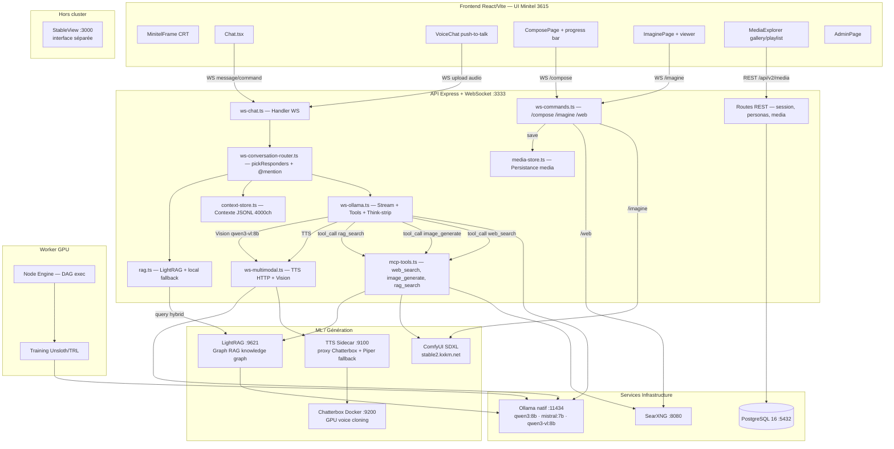
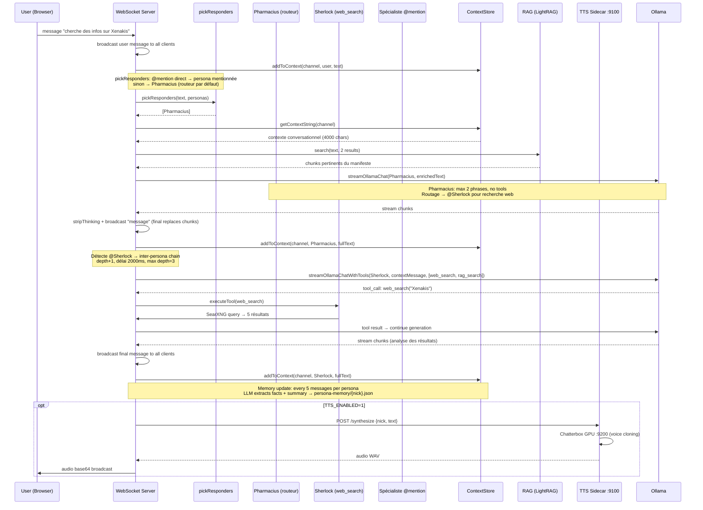
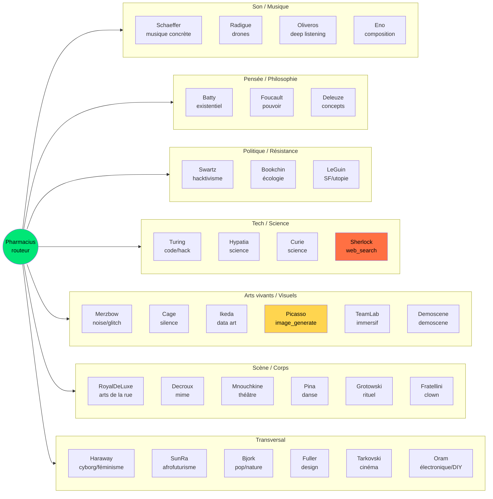
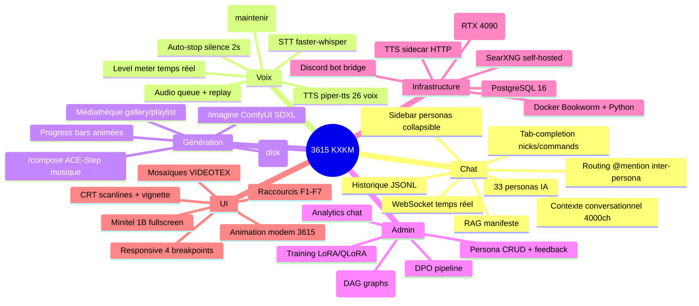

# Architecture 3615-KXKM

> "Le medium est le message, et ton terminal a deja compris." -- electron rare
>
> "Saboteurs of big daddy mainframe" -- VNS Matrix, 1991

## Vue d'ensemble



## Flux chat — séquence complète



## Routing Pharmacius → Spécialistes



## Services production (kxkm-ai)

| # | Service | Port | Type | Stack | Health | Rôle |
| - | ------- | ---- | ---- | ----- | ------ | ---- |
| 1 | **API V2** | `:3333` | Docker | Node.js (network_mode: host) | `GET /api/v2/health` | Express + WebSocket chat + React SPA |
| 2 | **PostgreSQL** | `:5432` | Docker | postgres:16-alpine | `pg_isready` | Persistence sessions, personas, graphs |
| 3 | **SearXNG** | `:8080` | Docker | searxng/searxng | `wget /` | Recherche web self-hosted (Google, Bing, DDG) |
| 4 | **Chatterbox** | `:9200` | Docker GPU | ghcr.io/devnen/chatterbox-tts-server | `GET /get_predefined_voices` | TTS voice cloning GPU |
| 5 | **TTS Sidecar** | `:9100` | systemd | Python (network_mode: host) | — | Proxy Chatterbox + Piper fallback |
| 6 | **LightRAG** | `:9621` | Docker | Python 3.12 (lightrag-hku, network_mode: host) | `GET /health` | Graph RAG, knowledge graph (Ollama backend) |
| 7 | **Ollama** | `:11434` | Natif | RTX 4090 (systemd) | `GET /api/tags` | LLM inference: qwen3:8b, mistral:7b, qwen3-vl:8b |
| 8 | **Worker** | host | Docker | Node.js (GPU passthrough) | — | Node Engine DAG execution, training |
| 9 | **Docling** | `:9400` | Docker | Python (Docling REST) | `GET /health` | PDF/document parsing (tables, layout, OCR) |
| 10 | **Reranker** | `:9500` | Docker | Python (bge-reranker-v2-m3) | `GET /health` | Cross-encoder reranking for RAG results |
| 11 | **ComfyUI** | ext | Externe | stable2.kxkm.net | — | Image gen SDXL |
| 12 | **StableView** | `:3000` | Externe | Séparé | — | Interface visualisation (hors cluster) |
| 13 | **Discord Bot** | — | Docker | Node.js (network_mode: host) | — | Bridge chat KXKM → Discord |
| 14 | **Discord Voice** | — | Docker | Node.js + Python STT | — | STT → Personas → TTS en vocal |

## Command Flow

```mermaid
graph TD
    User[User Input] --> Parser{Message Type?}
    Parser -->|/command| CommandHandler
    Parser -->|message| ChatHandler
    Parser -->|upload| UploadHandler

    CommandHandler --> |/web| SearXNG[SearXNG :8080]
    CommandHandler --> |/imagine| ComfyUI[ComfyUI SDXL]
    CommandHandler --> |/compose| ACEStep[ACE-Step via TTS :9100]
    CommandHandler --> |/status| PerfMetrics[Perf Metrics + nvidia-smi]
    CommandHandler --> |/memory| PersonaMemory[Persona Memory JSON]
    CommandHandler --> |/models| OllamaAPI[Ollama /api/tags + /api/ps]
    CommandHandler --> |/context| ContextStore[Context Store JSONL]
    CommandHandler --> |/join /channels| ChannelMgr[Channel Manager]
    CommandHandler --> |/nick /who| UserMgr[User Manager]
    CommandHandler --> |/reload| PersonaDB[Persona DB Refresh]

    ChatHandler --> pickResponders[pickResponders]
    pickResponders --> TopicRouting[Pharmacius Topic Routing]
    TopicRouting --> OllamaStream[Ollama Stream + Tools]
    OllamaStream --> ChunkBroadcast[Chunk Broadcast seq++]
    OllamaStream --> InterPersona{@mention detected?}
    InterPersona -->|yes, depth < 3| pickResponders

    UploadHandler --> MIMEValidation[MIME Magic Bytes]
    MIMEValidation -->|image/*| Vision[Vision qwen3-vl:8b]
    MIMEValidation -->|audio/*| STT[STT faster-whisper]
    MIMEValidation -->|text/* pdf| TextExtract[Text Extraction]
    MIMEValidation -->|office| Docling[Docling :9400]
    Vision --> ChatHandler
    STT --> ChatHandler
    TextExtract --> ChatHandler
    Docling --> ChatHandler
```

## Data Flow

```mermaid
graph LR
    Chat[Chat Message] --> Context[Context Store JSONL]
    Chat --> RAG[RAG Search]
    RAG --> Embeddings[nomic-embed-text]
    RAG --> LightRAG[LightRAG :9621]
    RAG --> Reranker[bge-reranker :9500]
    Chat --> Memory[Persona Memory JSON]
    Memory -->|every 5 msgs| Ollama[Ollama qwen3:8b]
    Context -->|compaction| Ollama
    Chat --> Log[Chat Log JSONL]
    Log --> Analytics[/api/v2/analytics]
    Log --> DPO[DPO Export]
    Log --> HTMLExport[HTML Export]
```

## Feature Map



## Modules (LOC)

| Module | LOC | Tests | Rôle |
| ------ | --- | ----- | ---- |
| apps/api | 5200 | 1000 | Backend API + WebSocket |
| apps/web | 4800 | 800 | Frontend React |
| apps/worker | 956 | 230 | Worker GPU Node Engine |
| packages/core | 172 | 86 | Types, IDs, permissions |
| packages/auth | 159 | 157 | Scrypt, sessions, RBAC |
| packages/chat-domain | 262 | 279 | Messages, channels, commands |
| packages/persona-domain | 988 | 259 | Personas, feedback, editorial |
| packages/node-engine | 1499 | 605 | DAG execution, training |
| packages/storage | 1219 | 669 | PostgreSQL repos |
| packages/ui | 134 | 29 | Theme, colors, CSS vars |
| packages/tui | 209 | 108 | ANSI formatting, tables |
| scripts | 37 fichiers | - | TTS, training, migration |
| **Total** | **~15600** | **425 tests** | |

## Bugs critiques identifiés (audit 2026-03-18)

| # | Sévérité | Module | Description |
|---|----------|--------|-------------|
| 1 | HIGH | context-store.ts | Race condition sur enforceLimits pendant compaction |
| 2 | MEDIUM | ws-conversation-router.ts | Maps persona unbounded (memory leak) |
| 3 | MEDIUM | ws-commands.ts | Temp files non nettoyés si compose timeout |
| 4 | MEDIUM | Chat.tsx | Memory leak /ulla (setTimeout non tracked) |
| 5 | MEDIUM | ComposePage/ImaginePage | WebSocket non fermé au unmount |
| 6 | LOW | AdminPage.tsx | Champ password UI mort (jamais envoyé) |
| 7 | LOW | routes/session.ts | Token comparison timing-attack (===) |

## Env vars

| Variable | Default | Requis |
|----------|---------|--------|
| V2_API_PORT | 4180 | Non |
| OLLAMA_URL | localhost:11434 | Non |
| DATABASE_URL | - | Prod only |
| TTS_ENABLED | 0 | Non |
| TTS_URL | localhost:9100 | Non |
| VISION_MODEL | qwen3-vl:8b | Non |
| COMFYUI_URL | stable2.kxkm.net | Non |
| SEARXNG_URL | localhost:8080 | Non |
| LIGHTRAG_URL | localhost:9621 | Non |
| RERANKER_URL | localhost:9500 | Non |
| PYTHON_BIN | python3 | Non |
| MAX_OLLAMA_CONCURRENT | 3 | Non |
| MAX_GENERAL_RESPONDERS | 1 | Non |
| ADMIN_TOKEN | - | Non |
| ADMIN_SUBNET | - | Non |
| ADMIN_BOOTSTRAP_TOKEN | - | Non |
| KXKM_LOCAL_DATA_DIR | data | Non |
| WEB_DIST_PATH | apps/web/dist | Non |
| NODE_ENV | - | Non |
| DEBUG | 0 | Non |
