# Architecture KXKM_Clown

> "Le medium est le message, et ton terminal a deja compris." -- electron rare
>
> Systeme de chat IA multimodal local. IRC dans l'interface, musique concrete dans le traitement,
> crypto-anarchisme dans l'infrastructure. Saboteur du big daddy mainframe.

---

## 1. Vue d'ensemble systeme

V2 est desormais l'architecture primaire. V1 reste fonctionnelle en parallele.

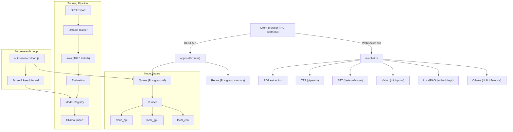

---

## 2. Architecture V2 (primaire — monorepo TypeScript)

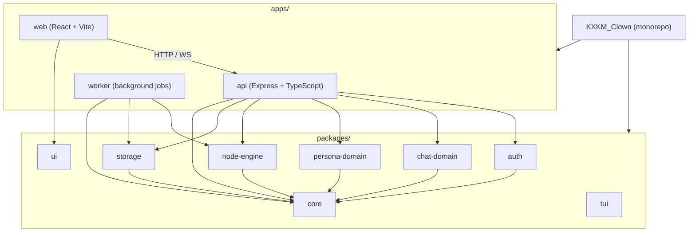

---

## 3. Architecture V1 (reference, monolithique)

```mermaid
flowchart TD
    server["server.js (entrypoint)"]

    server --> config["config.js"]
    server --> networkPolicy["network-policy.js"]
    server --> adminSession["admin-session.js"]

    server --> personaRegistry["persona-registry.js"]
    personaRegistry --> personas["personas.js"]
    server --> personaStore["persona-store.js"]
    personaStore --> pharmacius["pharmacius.js"]

    server --> runtimeState["runtime-state.js"]

    server --> storage["storage.js"]
    server --> sessions["sessions.js"]
    server --> clientRegistry["client-registry.js"]

    server --> ollama["ollama.js"]
    server --> webTools["web-tools.js"]

    server --> chatRouting["chat-routing.js"]
    server --> commands["commands.js"]

    server --> attachStore["attachment-store.js"]
    server --> attachPipeline["attachment-pipeline.js"]
    server --> attachService["attachment-service.js"]

    server --> neRegistry["node-engine-registry.js"]
    server --> neStore["node-engine-store.js"]
    server --> neRunner["node-engine-runner.js"]
    server --> neRuntimes["node-engine-runtimes.js"]
    server --> neQueue["node-engine-queue.js"]

    server --> httpApi["http-api.js"]
    server --> websocket["websocket.js"]

    chatRouting --> ollama
    chatRouting --> storage
    chatRouting --> runtimeState
    chatRouting --> personaRegistry

    commands --> ollama
    commands --> webTools
    commands --> storage

    httpApi --> networkPolicy
    httpApi --> adminSession
    httpApi --> personaStore
    httpApi --> neStore
    httpApi --> neQueue

    websocket --> chatRouting
    websocket --> commands
    websocket --> clientRegistry

    neQueue --> neRunner
    neRunner --> neRuntimes
    neRunner --> neRegistry
    neRunner --> neStore
```

---

## 4. Pipeline multimodal (chat)

Parcours d'un message dans le systeme multimodal. Le type de contenu determine le pipeline de traitement.

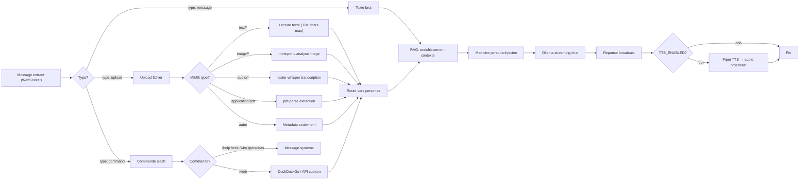

---

## 5. Flux RAG (Retrieval-Augmented Generation)

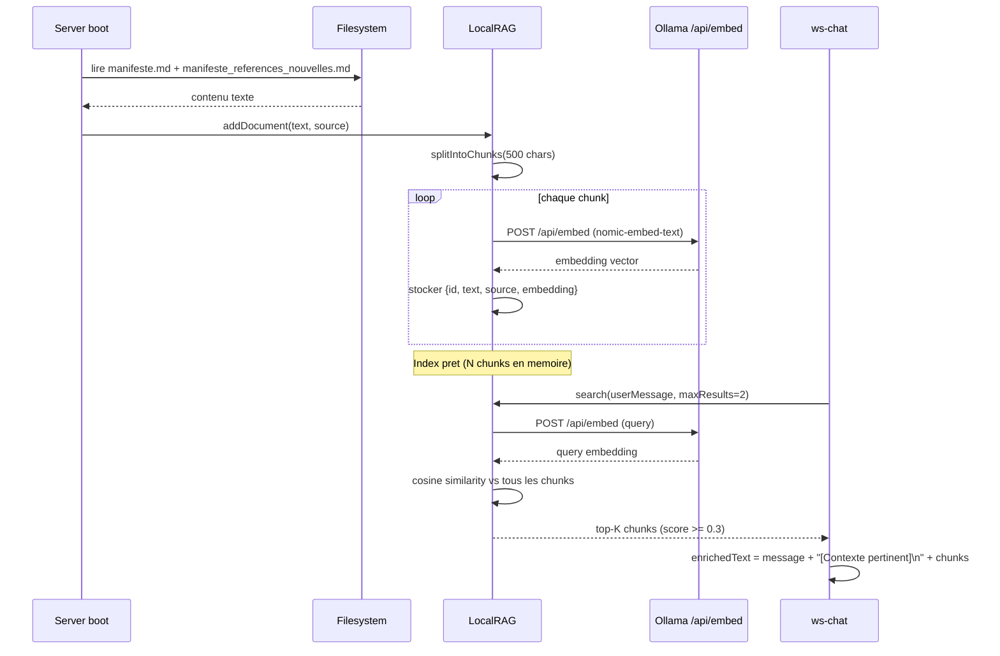

---

## 6. Pipeline Training (DPO → Ollama)

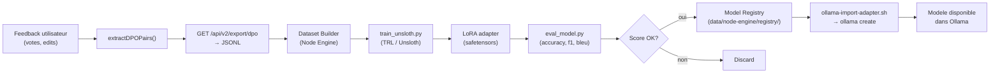

---

## 7. Pipeline TTS / STT

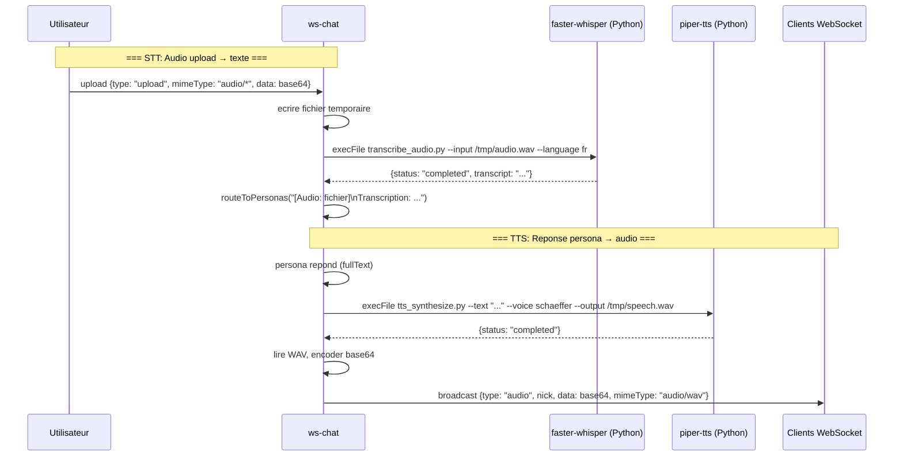

---

## 8. Flux de donnees

### 8.1 Message chat (V2)

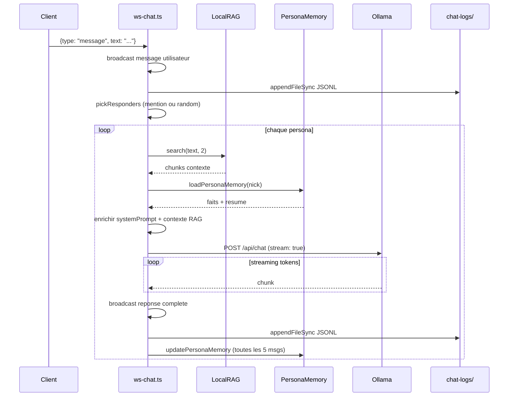

### 8.2 Node Engine pipeline

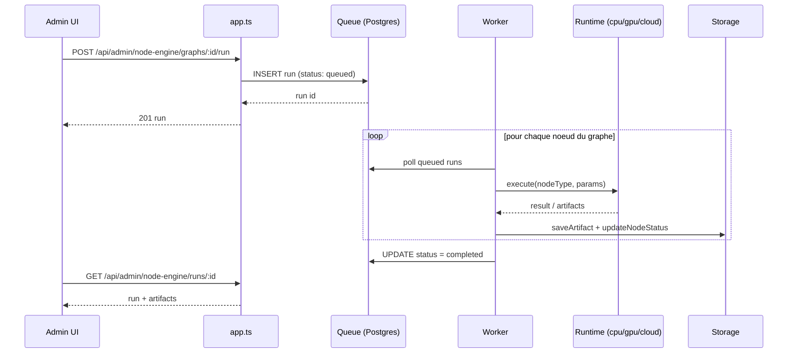

### 8.3 Persona lifecycle

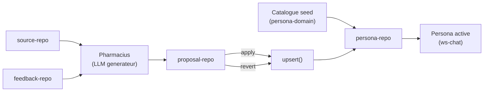

### 8.4 Persona editorial state machine

---

## 9. Autoresearch

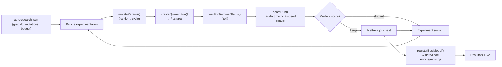

---

## 10. Stockage

### 10.1 Arborescence `data/`

```mermaid
flowchart TD
    data["data/"]
    data --> channels["channels.json"]
    data --> runtimeAdmin["runtime-admin.json"]
    data --> users["users.json"]
    data --> overrides["personas.overrides.json"]
    data --> manifeste["manifeste.md + manifeste_references_nouvelles.md"]

    data --> chatLogs["chat-logs/ (v2-YYYY-MM-DD.jsonl)"]
    data --> personaMemory["persona-memory/ (nick.json)"]
    data --> dpo["dpo/ (paires DPO jsonl)"]
    data --> training["training/ (conversations jsonl)"]
    data --> logs["logs/ (historiques par canal)"]
    data --> memory["memory/ (contexte par session)"]
    data --> sessions_dir["sessions/ (sessions persistees)"]
    data --> v2local["v2-local/ (personas, sources, feedback, proposals)"]

    data --> uploads["uploads/ (fichiers binaires)"]
    data --> uploadsMeta["uploads-meta/ (metadonnees)"]

    data --> pFeedback["persona-feedback/ (retours)"]
    data --> pProposals["persona-proposals/ (patches)"]
    data --> pSources["persona-sources/ (dossiers source)"]

    data --> ne["node-engine/ (graphes, runs, artifacts, registry)"]
```

### 10.2 Arborescence `models/`

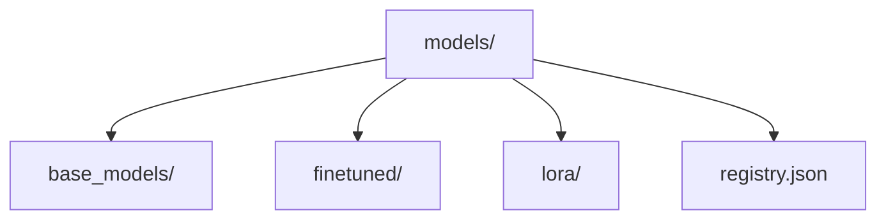

---

## 11. Securite

### Politique reseau

- `ADMIN_SUBNET` (V2): CIDR unique pour restriction admin.
- `ADMIN_ALLOWED_SUBNETS` (V1): liste de sous-reseaux.
- Verification IP source sur chaque requete admin.
- Mode d'acces: `loopback` (127.0.0.1) ou `lan_controlled`.

### Sessions admin

- Authentification par token (`ADMIN_TOKEN` ou `ADMIN_BOOTSTRAP_TOKEN`).
- Cookie de session `HttpOnly`, `SameSite=Strict`, `Secure` si HTTPS.
- Verification same-origin sur toute mutation.

### Roles RBAC

| Role       | Description                                    | Source de configuration    |
|------------|------------------------------------------------|----------------------------|
| `admin`    | Acces complet, gestion personas et node-engine | `ADMIN_TOKEN` match        |
| `operator` | Operations, monitoring, acces TUI              | Token eleve                |
| `editor`   | Modification personas (via admin UI)           | Session admin authentifiee |
| `viewer`   | Chat public, lecture seule                     | Tout client connecte       |

---

## 12. Routes API

### Routes publiques

| Methode | Route                              | Description                        |
|---------|------------------------------------|------------------------------------|
| GET     | `/api/v2/health`                   | Sante de l'API                     |
| GET     | `/api/v2/status`                   | Statut general (personas, runs)    |
| GET     | `/api/status`                      | Statut general (V1)                |
| GET     | `/api/models`                      | Liste des modeles Ollama           |
| GET     | `/api/channels`                    | Liste des canaux actifs            |
| GET     | `/api/personas`                    | Liste des personas publiques       |

### Routes session

| Methode | Route                    | Description                      |
|---------|--------------------------|----------------------------------|
| POST    | `/api/session/login`     | Creation session (token)         |
| GET     | `/api/session`           | Verification session courante    |
| POST    | `/api/session/logout`    | Deconnexion                      |

### Routes admin - Personas

| Methode | Route                                       | Description                          |
|---------|---------------------------------------------|--------------------------------------|
| PUT     | `/api/admin/personas/:id`                   | Modifier une persona                 |
| GET     | `/api/admin/personas/:id/source`            | Lire dossier source                  |
| PUT     | `/api/admin/personas/:id/source`            | Modifier dossier source              |
| GET     | `/api/admin/personas/:id/feedback`          | Lister les retours                   |
| GET     | `/api/admin/personas/:id/proposals`         | Lister les propositions              |
| POST    | `/api/admin/personas/:id/reinforce`         | Lancer renforcement Pharmacius       |
| POST    | `/api/admin/personas/:id/revert`            | Revenir a un etat precedent          |

### Routes admin - Node Engine

| Methode | Route                                           | Description                       |
|---------|--------------------------------------------------|-----------------------------------|
| GET     | `/api/admin/node-engine/overview`               | Vue d'ensemble (runs, queue)      |
| GET     | `/api/admin/node-engine/graphs`                 | Lister les graphes                |
| POST    | `/api/admin/node-engine/graphs`                 | Creer un graphe                   |
| PUT     | `/api/admin/node-engine/graphs/:id`             | Modifier un graphe                |
| POST    | `/api/admin/node-engine/graphs/:id/run`         | Lancer execution                  |
| GET     | `/api/admin/node-engine/runs/:id`               | Detail d'une execution            |
| POST    | `/api/admin/node-engine/runs/:id/cancel`        | Annuler une execution             |
| GET     | `/api/admin/node-engine/artifacts/:runId`       | Artifacts d'une execution         |
| GET     | `/api/admin/node-engine/models`                 | Lister les modeles                |

### Routes export et historique

| Methode | Route                              | Description                       |
|---------|------------------------------------|------------------------------------|
| GET     | `/api/v2/export/html`              | Export HTML conversation           |
| GET     | `/api/v2/export/dpo`               | Export paires DPO (JSONL)          |
| GET     | `/api/v2/chat/history`             | Liste fichiers de chat logs        |
| GET     | `/api/v2/chat/history/:date`       | Messages d'un jour (pagine)        |
| POST    | `/api/v2/admin/retention-sweep`    | Nettoyage runs anciens             |
