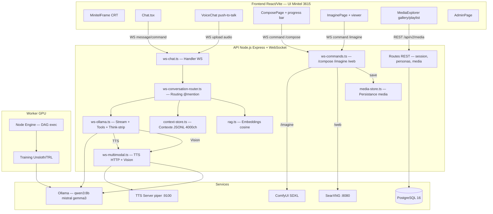
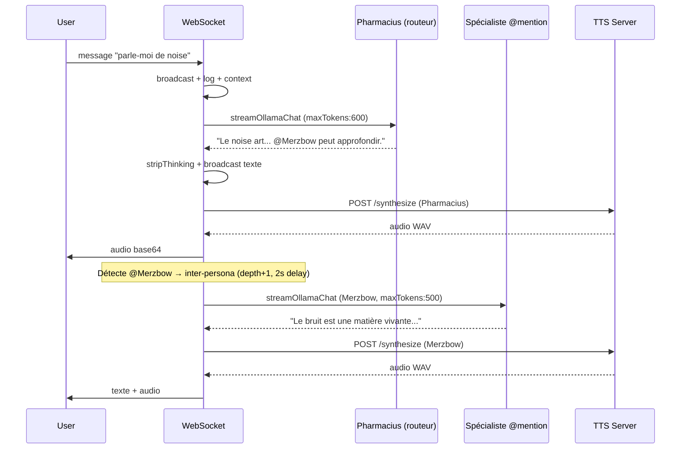
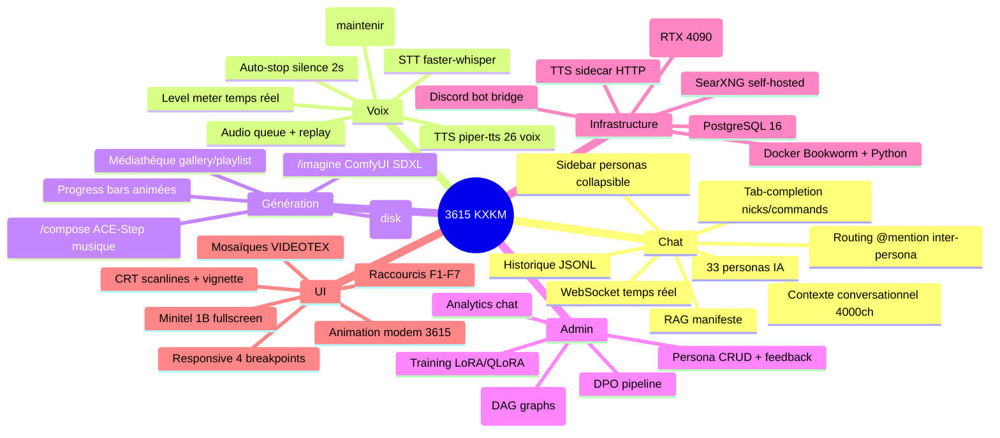

# Architecture 3615-KXKM

> "Le medium est le message, et ton terminal a deja compris." -- electron rare

## Vue d'ensemble

## Flux chat avec routing personas

## Feature Map

## Modules (LOC)

| Module | LOC | Tests | Rôle |
|--------|-----|-------|------|
| apps/api | 5200 | 1000 | Backend API + WebSocket |
| apps/web | 4800 | 800 | Frontend React |
| apps/worker | 956 | 230 | Worker GPU Node Engine |
| packages/core | 172 | 86 | Types, IDs, permissions |
| packages/auth | 159 | 157 | Scrypt, sessions, RBAC |
| packages/chat-domain | 262 | 279 | Messages, channels, commands |
| packages/persona-domain | 988 | 259 | Personas, feedback, editorial |
| packages/node-engine | 1499 | 605 | DAG execution, training |
| packages/storage | 1219 | 669 | PostgreSQL repos |
| packages/ui | 134 | 0 | Theme, colors, CSS vars |
| packages/tui | 209 | 108 | ANSI formatting, tables |
| scripts | 37 fichiers | - | TTS, training, migration |
| **Total** | **~15600** | **~3200** | |

## Bugs critiques identifiés (audit 2026-03-18)

| # | Sévérité | Module | Description |
|---|----------|--------|-------------|
| 1 | HIGH | context-store.ts | Race condition sur enforceLimits pendant compaction |
| 2 | MEDIUM | ws-conversation-router.ts | Maps persona unbounded (memory leak) |
| 3 | MEDIUM | ws-commands.ts | Temp files non nettoyés si compose timeout |
| 4 | MEDIUM | Chat.tsx | Memory leak /ulla (setTimeout non tracked) |
| 5 | MEDIUM | ComposePage/ImaginePage | WebSocket non fermé au unmount |
| 6 | LOW | AdminPage.tsx | Champ password UI mort (jamais envoyé) |
| 7 | LOW | routes/session.ts | Token comparison timing-attack (===) |

## Env vars

| Variable | Default | Requis |
|----------|---------|--------|
| V2_API_PORT | 3333 | Non |
| OLLAMA_URL | localhost:11434 | Non |
| DATABASE_URL | - | Prod only |
| TTS_ENABLED | 0 | Non |
| TTS_URL | localhost:9100 | Non |
| VISION_MODEL | qwen3-vl:8b | Non |
| COMFYUI_URL | stable2.kxkm.net | Non |
| SEARXNG_URL | localhost:8080 | Non |
| PYTHON_BIN | python3 | Non |
| MAX_OLLAMA_CONCURRENT | 3 | Non |
| ADMIN_BOOTSTRAP_TOKEN | - | Non |
