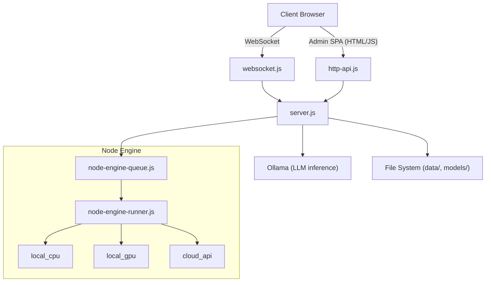
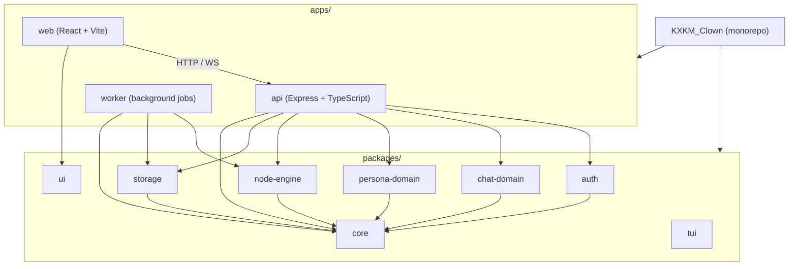
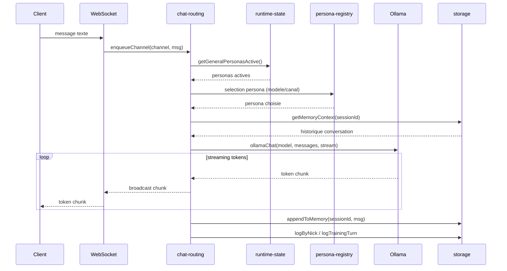
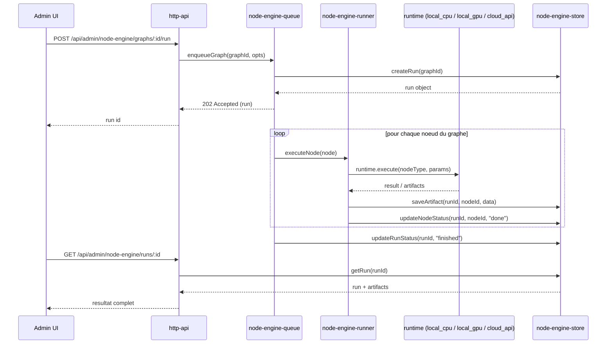
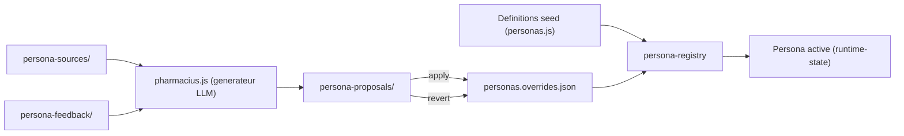
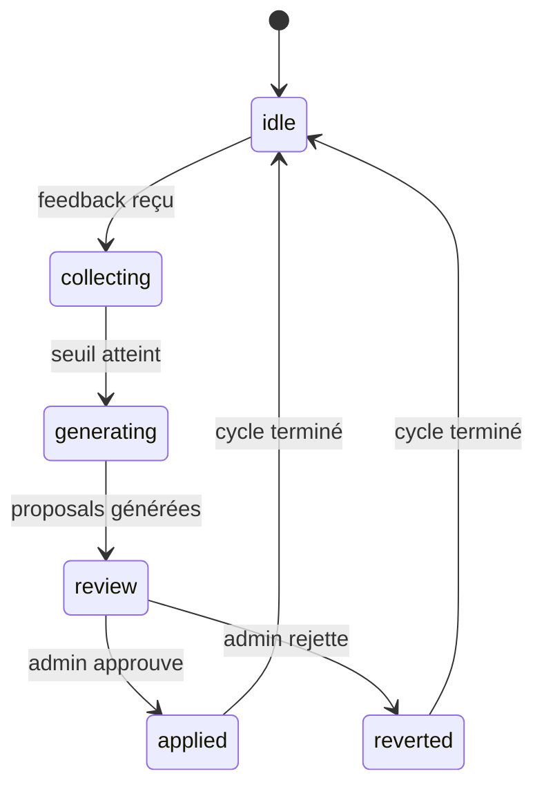
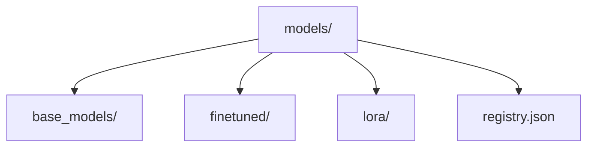

```mermaid
flowchart TD
    server["server.js (entrypoint)"]

    server --> config["config.js"]
    server --> networkPolicy["network-policy.js"]
    server --> adminSession["admin-session.js"]

    server --> personaRegistry["persona-registry.js"]
    personaRegistry --> personas["personas.js"]
    server --> personaStore["persona-store.js"]
    personaStore --> pharmacius["pharmacius.js"]

    server --> runtimeState["runtime-state.js"]

    server --> storage["storage.js"]
    server --> sessions["sessions.js"]
    server --> clientRegistry["client-registry.js"]

    server --> ollama["ollama.js"]
    server --> webTools["web-tools.js"]

    server --> chatRouting["chat-routing.js"]
    server --> commands["commands.js"]

    server --> attachStore["attachment-store.js"]
    server --> attachPipeline["attachment-pipeline.js"]
    server --> attachService["attachment-service.js"]

    server --> neRegistry["node-engine-registry.js"]
    server --> neStore["node-engine-store.js"]
    server --> neRunner["node-engine-runner.js"]
    server --> neRuntimes["node-engine-runtimes.js"]
    server --> neQueue["node-engine-queue.js"]

    server --> httpApi["http-api.js"]
    server --> websocket["websocket.js"]

    chatRouting --> ollama
    chatRouting --> storage
    chatRouting --> runtimeState
    chatRouting --> personaRegistry

    commands --> ollama
    commands --> webTools
    commands --> storage

    httpApi --> networkPolicy
    httpApi --> adminSession
    httpApi --> personaStore
    httpApi --> neStore
    httpApi --> neQueue

    websocket --> chatRouting
    websocket --> commands
    websocket --> clientRegistry

    neQueue --> neRunner
    neRunner --> neRuntimes
    neRunner --> neRegistry
    neRunner --> neStore
```

# Architecture KXKM_Clown

Document de reference decrivant l'architecture systeme, les flux de donnees et les interfaces du projet KXKM_Clown.

---

## 1. Vue d'ensemble systeme

---

## 2. Architecture V1 (actuelle)

Graphe de dependances des modules. `server.js` est le point d'entree unique qui instancie et relie tous les sous-systemes.

---

## 3. Architecture V2 (cible monorepo)

La V2 reorganise le code en monorepo `apps/` + `packages/` tout en conservant la V1 fonctionnelle pendant la migration.

---

## 4. Flux de donnees

### 4.1 Message chat

Parcours complet d'un message utilisateur, de la saisie a la diffusion de la reponse en streaming.

### 4.2 Node Engine pipeline

Execution d'un graphe de noeuds via le systeme de queue.

### 4.3 Persona lifecycle

Cycle de vie d'une persona : de la definition initiale aux propositions Pharmacius et retours en arriere.

### 4.4 Persona editorial state machine

Pipeline editorial de renforcement des personas via Pharmacius.

---

## 5. Stockage

### 5.1 Arborescence `data/`

```mermaid
flowchart TD
    data["data/"]
    data --> channels["channels.json"]
    data --> runtimeAdmin["runtime-admin.json"]
    data --> users["users.json"]
    data --> overrides["personas.overrides.json"]
    data --> manifeste["manifeste.md"]

    data --> dpo["dpo/ (paires DPO jsonl)"]
    data --> training["training/ (conversations jsonl)"]
    data --> logs["logs/ (historiques par canal)"]
    data --> memory["memory/ (contexte par session)"]
    data --> sessions_dir["sessions/ (sessions persistees)"]

    data --> uploads["uploads/ (fichiers binaires)"]
    data --> uploadsMeta["uploads-meta/ (metadonnees)"]

    data --> pFeedback["persona-feedback/ (retours)"]
    data --> pProposals["persona-proposals/ (patches)"]
    data --> pSources["persona-sources/ (dossiers source)"]

    data --> ne["node-engine/ (graphes, runs, artifacts)"]
```

### 5.2 Arborescence `models/`

---

## 6. Securite

### Politique reseau (`network-policy.js`)

- Liste blanche de sous-reseaux (`ADMIN_ALLOWED_SUBNETS`) pour l'acces aux routes admin.
- Verification de l'IP source sur chaque requete admin via `isAdminNetworkAllowed(req)`.
- Mode d'acces determine au demarrage : `loopback` (127.0.0.1) ou `lan_controlled`.

### Sessions admin (`admin-session.js`)

- Authentification par token bootstrap (`ADMIN_BOOTSTRAP_TOKEN`).
- Cookie de session `HttpOnly`, `SameSite=Strict`, `Secure` si HTTPS.
- Verification same-origin sur toute mutation (POST, PUT, DELETE) via header `Origin` / `Referer`.

### Roles RBAC

Le systeme distingue quatre niveaux de privileges, configures via `config.js` :

| Role       | Description                                    | Source de configuration    |
|------------|------------------------------------------------|----------------------------|
| `admin`    | Acces complet, gestion personas et node-engine | `ADMINS` (liste de nicks)  |
| `operator` | Operations, monitoring, acces TUI              | `OPS` (liste de nicks)     |
| `editor`   | Modification personas (via admin UI)           | Session admin authentifiee |
| `viewer`   | Chat public, lecture seule                     | Tout client connecte       |

---

## 7. Routes API

### Routes publiques

| Methode | Route                              | Description                        |
|---------|------------------------------------|------------------------------------|
| GET     | `/api/status`                      | Statut general du serveur          |
| GET     | `/api/models`                      | Liste des modeles Ollama           |
| GET     | `/api/channels`                    | Liste des canaux actifs            |
| GET     | `/api/personas`                    | Liste des personas publiques       |
| POST    | `/api/chat/attachments`            | Upload de fichier (chat)           |
| GET     | `/api/chat/attachments/:id`        | Metadonnees d'un attachement       |
| GET     | `/api/chat/attachments/:id/blob`   | Contenu binaire d'un attachement   |

### Routes admin - Session

| Methode | Route                    | Description                      |
|---------|--------------------------|----------------------------------|
| POST    | `/api/admin/session`     | Creation session admin (token)   |
| GET     | `/api/admin/session`     | Verification session courante    |
| DELETE  | `/api/admin/session`     | Deconnexion session admin        |

### Routes admin - Runtime et canaux

| Methode | Route                                | Description                       |
|---------|--------------------------------------|-----------------------------------|
| GET     | `/api/admin/runtime`                 | Etat complet du runtime           |
| GET     | `/api/admin/runtime/status`          | Statut detaille (uptime, modeles) |
| GET     | `/api/admin/channels`                | Liste canaux avec clients live    |
| GET     | `/api/admin/runtime/channels`        | Alias channels                    |
| PUT     | `/api/admin/channels/:id/topic`      | Modifier le topic d'un canal      |
| GET     | `/api/admin/runtime/topic`           | Lire topic d'un canal             |
| PUT     | `/api/admin/runtime/topic`           | Modifier topic via body           |

### Routes admin - Personas

| Methode | Route                                       | Description                          |
|---------|---------------------------------------------|--------------------------------------|
| GET     | `/api/admin/personas`                       | Liste complete (editable)            |
| PUT     | `/api/admin/personas/:id`                   | Modifier une persona                 |
| POST    | `/api/admin/personas/from-source`           | Creer persona depuis source          |
| GET     | `/api/admin/personas/:id/source`            | Lire dossier source                  |
| PUT     | `/api/admin/personas/:id/source`            | Modifier dossier source              |
| GET     | `/api/admin/personas/:id/feedback`          | Lister les retours                   |
| POST    | `/api/admin/personas/:id/feedback`          | Enregistrer un retour                |
| GET     | `/api/admin/personas/:id/proposals`         | Lister les propositions Pharmacius   |
| POST    | `/api/admin/personas/:id/reinforce`         | Lancer renforcement Pharmacius       |
| POST    | `/api/admin/personas/:id/revert`            | Revenir a un etat precedent          |
| POST    | `/api/admin/personas/:id/disable`           | Desactiver une persona               |
| POST    | `/api/admin/personas/:id/enable`            | Activer une persona                  |
| POST    | `/api/admin/personas/:id/runtime`           | Basculer etat runtime                |

### Routes admin - Historique et export

| Methode | Route                                | Description                       |
|---------|--------------------------------------|-----------------------------------|
| GET     | `/api/admin/history/search`          | Recherche dans l'historique       |
| GET     | `/api/admin/export/html`             | Export HTML inline                |
| GET     | `/api/admin/history/export.html`     | Export HTML telechargeable        |
| GET     | `/api/admin/logs/summary`            | Resume des logs par canal         |

### Routes admin - Node Engine

| Methode | Route                                           | Description                       |
|---------|--------------------------------------------------|-----------------------------------|
| GET     | `/api/admin/node-engine/overview`               | Vue d'ensemble (runs, queue)      |
| GET     | `/api/admin/node-engine/node-types`             | Familles et types de noeuds       |
| GET     | `/api/admin/node-engine/graphs`                 | Lister les graphes                |
| POST    | `/api/admin/node-engine/graphs`                 | Creer un graphe                   |
| GET     | `/api/admin/node-engine/graphs/:id`             | Lire un graphe                    |
| PUT     | `/api/admin/node-engine/graphs/:id`             | Modifier un graphe                |
| POST    | `/api/admin/node-engine/graphs/:id/run`         | Lancer l'execution d'un graphe    |
| GET     | `/api/admin/node-engine/runs`                   | Lister les executions             |
| GET     | `/api/admin/node-engine/runs/:id`               | Detail d'une execution            |
| POST    | `/api/admin/node-engine/runs/:id/cancel`        | Annuler une execution             |
| GET     | `/api/admin/node-engine/artifacts/:runId`       | Artifacts d'une execution         |
| POST    | `/api/admin/node-engine/nodes/preview`          | Preview d'un noeud                |
| GET     | `/api/admin/node-engine/models`                 | Lister les modeles node-engine    |
| GET     | `/api/admin/node-engine/models/:id`             | Detail d'un modele                |

### Routes admin - DPO et training

| Methode | Route                    | Description                       |
|---------|--------------------------|-----------------------------------|
| GET     | `/api/dpo/export`        | Export paires DPO (jsonl)         |
| GET     | `/api/training/export`   | Export conversations training     |
