# Carte Fonctionnelle

> "Nous sommes les saboteurs du big daddy mainframe." -- VNS Matrix, detourne par electron rare
>
> Ce document cartographie un systeme de chat IA multimodal local --
> IRC dans l'ame, crypto-anarchiste dans l'infrastructure, musique concrete dans le traitement du signal.

## Carte synthetique

```mermaid
flowchart TD
  Product[KXKM_Clown]
  Product --> Chat[Chat Multimodal]
  Product --> Admin[Admin]
  Product --> Personas[Personas]
  Product --> Engine[Node Engine]
  Product --> Multimodal[Multimodal Pipeline]
  Product --> Training[Training & DPO]
  Product --> Ops[Ops]
  Product --> Data[Donnees]
  Product --> Security[Securite]

  Chat --> Channels[Canaux]
  Chat --> Sessions[Sessions]
  Chat --> Attachments[Pieces jointes]
  Chat --> Routing[Routing IA]
  Chat --> Streaming[Streaming LLM]
  Chat --> WebSearch[Recherche web]
  Chat --> Memory[Memoire persona]
  Chat --> History[Historique chat]

  Admin --> Auth[Session admin]
  Admin --> Modules[Modules switcher]
  Admin --> Status[Status strip]
  Admin --> Runtime[Runtime]
  Admin --> Exports[Exports]

  Personas --> Sources[Sources web]
  Personas --> Feedback[Feedback]
  Personas --> Proposals[Proposals]
  Personas --> Pharmacius[Pharmacius]
  Personas --> Drawflow[React Flow nodal]

  Engine --> Graphs[Graphes DAG]
  Engine --> Runs[Runs lifecycle]
  Engine --> Artifacts[Artifacts]
  Engine --> Models[Registry modeles]
  Engine --> Queue[Queue async]

  Multimodal --> RAG[RAG local]
  Multimodal --> STT[STT / Whisper]
  Multimodal --> TTS[TTS / Piper]
  Multimodal --> Vision[Vision / minicpm-v]
  Multimodal --> PDF[Extraction PDF]

  Training --> DPO[Pipeline DPO]
  Training --> TrainDash[Training dashboard]
  Training --> Autoresearch[Autoresearch]
  Training --> OllamaImport[Ollama import adapter]

  Ops --> Check[check / smoke]
  Ops --> Build[build V1+V2]
  Ops --> Batch[Batch orchestrator]
  Ops --> Retention[Retention sweep]

  Data --> Persist[JSON/JSONL flat-file + Postgres]
  Data --> DPOData[DPO pairs]
  Data --> Export[HTML / training export]
  Data --> ConvMemory[Conversation memory]

  Security --> NetGate[Subnet gate]
  Security --> Cookie[HttpOnly cookies]
  Security --> RBAC[RBAC V2]
```

---

## Chat

| Fonctionnalite | Detail |
| --- | --- |
| WebSocket temps reel | Connexion persistante `/ws`, events bidirectionnels JSON |
| Multi-canaux | `#general`, canaux par persona, routage automatique |
| Streaming LLM | Reponses en streaming via Ollama avec indicateur d'ecriture |
| Tab completion | Completion nicks et commandes via Tab |
| Historique messages | ArrowUp/Down, 100 items en memoire client |
| DOM pruning | Elagage automatique a 500 messages max dans le DOM |
| Couleurs par bot | Mapping couleur unique par persona (palette deterministe) |
| Messages prives (PM) | Conversation directe utilisateur-persona via @mention |
| Upload fichiers | Pipeline multimodal: texte, image, audio, PDF |
| Commandes slash | `/help`, `/web`, `/nick`, `/who`, `/personas`, `/clear` |
| Recherche web | `/web <query>` — DuckDuckGo Lite ou API custom |
| Memoire persona | Contexte persistant par persona (faits, resume) |
| Historique chat | Logs JSONL par jour, API de consultation paginee |

## Pipeline Multimodal

| Fonctionnalite | Detail |
| --- | --- |
| RAG local | Embeddings via Ollama (`nomic-embed-text`), cosine similarity, contexte manifeste injecte |
| STT (Speech-to-Text) | `faster-whisper` (CTranslate2, int8) ou fallback `openai-whisper`, modeles tiny/base/small/medium/large |
| TTS (Text-to-Speech) | `piper-tts` (fallback rapide) + XTTS-v2 (voice cloning zero-shot per persona, GPU) |
| Vision | `qwen3-vl:8b` via Ollama, analyse d'images uploadees, description en francais |
| Extraction PDF | Docling (tables, layout, OCR) + fallback PyMuPDF |
| Texte/CSV/JSON | Lecture directe des fichiers texte, CSV, JSONL uploades |
| Generation musicale | `/compose` — ACE-Step 1.5 (GPU, <4GB VRAM) + fallback MusicGen |
| Generation images | `/imagine` — ComfyUI (SDXL Lightning + Flux 2 support) |
| Recherche web | SearXNG self-hosted + DuckDuckGo fallback |

## Discord

| Fonctionnalite | Detail |
| --- | --- |
| Bot texte Pharmacius | Bridge 2 salons Discord ↔ KXKM chat (WebSocket + Discord Gateway, sans deps) |
| Bot vocal | STT → personas → TTS en salon vocal Discord (@discordjs/voice) |
| Commandes | `!help`, `!personas`, `!status`, `@PersonaName message` |

## MCP (Model Context Protocol)

| Fonctionnalite | Detail |
| --- | --- |
| MCP Server | stdio transport, protocole 2024-11-05, compatible Claude Desktop |
| kxkm_chat | Envoyer un message aux personas |
| kxkm_personas | Lister les personas actives |
| kxkm_web_search | Recherche web via SearXNG |
| kxkm_status | Statut systeme (health + perf) |

## Admin Dashboard

| Fonctionnalite | Detail |
| --- | --- |
| Auth session | Cookie HttpOnly + fallback header legacy |
| Module switcher | dashboard, personas, runtime, channels, data, node-engine |
| Status strip | Connexion, clients connectes, sessions, personas actives, modeles |
| Endpoint status public | `/api/v2/status` sans authentification |
| Gestion runtime | Demarrage/arret personas, overrides modele |

## Personas

| Fonctionnalite | Detail |
| --- | --- |
| Personas seed | Schaeffer, Batty, Radigue, Oliveros, Lessig, etc. (catalogue initial) |
| Creation custom | Nouvelle persona depuis source editoriale |
| Overrides runtime | Nom, modele, style modifiables a chaud |
| Gestion sources | Subject, query, tone, themes, lexicon par persona |
| Pipeline feedback | Votes, signaux, edits utilisateur |
| Pharmacius | Orchestrateur editorial automatique |
| Systeme proposals | Suggestions d'amelioration auto-generees |
| Apply/revert | Application et annulation des proposals |
| Visualisation React Flow | Interface nodale pour le graphe de persona |
| Enable/disable | Activation/desactivation a chaud |
| Memoire persistante | Faits et resume par persona, mis a jour toutes les 5 interactions |

## Node Engine

| Fonctionnalite | Detail |
| --- | --- |
| Graphes DAG | Definition par noeuds et aretes, validation acyclique |
| 7 familles de noeuds | dataset_source, data_processing, dataset_builder, training, evaluation, registry, deployment |
| 16+ types de noeuds | Types specialises par famille |
| Cycle de vie run | queued -> running -> completed / failed / cancelled |
| Queue async | Concurrence controlee, execution asynchrone (Postgres) |
| Artifacts par etape | Tracking et stockage d'artifacts a chaque step |
| Registry modeles | Versionnage et catalogue des modeles produits |
| Templates seed | Graphes pre-configures comme point de depart |
| Recovery on crash | Reprise des runs interrompus au redemarrage |
| Cancel support | Annulation propre d'un run en cours |

## Training & DPO

| Fonctionnalite | Detail |
| --- | --- |
| Pipeline DPO | Extraction paires chosen/rejected depuis feedback personas, export JSONL |
| Training adapters | TRL (Hugging Face) + Unsloth, execution via Python venv |
| Autoresearch | Boucle d'experimentation automatisee: mutations, scoring, keep/discard |
| Evaluation | Score artifacts (accuracy, f1, bleu, perplexity), scoring deterministe |
| Registry | Enregistrement automatique du meilleur modele par session |
| Ollama import adapter | Import LoRA adapter dans Ollama via Modelfile (bash + node wrapper) |
| Training dashboard | React Flow dans le frontend V2, visualisation graphes et runs |
| Sandboxing runtimes | local_cpu, local_gpu, cloud_api |

## Stockage & Donnees

| Fonctionnalite | Detail |
| --- | --- |
| Persistance double | Postgres (production) ou flat-file JSON/JSONL (dev/demo) |
| Stats utilisateur | Compteurs et metriques par utilisateur |
| Memoire conversation | Contexte borne par persona/session |
| Memoire persona | Faits et resume persistants par persona (`data/persona-memory/`) |
| Logging DPO | Paires chosen/rejected pour entrainement RLHF |
| Chat logs | JSONL quotidien (`data/chat-logs/v2-YYYY-MM-DD.jsonl`) |
| Export training data | Extraction formatee pour fine-tuning |
| Recherche historique | Recherche dans les conversations passees |
| Export HTML | Export conversations en HTML lisible |
| Snapshots session | Capture d'etat de session a un instant T |
| Retention sweep | Nettoyage automatique sessions et logs anciens |

## Ops & Scripts

| Fonctionnalite | Detail |
| --- | --- |
| `npm run check` | Validation syntaxe V1 + TypeScript V2 |
| `npm run smoke` | 30+ tests d'integration automatises |
| `npm run build` | Build dist V1 + compilation V2 |
| `npm run v2:autoresearch` | Boucle autoresearch continue |
| Batch orchestrator | DAG Python pour orchestration de taches batch |
| TUI monitoring | health-check, queue-viewer, persona-manager, log-rotate |

## Securite

| Fonctionnalite | Detail |
| --- | --- |
| Subnet gate | Restriction d'acces admin par sous-reseau (`ADMIN_SUBNET`, `ADMIN_ALLOWED_SUBNETS`) |
| Cookies HttpOnly | Sessions admin non accessibles depuis JS client |
| Same-origin check | Verification origine sur les mutations |
| RBAC (V2) | Roles admin, editor, operator, viewer |

---

## Matrice de statut

| Fonctionnalite | V1 | V2 | Priorite |
| --- | --- | --- | --- |
| **Chat** | | | |
| WebSocket temps reel | OK | OK | haute |
| Multi-canaux | OK | OK | haute |
| Streaming LLM | OK | OK | haute |
| Tab completion | OK | OK | moyenne |
| Historique messages | OK | OK | basse |
| DOM pruning | OK | OK | basse |
| Upload fichiers | OK | OK | moyenne |
| Commandes slash | OK | OK | moyenne |
| Recherche web (`/web`) | OK | OK | moyenne |
| **Multimodal** | | | |
| RAG (embeddings locaux) | -- | OK | haute |
| STT (faster-whisper) | -- | OK | haute |
| TTS (piper-tts) | -- | OK | moyenne |
| Vision (minicpm-v) | -- | OK | haute |
| Extraction PDF | -- | OK | moyenne |
| Memoire persona | -- | OK | haute |
| **Admin** | | | |
| Auth session cookie | OK | OK | haute |
| Module switcher | OK | OK | haute |
| Status strip | OK | OK | moyenne |
| Status public | OK | OK | basse |
| **Personas** | | | |
| Personas seed | OK | OK | haute |
| Creation custom | OK | OK | haute |
| Overrides runtime | OK | OK | haute |
| Pipeline feedback | OK | OK | haute |
| Pharmacius | OK | OK | haute |
| Proposals apply/revert | OK | OK | haute |
| Drawflow nodal | OK | OK (React Flow) | moyenne |
| **Node Engine** | | | |
| Graphes DAG | OK | OK | critique |
| Run lifecycle | OK | OK | critique |
| Queue async | OK | OK (Postgres) | critique |
| Artifacts | OK | OK | critique |
| Registry modeles | OK | OK | critique |
| Recovery on crash | OK | OK | haute |
| Cancel support | OK | OK | haute |
| **Training & DPO** | | | |
| DPO export (JSONL) | OK | OK | haute |
| Training adapters (TRL/Unsloth) | -- | OK | haute |
| Autoresearch loop | -- | OK | haute |
| Ollama import adapter | -- | OK | haute |
| Training dashboard (React) | -- | OK | haute |
| Sandboxing runtimes | -- | OK | haute |
| **Stockage** | | | |
| Flat-file JSON/JSONL | OK | OK (+ Postgres) | haute |
| Memoire conversation | OK | OK | haute |
| Chat history (JSONL logs) | -- | OK | haute |
| Export HTML | OK | OK | basse |
| Retention sweep | OK | OK | moyenne |
| **Securite** | | | |
| Subnet gate | OK | OK | haute |
| Cookies HttpOnly | OK | OK | haute |
| RBAC roles | -- | OK | haute |
| **Tests** | | | |
| Backend unit tests | -- | OK (102) | haute |
| React component tests | -- | OK (33) | haute |
| Smoke tests | OK | OK (22) | haute |
| CI/CD GitHub Actions | -- | OK | haute |
