# Carte Fonctionnelle

## Carte synthetique

```mermaid
flowchart TD
  Product[KXKM_Clown]
  Product --> Chat[Chat]
  Product --> Admin[Admin]
  Product --> Personas[Personas]
  Product --> Engine[Node Engine]
  Product --> Ops[Ops]
  Product --> Data[Donnees]
  Product --> Security[Securite]

  Chat --> Channels[Canaux]
  Chat --> Sessions[Sessions]
  Chat --> Attachments[Pieces jointes]
  Chat --> Routing[Routing IA]
  Chat --> Streaming[Streaming LLM]

  Admin --> Auth[Session admin]
  Admin --> Modules[Modules switcher]
  Admin --> Status[Status strip]
  Admin --> Runtime[Runtime]
  Admin --> Exports[Exports]

  Personas --> Sources[Sources web]
  Personas --> Feedback[Feedback]
  Personas --> Proposals[Proposals]
  Personas --> Pharmacius[Pharmacius]
  Personas --> Drawflow[Drawflow nodal]

  Engine --> Graphs[Graphes DAG]
  Engine --> Runs[Runs lifecycle]
  Engine --> Artifacts[Artifacts]
  Engine --> Models[Registry modeles]
  Engine --> Queue[Queue async]

  Ops --> Check[check / smoke]
  Ops --> Build[build V1+V2]
  Ops --> Batch[Batch orchestrator]
  Ops --> Retention[Retention sweep]

  Data --> Persist[JSON/JSONL flat-file]
  Data --> DPO[DPO pairs]
  Data --> Export[HTML / training export]
  Data --> Memory[Conversation memory]

  Security --> NetGate[Subnet gate]
  Security --> Cookie[HttpOnly cookies]
  Security --> RBAC[RBAC V2]
```

---

## Chat

| Fonctionnalite | Detail |
|---|---|
| WebSocket temps reel | Connexion persistante, events bidirectionnels |
| Multi-canaux | `#general`, canaux par persona, routage automatique |
| Streaming LLM | Reponses en streaming avec animation de reflexion (thinking) |
| Tab completion | Completion nicks et commandes via Tab |
| Historique messages | ArrowUp/Down, 100 items en memoire client |
| DOM pruning | Elagage automatique a 500 messages max dans le DOM |
| Couleurs par bot | Mapping couleur unique par persona |
| Messages prives (PM) | Conversation directe utilisateur-persona |
| Upload fichiers | Pipeline attachment avec cartes visuelles |
| Commandes slash | `/help`, `/web`, `/admin`, `/clear`, etc. |

## Admin Dashboard

| Fonctionnalite | Detail |
|---|---|
| Auth session | Cookie HttpOnly + fallback header legacy |
| Module switcher | dashboard, personas, runtime, channels, data, node-engine |
| Status strip | Connexion, clients connectes, sessions, personas actives, modeles |
| Endpoint status public | `/api/status` sans authentification |
| Gestion runtime | Demarrage/arret personas, overrides modele |

## Personas

| Fonctionnalite | Detail |
|---|---|
| Personas seed | Schaeffer, Oliveros, Lessig, Batty, etc. (definitions de base) |
| Creation custom | Nouvelle persona depuis source editoriale |
| Overrides runtime | Nom, modele, style modifiables a chaud |
| Gestion sources | Subject, query, tone, themes, lexicon par persona |
| Pipeline feedback | Votes, signaux, edits utilisateur |
| Pharmacius | Orchestrateur editorial automatique |
| Systeme proposals | Suggestions d'amelioration auto-generees |
| Apply/revert | Application et annulation des proposals |
| Visualisation Drawflow | Interface nodale pour le graphe de persona |
| Enable/disable | Activation/desactivation a chaud |

## Node Engine

| Fonctionnalite | Detail |
|---|---|
| Graphes DAG | Definition par noeuds et aretes, validation acyclique |
| 7 familles de noeuds | dataset_source, data_processing, dataset_builder, training, evaluation, registry, deployment |
| 16+ types de noeuds | Types specialises par famille |
| Cycle de vie run | queued -> running -> completed / failed / cancelled |
| Queue async | Concurrence controlee, execution asynchrone |
| Artifacts par etape | Tracking et stockage d'artifacts a chaque step |
| Registry modeles | Versionnage et catalogue des modeles produits |
| Templates seed | Graphes pre-configures comme point de depart |
| Recovery on crash | Reprise des runs interrompus au redemarrage |
| Cancel support | Annulation propre d'un run en cours |

## Stockage & Donnees

| Fonctionnalite | Detail |
|---|---|
| Persistance flat-file | JSON et JSONL sur disque, pas de base externe |
| Stats utilisateur | Compteurs et metriques par utilisateur |
| Memoire conversation | Contexte borne par persona/session |
| Logging DPO | Paires chosen/rejected pour entrainement RLHF |
| Export training data | Extraction formatee pour fine-tuning |
| Recherche historique | Recherche dans les conversations passees |
| Export HTML | Export conversations en HTML lisible |
| Snapshots session | Capture d'etat de session a un instant T |
| Retention sweep | Nettoyage automatique sessions et logs anciens |

## Ops & Scripts

| Fonctionnalite | Detail |
|---|---|
| `npm run check` | Validation syntaxe V1 + TypeScript V2 |
| `npm run smoke` | 30+ tests d'integration automatises |
| `npm run build` | Build dist V1 + compilation V2 |
| Batch orchestrator | DAG Python pour orchestration de taches batch |
| `chain-actions.sh` | Enchainement d'actions scriptees |

## Securite

| Fonctionnalite | Detail |
|---|---|
| Subnet gate | Restriction d'acces admin par sous-reseau |
| Cookies HttpOnly | Sessions admin non accessibles depuis JS client |
| Same-origin check | Verification origine sur les mutations |
| RBAC (V2) | Roles admin, editor, operator, viewer |

---

## Matrice de statut

| Fonctionnalite | V1 | V2 | Priorite |
|---|---|---|---|
| **Chat** | | | |
| WebSocket temps reel | OK | prevu | haute |
| Multi-canaux | OK | prevu | haute |
| Streaming LLM | OK | prevu | haute |
| Tab completion | OK | prevu | moyenne |
| Historique messages | OK | prevu | basse |
| DOM pruning | OK | prevu | basse |
| Upload fichiers | OK | prevu | moyenne |
| Commandes slash | OK | prevu | moyenne |
| **Admin** | | | |
| Auth session cookie | OK | OK | haute |
| Module switcher | OK | prevu | haute |
| Status strip | OK | prevu | moyenne |
| Status public | OK | prevu | basse |
| **Personas** | | | |
| Personas seed | OK | prevu | haute |
| Creation custom | OK | prevu | haute |
| Overrides runtime | OK | prevu | haute |
| Pipeline feedback | OK | prevu | haute |
| Pharmacius | OK | prevu | haute |
| Proposals apply/revert | OK | prevu | haute |
| Drawflow nodal | OK | prevu | moyenne |
| **Node Engine** | | | |
| Graphes DAG | OK | prevu | critique |
| Run lifecycle | OK | prevu | critique |
| Queue async | OK | prevu | critique |
| Artifacts | OK | prevu | critique |
| Registry modeles | OK | prevu | critique |
| Recovery on crash | OK | prevu | haute |
| Cancel support | OK | prevu | haute |
| **Stockage** | | | |
| Flat-file JSON/JSONL | OK | prevu | haute |
| Memoire conversation | OK | prevu | haute |
| DPO logging | OK | prevu | moyenne |
| Export HTML | OK | prevu | basse |
| Retention sweep | OK | prevu | moyenne |
| **Securite** | | | |
| Subnet gate | OK | prevu | haute |
| Cookies HttpOnly | OK | OK | haute |
| RBAC roles | -- | prevu | haute |

---

## Priorites V2

1. Socle architecture, specs, docs, tests
2. Node Engine central (coeur d'orchestration)
3. Pipeline personas complet
4. Frontend V2 (React/Vite)
5. TUI et operabilite
6. Migration et bascule V1 -> V2

## Parite minimale V1 -> V2

- Chat temps reel avec streaming
- Login/logout admin avec session cookie
- Personas actives et reglables a chaud
- Pipeline feedback : reinforce/revert/proposals
- Graphes, runs, overview, preview, artifacts
- Model registry avec versionnage
- Logs et exports principaux
