# Carte Fonctionnelle

> "Nous sommes les saboteurs du big daddy mainframe." -- VNS Matrix, detourne par electron rare
>
> Ce document cartographie un systeme de chat IA multimodal local --
> IRC dans l'ame, crypto-anarchiste dans l'infrastructure, musique concrete dans le traitement du signal.

## Carte synthetique

```mermaid
flowchart TD
  Product[KXKM_Clown]
  Product --> Chat[Chat Multimodal]
  Product --> Admin[Admin]
  Product --> Personas[Personas]
  Product --> Engine[Node Engine]
  Product --> Multimodal[Multimodal Pipeline]
  Product --> Training[Training & DPO]
  Product --> DAW[openDIAW.be + Composition]
  Product --> Ops[Ops]
  Product --> Data[Donnees]
  Product --> Security[Securite]

  Chat --> Channels[Canaux]
  Chat --> Sessions[Sessions]
  Chat --> Attachments[Pieces jointes]
  Chat --> Routing[Routing IA]
  Chat --> Streaming[Streaming LLM]
  Chat --> WebSearch[Recherche web]
  Chat --> Memory[Memoire persona]
  Chat --> History[Historique chat]

  Admin --> Auth[Session admin]
  Admin --> Modules[Modules switcher]
  Admin --> Status[Status strip]
  Admin --> Runtime[Runtime]
  Admin --> Exports[Exports]

  Personas --> Sources[Sources web]
  Personas --> Feedback[Feedback]
  Personas --> Proposals[Proposals]
  Personas --> Pharmacius[Pharmacius]
  Personas --> Drawflow[React Flow nodal]

  Engine --> Graphs[Graphes DAG]
  Engine --> Runs[Runs lifecycle]
  Engine --> Artifacts[Artifacts]
  Engine --> Models[Registry modeles]
  Engine --> Queue[Queue async]

  Multimodal --> RAG[RAG local]
  Multimodal --> STT[STT / Whisper]
  Multimodal --> TTS[TTS / Piper]
  Multimodal --> Vision[Vision / minicpm-v]
  Multimodal --> PDF[Extraction PDF]

  Training --> DPO[Pipeline DPO]
  Training --> TrainDash[Training dashboard]
  Training --> Autoresearch[Autoresearch]
  Training --> OllamaImport[Ollama import adapter]

  Ops --> Check[check / smoke]
  Ops --> Build[build V1+V2]
  Ops --> Batch[Batch orchestrator]
  Ops --> Retention[Retention sweep]

  Data --> Persist[JSON/JSONL flat-file + Postgres]
  Data --> DPOData[DPO pairs]
  Data --> Export[HTML / training export]
  Data --> ConvMemory[Conversation memory]

  DAW --> Instruments[9 Instruments DSP]
  DAW --> AIBridge[AI Bridge 17 backends]
  DAW --> Compose[Composition pipeline]
  DAW --> Effects[FX + mastering]
  DAW --> Stems[Demucs stems]
  DAW --> SampleLib[Sample library]

  Instruments --> SynthDSP[Drone/Grain/Glitch/Circus/Honk]
  Instruments --> MagentaJS[Magenta.js MIDI]
  Instruments --> AIInstr[AceStep/KokoroTTS/Piper]

  AIBridge --> TTS_B[Kokoro + Piper + Chatterbox]
  AIBridge --> MusicGen_B[ACE-Step + MusicGen]
  AIBridge --> FFmpeg[ffmpeg synthesis]
  AIBridge --> Demucs_B[Demucs + Matchering]

  Security --> NetGate[Subnet gate]
  Security --> Cookie[HttpOnly cookies]
  Security --> RBAC[RBAC V2]
```

---

## Chat

| Fonctionnalite | Detail |
| --- | --- |
| WebSocket temps reel | Connexion persistante `/ws`, events bidirectionnels JSON |
| Multi-canaux | `#general`, canaux par persona, routage automatique |
| Streaming LLM | Reponses en streaming via Ollama avec indicateur d'ecriture |
| Tab completion | Completion nicks et commandes via Tab |
| Historique messages | ArrowUp/Down, 100 items en memoire client |
| DOM pruning | Elagage automatique a 500 messages max dans le DOM |
| Couleurs par bot | Mapping couleur unique par persona (palette deterministe) |
| Messages prives (PM) | Conversation directe utilisateur-persona via @mention |
| Upload fichiers | Pipeline multimodal: texte, image, audio, PDF |
| Commandes slash | `/help`, `/web`, `/nick`, `/who`, `/personas`, `/clear` |
| Recherche web | `/web <query>` — DuckDuckGo Lite ou API custom |
| Memoire persona | Contexte persistant par persona (faits, resume) |
| Historique chat | Logs JSONL par jour, API de consultation paginee |

## Pipeline Multimodal

| Fonctionnalite | Detail |
| --- | --- |
| RAG local | Embeddings via Ollama (`nomic-embed-text`), cosine similarity, contexte manifeste injecte |
| STT (Speech-to-Text) | `faster-whisper` (CTranslate2, int8) ou fallback `openai-whisper`, modeles tiny/base/small/medium/large |
| TTS (Text-to-Speech) | Dual backend: `piper-tts` (CPU) + `Chatterbox` (GPU, emotion tags, MIT) via TTS sidecar HTTP :9100 |
| Vision | `qwen3-vl:8b` via Ollama, analyse d'images uploadees, description en francais |
| VoiceChat | Push-to-talk (maintenir), level meter temps reel, silence auto 2s, 26 voix piper |
| Mediatheque | Gallery images + playlist audio, persistance disk, API REST |
| Extraction PDF | Docling (tables, layout, OCR) + fallback PyMuPDF |
| Texte/CSV/JSON | Lecture directe des fichiers texte, CSV, JSONL uploades |
| Generation musicale | `/compose` — ACE-Step 1.5 (GPU, <4GB VRAM) + fallback MusicGen |
| Generation images | `/imagine` — ComfyUI (SDXL Lightning + Flux 2 support) |
| Recherche web | SearXNG self-hosted + DuckDuckGo fallback |

## Discord

| Fonctionnalite | Detail |
| --- | --- |
| Bot texte Pharmacius | Bridge 2 salons Discord ↔ KXKM chat (WebSocket + Discord Gateway, sans deps) |
| Bot vocal | STT → personas → TTS en salon vocal Discord (@discordjs/voice) |
| Commandes | `!help`, `!personas`, `!status`, `@PersonaName message` |

## MCP (Model Context Protocol)

| Fonctionnalite | Detail |
| --- | --- |
| MCP Server | stdio transport, protocole 2024-11-05, compatible Claude Desktop |
| kxkm_chat | Envoyer un message aux personas |
| kxkm_personas | Lister les personas actives |
| kxkm_web_search | Recherche web via SearXNG |
| kxkm_status | Statut systeme (health + perf) |

## Admin Dashboard

| Fonctionnalite | Detail |
| --- | --- |
| Auth session | Cookie HttpOnly + fallback header legacy |
| Module switcher | dashboard, personas, runtime, channels, data, node-engine |
| Status strip | Connexion, clients connectes, sessions, personas actives, modeles |
| Endpoint status public | `/api/v2/status` sans authentification |
| Gestion runtime | Demarrage/arret personas, overrides modele |

## Personas

| Fonctionnalite | Detail |
| --- | --- |
| Personas seed | Schaeffer, Batty, Radigue, Oliveros, Lessig, etc. (catalogue initial) |
| Creation custom | Nouvelle persona depuis source editoriale |
| Overrides runtime | Nom, modele, style modifiables a chaud |
| Gestion sources | Subject, query, tone, themes, lexicon par persona |
| Pipeline feedback | Votes, signaux, edits utilisateur |
| Pharmacius | Orchestrateur editorial automatique |
| Systeme proposals | Suggestions d'amelioration auto-generees |
| Apply/revert | Application et annulation des proposals |
| Visualisation React Flow | Interface nodale pour le graphe de persona |
| Enable/disable | Activation/desactivation a chaud |
| Memoire persistante | Faits et resume par persona, mis a jour toutes les 5 interactions |

## Node Engine

| Fonctionnalite | Detail |
| --- | --- |
| Graphes DAG | Definition par noeuds et aretes, validation acyclique |
| 7 familles de noeuds | dataset_source, data_processing, dataset_builder, training, evaluation, registry, deployment |
| 16+ types de noeuds | Types specialises par famille |
| Cycle de vie run | queued -> running -> completed / failed / cancelled |
| Queue async | Concurrence controlee, execution asynchrone (Postgres) |
| Artifacts par etape | Tracking et stockage d'artifacts a chaque step |
| Registry modeles | Versionnage et catalogue des modeles produits |
| Templates seed | Graphes pre-configures comme point de depart |
| Recovery on crash | Reprise des runs interrompus au redemarrage |
| Cancel support | Annulation propre d'un run en cours |

## Training & DPO

| Fonctionnalite | Detail |
| --- | --- |
| Pipeline DPO | Extraction paires chosen/rejected depuis feedback personas, export JSONL |
| Training adapters | TRL (Hugging Face) + Unsloth, execution via Python venv |
| Autoresearch | Boucle d'experimentation automatisee: mutations, scoring, keep/discard |
| Evaluation | Score artifacts (accuracy, f1, bleu, perplexity), scoring deterministe |
| Registry | Enregistrement automatique du meilleur modele par session |
| Ollama import adapter | Import LoRA adapter dans Ollama via Modelfile (bash + node wrapper) |
| Training dashboard | React Flow dans le frontend V2, visualisation graphes et runs |
| Sandboxing runtimes | local_cpu, local_gpu, cloud_api |

## Stockage & Donnees

| Fonctionnalite | Detail |
| --- | --- |
| Persistance double | Postgres (production) ou flat-file JSON/JSONL (dev/demo) |
| Stats utilisateur | Compteurs et metriques par utilisateur |
| Memoire conversation | Contexte borne par persona/session |
| Memoire persona | Faits et resume persistants par persona (`data/v2-local/persona-memory/`, miroir legacy `data/persona-memory/` pendant migration) |
| Logging DPO | Paires chosen/rejected pour entrainement RLHF |
| Chat logs | JSONL quotidien (`data/chat-logs/v2-YYYY-MM-DD.jsonl`) |
| Export training data | Extraction formatee pour fine-tuning |
| Recherche historique | Recherche dans les conversations passees |
| Export HTML | Export conversations en HTML lisible |
| Snapshots session | Capture d'etat de session a un instant T |
| Retention sweep | Nettoyage automatique sessions et logs anciens |

## Ops & Scripts

| Fonctionnalite | Detail |
| --- | --- |
| `npm run check` | Validation syntaxe V1 + TypeScript V2 |
| `npm run smoke` | 30+ tests d'integration automatises |
| `npm run build` | Build dist V1 + compilation V2 |
| `npm run v2:autoresearch` | Boucle autoresearch continue |
| Batch orchestrator | DAG Python pour orchestration de taches batch |
| TUI monitoring | health-check, queue-viewer, persona-manager, log-rotate |

## Securite

| Fonctionnalite | Detail |
| --- | --- |
| Subnet gate | Restriction d'acces admin par sous-reseau (`ADMIN_SUBNET`, `ADMIN_ALLOWED_SUBNETS`) |
| Cookies HttpOnly | Sessions admin non accessibles depuis JS client |
| Same-origin check | Verification origine sur les mutations |
| RBAC (V2) | Roles admin, editor, operator, viewer |

## Composition Pipeline (lots 184-191)

| Fonctionnalite | Detail |
| --- | --- |
| **Phase 1: Multi-track** | `/compose` generates base track, `/layer` adds tracks, composition-store manages multi-track state |
| **Phase 2: Voice & Noise** | `/voice` TTS voiceover injected as track, `/noise` 5 types (white/pink/brown/rain/wind), `/ambient` scene generator (forest/ocean/city/space/cave) |
| **Phase 3: Effects & Mix** | `/fx` 9 audio effects (reverb, delay, chorus, flanger, distortion, bitcrusher, EQ, compressor, tremolo), `/mix` merge all tracks with mastering (loudness normalization, limiter) |
| **Commands** | `/comp` (composition info/structure), `/layer` (add track), `/mix` (merge + master), `/voice` (TTS layer), `/noise` (noise layer), `/ambient` (scene layer), `/fx` (apply effect) |

## Fonctionnalites session 2026-03-20 (lots 174-177)

| Fonctionnalite | Detail |
| --- | --- |
| **35 music styles** | ACE-Step: ambient, techno, house, drum-n-bass, dubstep, trance, IDM, noise, drone, classical, jazz, blues, rock, metal, hip-hop, trap, lo-fi, chillwave, synthwave, vaporwave, industrial, EBM, darkwave, post-punk, shoegaze, krautrock, musique concrete, electroacoustique, minimal, glitch, breakcore, gabber, footwork, grime, UK garage |
| **5 CSS themes** | minitel (phosphore vert), crt (amber), hacker (matrix green), synthwave (neon pink/blue), default (neutral) |
| **ComfyUI smart selection** | 32 checkpoints + 24 LoRAs, auto-selection based on prompt NLP analysis (style, subject, medium) |
| **NLP auto-detect generation** | Automatic detection of generation intent from natural language (compose vs imagine routing) |
| **Guest mode** | Read-only access without login, rate-limited, no admin functions |
| **Mobile responsive** | Touch gestures, bottom nav, viewport units, responsive layout pass |

## Fonctionnalites session 2026-03-19/20

| Fonctionnalite | Detail |
| --- | --- |
| **53 chat commands** | /help, /nick, /who, /personas, /web, /clear, /status, /model, /persona, /reload, /export, /compose, /imagine, /voice, /memory, /context, /rag, /stats, /uptime, /changelog, /version, /dice, /roll, /flip, /ban, /unban, /mute, /unmute, /whisper, /w, /history, /search, /react, /invite, /time, /date, /session, /speed, + more |
| **Markdown rendering** | marked + DOMPurify, bold, italic, code blocks, links, lists in chat messages |
| **Smart routing** | 5 topic domains (music, philosophy, tech, arts, science), keyword + embedding scoring |
| **Dynamic context window** | Adaptive 4k-32k tokens based on conversation length and complexity |
| **Perf instrumentation** | 6 labels (http, ollama_ttfb, ollama_total, rag_search, rag_rerank, ws_message), p50/p95/p99 endpoint |
| **Error telemetry** | 16 error labels (validation, auth, ws, ollama, rag, tts, comfy, vision, stt, pdf, upload, memory, context, persona, mcp, search) |
| **Zod validation** | 19 schemas covering personas, sessions, node-engine, chat, media, admin, analytics routes |
| **MIME magic bytes** | file-type library magic bytes detection, SAFE_MIMES allowlist, blocks disguised executables |
| **WS reconnect + seq numbers** | Auto-reconnect (1s-30s exponential backoff), seq numbers for gap detection, missed message replay |
| **CRT boot animation** | Modem dial sound, progressive scanline reveal, phosphor glow warmup, 0.8s boot sequence |

---

## Matrice de statut

| Fonctionnalite | V1 | V2 | Priorite |
| --- | --- | --- | --- |
| **Chat** | | | |
| WebSocket temps reel | OK | OK | haute |
| Multi-canaux | OK | OK | haute |
| Streaming LLM | OK | OK | haute |
| Tab completion | OK | OK | moyenne |
| Historique messages | OK | OK | basse |
| DOM pruning | OK | OK | basse |
| Upload fichiers | OK | OK | moyenne |
| Commandes slash | OK | OK | moyenne |
| Recherche web (`/web`) | OK | OK | moyenne |
| **Multimodal** | | | |
| RAG (embeddings locaux) | -- | OK | haute |
| STT (faster-whisper) | -- | OK | haute |
| TTS (piper + Chatterbox) | -- | OK | moyenne |
| VoiceChat push-to-talk | -- | OK | haute |
| Mediatheque gallery/playlist | -- | OK | moyenne |
| Vision (qwen3-vl:8b) | -- | OK | haute |
| Extraction PDF | -- | OK | moyenne |
| Memoire persona | -- | OK | haute |
| **Admin** | | | |
| Auth session cookie | OK | OK | haute |
| Module switcher | OK | OK | haute |
| Status strip | OK | OK | moyenne |
| Status public | OK | OK | basse |
| **Personas** | | | |
| Personas seed | OK | OK | haute |
| Creation custom | OK | OK | haute |
| Overrides runtime | OK | OK | haute |
| Pipeline feedback | OK | OK | haute |
| Pharmacius | OK | OK | haute |
| Proposals apply/revert | OK | OK | haute |
| Drawflow nodal | OK | OK (React Flow) | moyenne |
| **Node Engine** | | | |
| Graphes DAG | OK | OK | critique |
| Run lifecycle | OK | OK | critique |
| Queue async | OK | OK (Postgres) | critique |
| Artifacts | OK | OK | critique |
| Registry modeles | OK | OK | critique |
| Recovery on crash | OK | OK | haute |
| Cancel support | OK | OK | haute |
| **Training & DPO** | | | |
| DPO export (JSONL) | OK | OK | haute |
| Training adapters (TRL/Unsloth) | -- | OK | haute |
| Autoresearch loop | -- | OK | haute |
| Ollama import adapter | -- | OK | haute |
| Training dashboard (React) | -- | OK | haute |
| Sandboxing runtimes | -- | OK | haute |
| **Stockage** | | | |
| Flat-file JSON/JSONL | OK | OK (+ Postgres) | haute |
| Memoire conversation | OK | OK | haute |
| Chat history (JSONL logs) | -- | OK | haute |
| Export HTML | OK | OK | basse |
| Retention sweep | OK | OK | moyenne |
| **Securite** | | | |
| Subnet gate | OK | OK | haute |
| Cookies HttpOnly | OK | OK | haute |
| RBAC roles | -- | OK | haute |
| **openDIAW.be / Composition** | | | |
| 9 instruments DSP (Drone/Grain/Glitch/Circus/Honk/Magenta/AceStep/KokoroTTS/Piper) | -- | OK | haute |
| AI Bridge (17 backends, :8301) | -- | OK | critique |
| Composition pipeline (/comp /layer /mix /master) | -- | OK | haute |
| Wavesurfer waveform player | -- | OK | moyenne |
| Sample library (upload/browse/delete) | -- | OK | haute |
| Stem separation (Demucs) | -- | OK | haute |
| AI mastering (Matchering) | -- | OK | moyenne |
| Magenta.js browser MIDI (MelodyRNN/DrumsRNN) | -- | OK | moyenne |
| FX rack (12 effets: volume/fade/reverse/reverb/pitch/speed/echo/distortion/stutter/glitch/stretch/pan) | -- | OK | haute |
| Chat commands (/drone /grain /circus /honk /kokoro /translate) | -- | OK | haute |
| Tab completion V2 (fuzzy commands + @mentions) | -- | OK | moyenne |
| **Tests** | | | |
| Backend unit tests | -- | OK (425) | haute |
| React component tests | -- | OK | haute |
| E2E Playwright (commands + DAW) | -- | OK | haute |
| Smoke tests | OK | OK | haute |
| UI Minitel VIDEOTEX | -- | OK | haute |
| Deploy tmux (deploy.sh) | -- | OK | moyenne |
| CI/CD GitHub Actions | -- | OK | haute |
