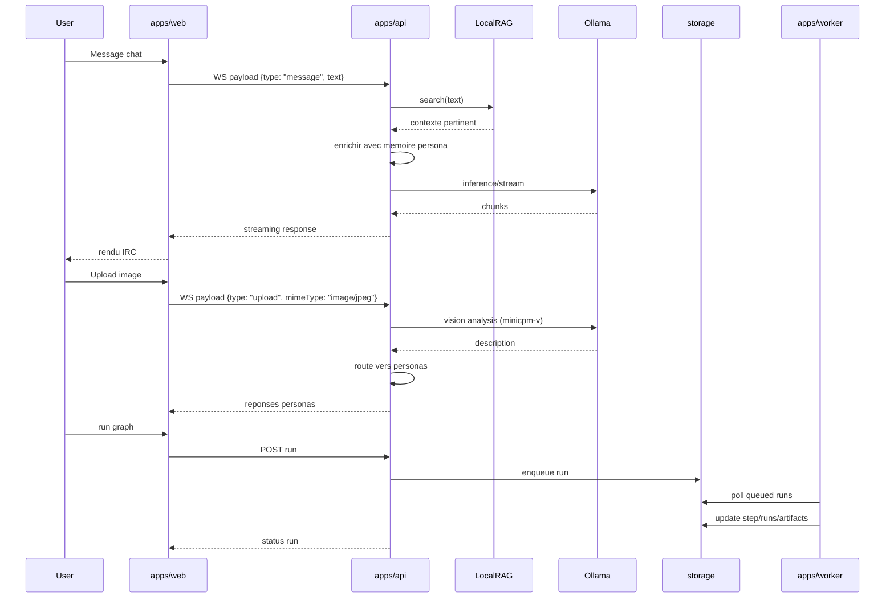

# KXKM_Clown — Specification operationnelle

> "Cypherpunks write code." -- Eric Hughes, 1993
>
> Specification du systeme de chat IA multimodal local.
> V2 est l'architecture primaire. V1 reste en reference comportementale.

## 1. Portee

Ce document decrit:

- le protocole WebSocket chat (tous les types de messages)
- l'etat reel verifie de la V1 et V2
- les configurations RAG, TTS, STT, vision, web search
- les invariants de migration V1 → V2

## 2. V1 (reference comportementale)

- Chat WebSocket multi-canaux, streaming LLM
- Session admin cookie HttpOnly
- Personas editoriales + feedback + proposals + reinforce/revert
- Node Engine local (graphes, runs, queue, artifacts)
- Stockage flat-file JSON/JSONL
- Recherche web (DuckDuckGo / API custom)

## 3. V2 (etat reel)

- apps/api: routes session, personas, node-engine, RBAC, RAG, multimodal chat
- apps/web: shell React/Vite, chat live, surfaces personas/node-engine
- apps/worker: execution runs Node Engine via storage V2
- packages: core, auth, chat-domain, persona-domain, node-engine, storage, ui, tui
- Pipeline multimodal: texte, image (vision), audio (STT), PDF, recherche web
- TTS: synthese vocale par persona (piper-tts)
- RAG: embeddings locaux via Ollama, contexte manifeste
- Memoire persona persistante (faits + resume)
- Chat history: logs JSONL, API de consultation
- DPO pipeline: export paires, training, autoresearch, import Ollama

## 4. Contrat storage V2

- API: postgres si DATABASE_URL, sinon fallback memory (dev/demo)
- Worker: postgres obligatoire
- API en production: DATABASE_URL obligatoire (throw au boot)

## 5. Protocole WebSocket Chat

### 5.1 Connexion

- Endpoint: `ws://<host>:<port>/ws`
- Max message size: 16 MB (pour supporter les uploads)
- Rate limit: 15 messages par fenetre de 10 secondes

### 5.2 Messages entrants (client → serveur)

Tous les messages sont des objets JSON avec un champ `type`.

#### `message` — Message texte

```json
{
  "type": "message",
  "text": "Bonjour @Schaeffer, que penses-tu de Xenakis?"
}
```

Le texte est limite a 8192 caracteres. Le message est broadcast a tous les clients du canal, puis route vers les personas selectionnees (mention directe `@Nom` ou selection aleatoire parmi `maxGeneralResponders`).

#### `command` — Commande slash

```json
{
  "type": "command",
  "text": "/web musique concrete Pierre Schaeffer"
}
```

Commandes supportees: `/help`, `/nick <nom>`, `/who`, `/personas`, `/web <query>`.

#### `upload` — Upload de fichier

```json
{
  "type": "upload",
  "filename": "photo.jpg",
  "mimeType": "image/jpeg",
  "data": "<base64-encoded>",
  "size": 245760
}
```

Taille max: 12 MB. Le traitement depend du MIME type:

| MIME type | Pipeline | Detail |
| --- | --- | --- |
| `text/*`, `application/json`, `.csv`, `.jsonl` | Lecture texte | Extraction directe, 12K chars max |
| `image/*` | Vision | Analyse via Ollama (`VISION_MODEL`, default `minicpm-v`) |
| `audio/*` | STT | Transcription via `faster-whisper` (Python script) |
| `application/pdf` | PDF | Extraction texte via `pdf-parse`, nb pages |
| Autre | Metadata | Type et taille seulement |

### 5.3 Messages sortants (serveur → client)

#### `message` — Message texte (utilisateur ou persona)

```json
{
  "type": "message",
  "nick": "Schaeffer",
  "text": "Xenakis a formalise la stochastique musicale...",
  "color": "#4fc3f7"
}
```

#### `system` — Message systeme

```json
{
  "type": "system",
  "text": "Schaeffer est en train d'ecrire..."
}
```

Utilise pour: indicateurs d'ecriture, resultats de recherche web, notifications d'upload, erreurs Ollama.

#### `join` — Connexion d'un utilisateur

```json
{
  "type": "join",
  "nick": "user_42",
  "channel": "#general",
  "text": "user_42 a rejoint #general"
}
```

#### `part` — Deconnexion d'un utilisateur

```json
{
  "type": "part",
  "nick": "user_42",
  "channel": "#general",
  "text": "user_42 a quitte #general"
}
```

#### `userlist` — Liste des utilisateurs du canal

```json
{
  "type": "userlist",
  "users": ["user_42", "Schaeffer", "Batty", "Radigue"]
}
```

Inclut les personas actives. Envoye a la connexion et apres chaque join/part.

#### `persona` — Information de couleur d'une persona

```json
{
  "type": "persona",
  "nick": "Schaeffer",
  "color": "#4fc3f7"
}
```

Envoye a la connexion pour chaque persona active. Permet au client de colorer les messages.

#### `audio` — Audio synthetise (TTS)

```json
{
  "type": "audio",
  "nick": "Schaeffer",
  "data": "<base64-encoded WAV>",
  "mimeType": "audio/wav"
}
```

Envoye uniquement quand `TTS_ENABLED=1`. Broadcast a tout le canal.

## 6. Configuration RAG

Le RAG (Retrieval-Augmented Generation) enrichit les messages utilisateur avec du contexte pertinent extrait de documents indexes.

### RAG — Principe

1. **Indexation** (au boot): les fichiers `data/manifeste.md` et `data/manifeste_references_nouvelles.md` sont decoupes en chunks de ~500 caracteres, puis chaque chunk est transforme en vecteur via Ollama `/api/embed`.
2. **Recherche** (a chaque message): le message utilisateur est lui aussi transforme en vecteur, puis compare par cosine similarity aux chunks indexes.
3. **Injection**: les 2 chunks les plus pertinents (score >= 0.3) sont injectes dans le message avant envoi a la persona.

### RAG — Parametres

| Parametre | Default | Description |
| --- | --- | --- |
| Modele d'embedding | `nomic-embed-text` | Modele Ollama pour les embeddings |
| Chunk size | 500 chars | Taille max d'un chunk de texte |
| Max results | 2 | Nombre max de chunks injectes |
| Min similarity | 0.3 | Seuil minimum de cosine similarity |
| Sources indexees | `manifeste.md`, `manifeste_references_nouvelles.md` | Documents indexes au boot |

### RAG — Impact

Le RAG permet aux personas de repondre avec le vocabulaire et les references du manifeste du projet: musique concrete, cyberfeminisme, crypto-anarchisme, afrofuturisme, demoscene. Le contexte est injecte sous la forme `[Contexte pertinent]\n<chunks>` apres le message utilisateur.

## 7. Configuration TTS (Text-to-Speech)

### TTS — Activation

Variable d'environnement: `TTS_ENABLED=1`

### TTS — Principe

Apres chaque reponse de persona, le texte est synthetise en audio via `piper-tts` (Python). L'audio WAV est encode en base64 et broadcast au canal en tant que message `audio`.

### TTS — Voix par persona

| Persona | Voix Piper | Registre |
| --- | --- | --- |
| Schaeffer | `fr_FR-siwis-medium` | Medium, neutre |
| Batty | `fr_FR-upmc-medium` | Medium, dramatique |
| Radigue | `fr_FR-siwis-low` | Bas, contemplatif |
| Pharmacius | `fr_FR-gilles-low` | Bas, analytique |
| Moorcock | `en_GB-alan-medium` | Medium, anglais |
| Default | `fr_FR-siwis-medium` | Medium, neutre |

### TTS — Limites

- Texte tronque a 1000 caracteres pour la synthese
- Textes de moins de 10 caracteres ignores
- Timeout: 30 secondes par synthese
- Echec non-bloquant (la reponse texte est toujours envoyee)

## 8. Configuration STT (Speech-to-Text)

### STT — Principe

Les fichiers audio uploades via le chat sont transcrits automatiquement via `faster-whisper` (prioritaire) ou `openai-whisper` (fallback).

### STT — Parametres

| Parametre | Default | Description |
| --- | --- | --- |
| `PYTHON_BIN` | `python3` | Executable Python avec faster-whisper installe |
| Modele | `base` | Taille du modele Whisper (tiny/base/small/medium/large) |
| Langue | `fr` | Langue de transcription |
| Device | `cpu` | Appareil d'inference (`cpu`, CTranslate2 int8) |
| Timeout | 120 secondes | Timeout de transcription |

### STT — Pipeline

1. Le fichier audio est ecrit dans `/tmp/kxkm-audio-<timestamp>.<ext>`
2. Le script `scripts/transcribe_audio.py` est execute via `execFile`
3. Le resultat JSON est parse: `{status, transcript, language, model, duration}`
4. La transcription est injectee dans le chat: `[Audio: fichier]\nTranscription: ...`
5. Le message est route vers les personas pour commentaire
6. Le fichier temporaire est supprime

## 9. Configuration Vision

### Vision — Principe

Les images uploadees sont analysees via un modele Ollama compatible vision.

### Vision — Parametres

| Parametre | Default | Description |
| --- | --- | --- |
| `VISION_MODEL` | `minicpm-v` | Modele Ollama avec capacite vision |
| Timeout | 5 minutes | Timeout d'analyse |
| Prompt | Fixe | "Analyse cette image en detail. Decris ce que tu vois..." (francais) |

### Vision — Pipeline

1. L'image est encodee en base64
2. Envoi a Ollama `/api/chat` avec le champ `images: [base64]`
3. Le modele produit une description textuelle
4. Le resultat est injecte: `[Image: fichier]\n<description>`
5. Le message est route vers les personas

## 10. Integration recherche web

### Web — Commande

`/web <query>` dans le chat.

### Web — Backends

1. **API custom** (si `WEB_SEARCH_API_BASE` est defini): requete GET avec `?q=<query>`, attend un JSON `{results: [{title, snippet, url}]}`
2. **DuckDuckGo Lite** (fallback par defaut): scraping HTML de `lite.duckduckgo.com`, extraction des liens et snippets

### Web — Flux

1. L'utilisateur tape `/web musique concrete`
2. Message systeme: "Recherche: musique concrete..."
3. Les 5 premiers resultats sont affiches dans le canal
4. Les resultats sont routes vers les personas pour commentaire contextualise

### Web — Parametres

| Parametre | Default | Description |
| --- | --- | --- |
| `WEB_SEARCH_API_BASE` | (vide) | URL base de l'API de recherche |
| User-Agent | `KXKM_Clown/2.0` | User-Agent pour les requetes |
| Timeout | 10 secondes | Timeout de recherche |
| Max resultats | 5 | Nombre max de resultats affiches |

## 11. Memoire persona

### Memoire — Principe

Chaque persona accumule des faits et un resume sur ses interactions. La memoire est persistee sur disque dans `data/persona-memory/<nick>.json`.

### Memoire — Structure

```json
{
  "nick": "Schaeffer",
  "facts": ["L'utilisateur s'interesse a la musique concrete", "Il travaille sur un projet Arduino"],
  "summary": "Discussion autour de la synthesis sonore et de l'electroacoustique",
  "lastUpdated": "2026-03-15T14:22:00.000Z"
}
```

### Memoire — Mise a jour

- Toutes les 5 interactions, la persona recoit ses 10 derniers echanges et genere un JSON de faits + resume via Ollama
- Les faits sont dedupliques et limites a 20 max
- La memoire est injectee dans le systemPrompt sous forme de bloc `[Memoire]`

## 12. Flux principal (mermaid)



## 13. Commandes slash

| Commande | Description | Admin |
|----------|-------------|-------|
| `/help` | Aide | non |
| `/nick <nom>` | Changer pseudo (2-24 chars) | non |
| `/who` | Liste des connectes + personas | non |
| `/personas` | Liste personas actives (nick, modele, prompt) | non |
| `/web <query>` | Recherche web + commentaire personas | non |
| `/clear` | Effacer le chat | non |
| `/status` | Statut systeme | non |
| `/model` | Changer modele | oui |
| `/persona` | Gerer personas | oui |
| `/reload` | Recharger config | oui |
| `/export` | Exporter donnees | oui |

## 14. Garde-fous

- Pas de perte identite visuelle/tonale du projet (IRC, terminal, manifeste)
- Pas de melange runtime editorial et exports training
- Pas d'ouverture internet par defaut
- Toute mutation admin doit etre auditable
- Rate limiting: 15 messages par 10 secondes
- Upload max: 12 MB par fichier
- Texte max: 8192 caracteres par message
