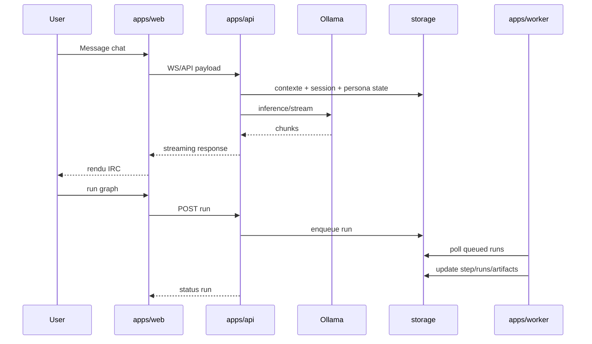

# KXKM_Clown - Specification operationnelle (V1 verifiee, V2 active)

## 1. Portee

Ce document decrit:
- l etat reel verifie de la V1
- l etat reel verifie de la V2
- les invariants de migration V1 -> V2

## 2. V1 (reference comportementale)

- Chat WebSocket multi-canaux, streaming LLM
- Session admin cookie HttpOnly
- Personas editoriales + feedback + proposals + reinforce/revert
- Node Engine local (graphes, runs, queue, artifacts)
- Stockage flat-file JSON/JSONL

## 3. V2 (etat reel)

- apps/api: routes session, personas, node-engine, RBAC
- apps/web: shell React/Vite, chat live, surfaces personas/node-engine
- apps/worker: execution runs Node Engine via storage V2
- packages: core, auth, chat-domain, persona-domain, node-engine, storage, ui, tui

## 4. Contrat storage V2

- API: postgres si DATABASE_URL, sinon fallback memory (dev/demo)
- Worker: postgres obligatoire
- API en production: DATABASE_URL obligatoire

## 5. Flux principal (mermaid)

## 6. Garde-fous

- Pas de perte identite visuelle/tonale du projet
- Pas de melange runtime editorial et exports training
- Pas d ouverture internet par defaut
- Toute mutation admin doit etre auditable
