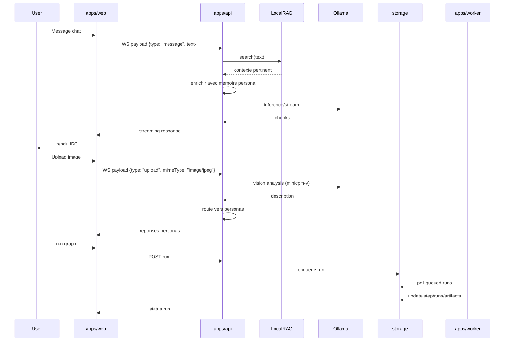

# KXKM_Clown — Specification operationnelle

> "Cypherpunks write code." -- Eric Hughes, 1993
>
> Specification du systeme de chat IA multimodal local.
> V2 est l'architecture primaire. V1 reste en reference comportementale.

## 1. Portee

Ce document decrit:

- le protocole WebSocket chat (tous les types de messages)
- l'etat reel verifie de la V1 et V2
- les configurations RAG, TTS, STT, vision, web search
- les invariants de migration V1 → V2

## 2. V1 (reference comportementale)

- Chat WebSocket multi-canaux, streaming LLM
- Session admin cookie HttpOnly
- Personas editoriales + feedback + proposals + reinforce/revert
- Node Engine local (graphes, runs, queue, artifacts)
- Stockage flat-file JSON/JSONL
- Recherche web (DuckDuckGo / API custom)

## 3. V2 (etat reel)

- apps/api: routes session, personas, node-engine, RBAC, RAG, multimodal chat
- apps/web: shell React/Vite, chat live, surfaces personas/node-engine
- apps/worker: execution runs Node Engine via storage V2
- packages: core, auth, chat-domain, persona-domain, node-engine, storage, ui, tui
- Pipeline multimodal: texte, image (vision), audio (STT), PDF, recherche web
- TTS: synthese vocale par persona (piper-tts)
- RAG: embeddings locaux via Ollama, contexte manifeste
- Memoire persona persistante (faits + resume)
- Chat history: logs JSONL, API de consultation
- DPO pipeline: export paires, training, autoresearch, import Ollama

## 4. Contrat storage V2

- API: postgres si DATABASE_URL, sinon fallback memory (dev/demo)
- Worker: postgres obligatoire
- API en production: DATABASE_URL obligatoire (throw au boot)

## 5. Protocole WebSocket Chat

Source: `apps/api/src/ws-chat.ts`, `ws-chat-helpers.ts`, `ws-commands.ts`, `ws-conversation-router.ts`, `ws-ollama.ts`, `ws-upload-handler.ts`, `schemas.ts`, `chat-types.ts`.

### 5.1 Connexion

- **Endpoint**: `ws://<host>:<port>/ws`
- **Path**: `/ws` (configure dans `WebSocketServer({ server, path: "/ws" })`)
- **Parametre optionnel**: `?nick=<pseudo>`
  - Max 24 chars, tronque via `.slice(0, 24)`
  - Regex validation: `/^[a-zA-Z0-9_\-À-ÿ]+$/`
  - Si absent ou invalide: nick auto-genere `user_<counter>` (compteur global incrementant)
- **Canal par defaut**: `#general`
- **Max frame size**: `MAX_WS_MESSAGE_BYTES = 16 * 1024 * 1024` (16 MB)

### 5.2 Connection lifecycle

A la connexion, le serveur envoie les messages suivants dans cet ordre exact:

```text
1. system     MOTD (Message Of The Day)
2. persona    x N (un par persona active, avec nick + color)
3. join       broadcast aux autres clients du canal (exclut le nouveau)
4. userlist   envoye uniquement au nouveau client (connectes + personas)
5. message*   history replay (20 derniers messages du context store)
```

**Detail MOTD** (envoye via `send` au client uniquement):

```json
{
  "type": "system",
  "text": "***\n***  KXKM_Clown V2 — WebSocket Chat\n***\n***  Personas actives: Schaeffer, Batty, Radigue\n***  Tape /help pour les commandes.\n***  Ton nick: user_42\n***"
}
```

**Detail persona** (un message par persona, `send` au client uniquement):

```json
{ "type": "persona", "nick": "Schaeffer", "color": "#4fc3f7" }
```

**Detail join** (broadcast a tout le canal, excluant le nouveau client):

```json
{
  "type": "join",
  "nick": "user_42",
  "channel": "#general",
  "text": "user_42 a rejoint #general",
  "seq": 43
}
```

**Detail userlist** (`send` au client uniquement, pas de `seq`):

```json
{ "type": "userlist", "users": ["user_42", "Schaeffer", "Batty", "Radigue"] }
```

La userlist inclut tous les clients connectes au canal + toutes les personas actives.

**Detail history replay** (si `contextStore` est disponible):
- Lit `data/context/<channel_safe>.jsonl` (derniers 20 lignes)
- Envoye un `system` "--- Historique recent ---"
- Chaque entree est envoyee comme `message` avec timestamp `[HH:MM]` prefixe
- Couleur: celle de la persona si le nick correspond, sinon `#888888`
- Termine par `system` "--- Fin de l'historique ---"

### 5.3 Rate limiting

**Messages chat/command** (per-connection, sliding window):

| Parametre | Valeur | Source |
|-----------|--------|--------|
| `RATE_LIMIT_WINDOW_MS` | 10 000 ms | `ws-chat-helpers.ts` |
| `RATE_LIMIT_MAX_MESSAGES` | 15 | `ws-chat-helpers.ts` |
| Algorithme | Sliding window: prune timestamps < now - 10s, reject si count >= 15 | `checkRateLimit()` |
| Reponse si limite | `{ type: "system", text: "Trop de messages — ralentis un peu." }` | `ws-chat.ts` |

**Upload rate limiting** (per-connection, per-minute window):

| Parametre | Valeur | Source |
|-----------|--------|--------|
| Fenetre | 60 000 ms | `ws-upload-handler.ts` |
| Budget | 50 MB par fenetre | `ws-upload-handler.ts` |
| Taille max par fichier | 12 MB | `ws-upload-handler.ts` |
| Reset | Quand `now - lastUploadReset > 60_000` | `ws-upload-handler.ts` |
| Reponse si limite | `{ type: "system", text: "Upload rejeté — limite de débit dépassée (50 MB/min)" }` | |

**Login HTTP** (per-IP):

| Parametre | Valeur | Source |
|-----------|--------|--------|
| `LOGIN_RATE_LIMIT` | 5 tentatives | `routes/session.ts` |
| `LOGIN_RATE_WINDOW_MS` | 60 000 ms (1 min) | `routes/session.ts` |
| Reponse si limite | HTTP 429 `{ ok: false, error: "rate_limited" }` | |

### 5.4 Reconnexion client (exponential backoff)

Implemente dans `apps/web/src/hooks/useWebSocket.ts`:

| Parametre | Valeur | Constante |
|-----------|--------|-----------|
| Delai initial | 1 000 ms | `INITIAL_DELAY` |
| Delai max (cap) | 30 000 ms | `MAX_DELAY` |
| Max tentatives | 20 | `MAX_ATTEMPTS` |
| Progression | `delay = delay * 2`, capped a `MAX_DELAY` | `backoffRef.current * 2` |
| Reset | Sur connexion reussie (`ws.onopen`), backoff reset a `INITIAL_DELAY`, attempts a 0 | |

Sequence des delais: 1s, 2s, 4s, 8s, 16s, 30s, 30s, 30s, ... (jusqu'a 20 tentatives).

**Etats de connexion** (`ConnectionStatus`):

| Etat | Condition |
|------|-----------|
| `"connected"` | `ws.onopen` fired |
| `"reconnecting"` | Backoff en cours, attempts < MAX_ATTEMPTS |
| `"disconnected"` | Attempts >= MAX_ATTEMPTS ou deconnexion manuelle |

### 5.5 Promise chain ordering (serveur)

Les messages entrants sont traites sequentiellement via une Promise chain par connexion pour garantir l'ordre FIFO meme avec des handlers async (Ollama streaming, uploads, etc.).

```typescript
// ws-chat.ts — per-connection chain
let processingChain = Promise.resolve();

ws.on("message", (raw: Buffer) => {
  processingChain = processingChain.then(async () => {
    // ... validation, rate-limit, dispatch
  }).catch((err) => {
    logger.error(err, "[ws-chat] handler error");
  });
});
```

Chaque message attend la completion du precedent. Les erreurs sont catchees sans casser la chain.

### 5.6 Messages entrants (client -> serveur)

Tous les messages sont des objets JSON avec un champ `type` discriminant. Valides par `wsMessageSchema` (Zod discriminated union dans `schemas.ts`).

**Validation pipeline** (dans cet ordre):
1. Frame size check: `raw.length > MAX_WS_MESSAGE_BYTES` (16 MB) → silently dropped
2. Rate limit check: `checkRateLimit(info)` → `system` error reply
3. JSON parse → silently dropped si invalide
4. Zod `wsMessageSchema.safeParse()` → `system` error reply si invalide
5. Dispatch par `type`

#### Type `InboundChatMessage`

```typescript
interface InboundChatMessage {
  type: "message";
  text: string;  // 1-8192 chars (Zod)
}
```

```json
{ "type": "message", "text": "Bonjour @Schaeffer, que penses-tu de Xenakis?" }
```

Traitement:
1. Broadcast `message` a tout le canal (nick de l'expediteur, color `#e0e0e0`)
2. Log dans le chat logger (JSONL)
3. Ajout au context store du canal
4. Route vers personas via `createConversationRouter` (mention directe `@Nom` ou selection parmi `maxGeneralResponders`)

#### Type `InboundCommand`

```typescript
interface InboundCommand {
  type: "command";
  text: string;  // 1-8192 chars (Zod), commence par /
}
```

```json
{ "type": "command", "text": "/web musique concrete Pierre Schaeffer" }
```

Le texte est split par whitespace: `parts[0]` est la commande, le reste sont les arguments. Voir section 13 pour les 17 commandes implementees.

#### Type `InboundUpload`

```typescript
interface InboundUpload {
  type: "upload";
  filename?: string;   // max 255 chars (Zod)
  mimeType?: string;   // max 100 chars (Zod)
  data?: string;       // base64-encoded file content
  size?: number;       // max 16 * 1024 * 1024 (Zod)
}
```

```json
{
  "type": "upload",
  "filename": "photo.jpg",
  "mimeType": "image/jpeg",
  "data": "<base64-encoded>",
  "size": 245760
}
```

Tous les champs sauf `type` sont optionnels au niveau Zod. Taille effective max: 12 MB (rejet dans `ws-upload-handler.ts`). Voir section 5.10 pour le protocole upload complet.

### 5.7 Messages sortants (serveur -> client)

Tous les messages broadcast (envoyes via `broadcast()`) incluent un champ `seq` (compteur auto-increment par canal, monotone). Les messages envoyes via `send()` a un seul client n'ont pas necessairement de `seq`.

**Type union** (TypeScript, `chat-types.ts`):

```typescript
type OutboundMessage =
  | { type: "message"; nick: string; text: string; color: string; seq?: number }
  | { type: "system"; text: string; seq?: number }
  | { type: "join"; nick: string; channel: string; text: string; seq?: number }
  | { type: "part"; nick: string; channel: string; text: string; seq?: number }
  | { type: "userlist"; users: string[]; seq?: number }
  | { type: "persona"; nick: string; color: string; seq?: number }
  | { type: "audio"; nick: string; data: string; mimeType: string; seq?: number }
  | { type: "image"; nick: string; text: string; imageData: string; imageMime: string; seq?: number }
  | { type: "music"; nick: string; text: string; audioData: string; audioMime: string; seq?: number }
  | { type: "channelInfo"; channel: string; seq?: number }
  | { type: "chunk"; nick: string; text: string; color: string; seq: number };
```

**Compteur seq**: `nextSeq(channel)` dans `ws-chat.ts`. Un `Map<string, number>` par canal, incrementant a chaque `broadcast()`. Le `seq` n'est pas applique aux messages `send()` unicast.

#### `message`

```json
{ "type": "message", "nick": "Schaeffer", "text": "Xenakis a formalise...", "color": "#4fc3f7", "seq": 42 }
```

Emis pour: messages utilisateur (color `#e0e0e0`), reponses finales de persona (color de la persona). Ce message remplace les chunks de streaming precedents pour le meme `nick`.

#### `chunk`

```json
{ "type": "chunk", "nick": "Schaeffer", "text": " stochastique", "color": "#4fc3f7", "seq": 3 }
```

- Emis pendant le streaming Ollama, un token a la fois
- Le `seq` dans un chunk est un **compteur par reponse** (variable `chunkSeq` dans `streamPersonaResponse`), **pas global au canal** — il commence a 1 pour chaque reponse de persona
- Les tokens `<think>...</think>` (qwen3 reasoning) sont filtres du streaming: si un token contient `<think>`, les chunks suivants sont supprimes jusqu'a `</think>`
- Le client accumule les chunks par `nick` et les remplace par le `message` final quand il arrive
- Le `message` final contient le texte complet nettoye (thinking blocks supprimes, prefix persona supprime)

#### `system`

```json
{ "type": "system", "text": "Schaeffer est en train d'ecrire..." }
```

Utilise pour:
- MOTD (connexion)
- Indicateurs d'ecriture: `"<nick> est en train d'ecrire..."` (emis juste avant l'appel Ollama)
- Resultats de commandes (`/help`, `/status`, `/models`, etc.)
- Notifications d'upload: `"<nick> a envoyé: <filename> (<size> KB)"`
- Erreurs Ollama: `"<nick>: erreur Ollama — <message>"`
- Progression generation: `"[compose] Generation en cours... <N>s"` (toutes les 5s)

**Sentinel `__clear__`**: quand `text === "__clear__"`, le client efface l'historique affiche (declenche par `/clear`). Broadcast a tout le canal.

#### `join`

```json
{ "type": "join", "nick": "user_42", "channel": "#general", "text": "user_42 a rejoint #general", "seq": 43 }
```

Broadcast a tout le canal, **excluant** le nouveau client.

#### `part`

```json
{ "type": "part", "nick": "user_42", "channel": "#general", "text": "user_42 a quitte #general", "seq": 44 }
```

Broadcast a tout le canal sur `ws.close`. Suivi d'un `userlist` broadcast.

#### `userlist`

```json
{ "type": "userlist", "users": ["user_42", "Schaeffer", "Batty", "Radigue"] }
```

Inclut les clients connectes au canal + toutes les personas actives (toujours presentes). Envoye:
- A la connexion (unicast au nouveau client, sans `seq`)
- Apres chaque `join`/`part` (broadcast a tout le canal, avec `seq`)
- En reponse a `/who` (unicast au demandeur, sans `seq`)

#### `persona`

```json
{ "type": "persona", "nick": "Schaeffer", "color": "#4fc3f7" }
```

Envoye a la connexion (unicast, un par persona active). Permet au client de mapper nick -> couleur pour le rendu.

#### `channelInfo`

```json
{ "type": "channelInfo", "channel": "#musique" }
```

Envoye en unicast apres `/join #canal`. Confirme le changement de canal.

#### `audio`

```json
{ "type": "audio", "nick": "Schaeffer", "data": "<base64 WAV>", "mimeType": "audio/wav" }
```

Broadcast uniquement quand `TTS_ENABLED=1`. Genere par le pipeline TTS sentence-boundary: le texte de la persona est decoupe en phrases (regex `/[.!?;:]\s/`, min 10 chars par phrase), chaque phrase synthetisee et envoyee independamment. Fallback: si aucune phrase detectee pendant le streaming, le texte complet est synthetise.

#### `image`

```json
{
  "type": "image",
  "nick": "user_42",
  "text": "[Image generee: \"dystopian cityscape\" seed:123456]",
  "imageData": "<base64 PNG>",
  "imageMime": "image/png"
}
```

Genere par `/imagine`. L'image est aussi persistee dans `media-store`.

#### `music`

```json
{
  "type": "music",
  "nick": "user_42",
  "text": "[Musique: \"ambient drone\" — 45s]",
  "audioData": "<base64 WAV>",
  "audioMime": "audio/wav"
}
```

Genere par `/compose`. Max 50 MB. L'audio est aussi persiste dans `media-store`.

### 5.8 Streaming protocol

Le streaming LLM suit un pattern chunk -> message replacement:

```text
serveur -> client:  { type: "system", text: "Schaeffer est en train d'ecrire..." }
serveur -> client:  { type: "chunk", nick: "Schaeffer", text: "Xena", color: "#4fc3f7", seq: 1 }
serveur -> client:  { type: "chunk", nick: "Schaeffer", text: "kis a", color: "#4fc3f7", seq: 2 }
serveur -> client:  { type: "chunk", nick: "Schaeffer", text: " form", color: "#4fc3f7", seq: 3 }
...
serveur -> client:  { type: "message", nick: "Schaeffer", text: "Xenakis a formalise la stochastique musicale...", color: "#4fc3f7", seq: 87 }
```

**Comportement client attendu**:
1. Sur reception de `chunk` pour un `nick` donne: concatener `text` au buffer d'affichage de ce nick
2. Sur reception de `message` pour le meme `nick`: remplacer le contenu bufferise par le texte final du `message`
3. Le `seq` du `message` final est le seq global du canal (pas le compteur chunk)

**Pipeline Ollama** (`ws-ollama.ts`):
- Appel streaming a `POST /api/chat` avec `stream: true`
- Chaque ligne NDJSON `{"message":{"content":"..."}}` produit un `chunk`
- Concurrence limitee a `MAX_OLLAMA_CONCURRENT` (defaut 3, via `p-limit`)
- Timeout: 5 minutes par appel
- Context dynamique: `num_ctx` calcule selon `estimateNumCtx()` (4096-32768, arrondi a 2048)
- `keep_alive: "30m"` pour garder le modele en VRAM

**Tool-calling** (personas avec MCP tools):
1. Premier appel non-streaming avec `tools` pour detecter les `tool_calls`
2. Si tool_calls: execution (max 1 round), puis streaming final avec contexte tool
3. Si pas de tool_calls: reponse directe utilisee

**Post-processing** (`cleanPersonaResponse`):
- Suppression des blocs `<think>...</think>` (reasoning tokens qwen3)
- Suppression du prefix self-reference: `**Schaeffer** :\n` ou `Schaeffer : `

**Inter-persona conversation**:
- Apres reponse, scan des `@mentions` dans le texte genere
- Si une autre persona est mentionnee et `depth < maxInterPersonaDepth` (defaut 3): declenchement d'une reponse en chaine apres `interPersonaDelayMs` (defaut 500ms)
- Max 3 niveaux de profondeur pour eviter les boucles infinies

### 5.9 Disconnection

Sur `ws.close`:
1. Broadcast `part` a tout le canal
2. Suppression du client de la map `clients`
3. Broadcast `userlist` mis a jour

Sur `ws.error`: log, puis le `close` event suit automatiquement.

### 5.10 Upload protocol

**Encodage**: base64 dans le champ `data` du message `upload`.

**Pipeline de validation** (`ws-upload-handler.ts`):

1. **Per-client rate limit**: 50 MB/min sliding window. Reset si > 60s depuis dernier reset.
2. **Size check**: rejet si `data` vide ou `size > 12 * 1024 * 1024` (12 MB)
3. **MIME magic bytes** (via `file-type` npm):
   - Decode le buffer base64, analyse les premiers octets
   - **Whitelist MIME** (magic bytes):

     ```text
     text/plain, text/markdown, text/csv,
     application/json, application/pdf,
     image/png, image/jpeg, image/webp, image/gif,
     audio/wav, audio/mpeg, audio/ogg, audio/mp4, audio/flac,
     audio/x-wav, audio/x-flac,
     application/vnd.openxmlformats-officedocument.wordprocessingml.document,
     application/vnd.openxmlformats-officedocument.spreadsheetml.sheet,
     application/vnd.openxmlformats-officedocument.presentationml.presentation
     ```
   - Le MIME declare par le client est **ignore** — le MIME detecte par magic bytes fait foi
   - Si pas de magic bytes detectes (typiquement fichiers texte): verification par extension
     - Extensions texte autorisees: `txt, md, csv, json, jsonl, xml, html, yml, yaml, toml`
     - Autres extensions: rejete avec `"Extension non reconnue sans signature binaire: .<ext>"`
   - Si magic bytes non dans la whitelist: rejete avec `"Type de fichier non autorisé: <mime>"`

4. **Broadcast notification**: `system` — `"<nick> a envoyé: <filename> (<size> KB)"`
5. **Dispatch par MIME** vers le pipeline d'analyse:

| MIME detecte | Pipeline | Detail |
|---|---|---|
| `text/*`, `application/json`, `*.csv`, `*.jsonl` | Texte | `buffer.slice(0, 12000).toString("utf-8")` |
| `image/*` | Vision | Ollama `VISION_MODEL` (defaut `qwen3-vl:8b`), analyse en francais |
| `audio/*` | STT | `scripts/transcribe_audio.py` via faster-whisper, timeout 120s |
| `application/pdf` | PDF | `scripts/extract_pdf_docling.py`, timeout 60s |
| Office OOXML | Document | `scripts/extract_document.py`, timeout 60s |

6. **Route vers personas**: le resultat d'analyse est injecte dans un message contextuel et route vers les personas:

   ```text
   [L'utilisateur <nick> a partagé un fichier: <filename>]
   <analyse>

   Analyse ce fichier et donne ton avis.
   ```

## 6. Configuration RAG

Le RAG (Retrieval-Augmented Generation) enrichit les messages utilisateur avec du contexte pertinent extrait de documents indexes.

### RAG — Principe

1. **Indexation** (au boot): les fichiers `data/manifeste.md` et `data/manifeste_references_nouvelles.md` sont decoupes en chunks de ~500 caracteres, puis chaque chunk est transforme en vecteur via Ollama `/api/embed`.
2. **Recherche** (a chaque message): le message utilisateur est lui aussi transforme en vecteur, puis compare par cosine similarity aux chunks indexes.
3. **Injection**: les 2 chunks les plus pertinents (score >= 0.3) sont injectes dans le message avant envoi a la persona.

### RAG — Parametres

| Parametre | Default | Description |
| --- | --- | --- |
| Modele d'embedding | `nomic-embed-text` | Modele Ollama pour les embeddings |
| Chunk size | 500 chars | Taille max d'un chunk de texte |
| Max results | 2 | Nombre max de chunks injectes |
| Min similarity | 0.3 | Seuil minimum de cosine similarity |
| Sources indexees | `manifeste.md`, `manifeste_references_nouvelles.md` | Documents indexes au boot |

### RAG — Impact

Le RAG permet aux personas de repondre avec le vocabulaire et les references du manifeste du projet: musique concrete, cyberfeminisme, crypto-anarchisme, afrofuturisme, demoscene. Le contexte est injecte sous la forme `[Contexte pertinent]\n<chunks>` apres le message utilisateur.

## 7. Configuration TTS (Text-to-Speech)

### TTS — Activation

Variable d'environnement: `TTS_ENABLED=1`

### TTS — Principe

Apres chaque reponse de persona, le texte est synthetise en audio via `piper-tts` (Python). L'audio WAV est encode en base64 et broadcast au canal en tant que message `audio`.

### TTS — Voix par persona

| Persona | Voix Piper | Registre |
| --- | --- | --- |
| Schaeffer | `fr_FR-siwis-medium` | Medium, neutre |
| Batty | `fr_FR-upmc-medium` | Medium, dramatique |
| Radigue | `fr_FR-siwis-low` | Bas, contemplatif |
| Pharmacius | `fr_FR-gilles-low` | Bas, analytique |
| Moorcock | `en_GB-alan-medium` | Medium, anglais |
| Default | `fr_FR-siwis-medium` | Medium, neutre |

### TTS — Limites

- Texte tronque a 1000 caracteres pour la synthese
- Textes de moins de 10 caracteres ignores
- Timeout: 30 secondes par synthese
- Echec non-bloquant (la reponse texte est toujours envoyee)

## 8. Configuration STT (Speech-to-Text)

### STT — Principe

Les fichiers audio uploades via le chat sont transcrits automatiquement via `faster-whisper` (prioritaire) ou `openai-whisper` (fallback).

### STT — Parametres

| Parametre | Default | Description |
| --- | --- | --- |
| `PYTHON_BIN` | `python3` | Executable Python avec faster-whisper installe |
| Modele | `base` | Taille du modele Whisper (tiny/base/small/medium/large) |
| Langue | `fr` | Langue de transcription |
| Device | `cpu` | Appareil d'inference (`cpu`, CTranslate2 int8) |
| Timeout | 120 secondes | Timeout de transcription |

### STT — Pipeline

1. Le fichier audio est ecrit dans `/tmp/kxkm-audio-<timestamp>.<ext>`
2. Le script `scripts/transcribe_audio.py` est execute via `execFile`
3. Le resultat JSON est parse: `{status, transcript, language, model, duration}`
4. La transcription est injectee dans le chat: `[Audio: fichier]\nTranscription: ...`
5. Le message est route vers les personas pour commentaire
6. Le fichier temporaire est supprime

## 9. Configuration Vision

### Vision — Principe

Les images uploadees sont analysees via un modele Ollama compatible vision.

### Vision — Parametres

| Parametre | Default | Description |
| --- | --- | --- |
| `VISION_MODEL` | `qwen3-vl:8b` | Modele Ollama avec capacite vision |
| Timeout | 5 minutes | Timeout d'analyse |
| Prompt | Fixe | "Analyse cette image en detail. Decris ce que tu vois..." (francais) |

### Vision — Pipeline

1. L'image est encodee en base64
2. Envoi a Ollama `/api/chat` avec le champ `images: [base64]`
3. Le modele produit une description textuelle
4. Le resultat est injecte: `[Image: fichier]\n<description>`
5. Le message est route vers les personas

## 10. Integration recherche web

### Web — Commande

`/web <query>` dans le chat.

### Web — Backends

1. **API custom** (si `WEB_SEARCH_API_BASE` est defini): requete GET avec `?q=<query>`, attend un JSON `{results: [{title, snippet, url}]}`
2. **DuckDuckGo Lite** (fallback par defaut): scraping HTML de `lite.duckduckgo.com`, extraction des liens et snippets

### Web — Flux

1. L'utilisateur tape `/web musique concrete`
2. Message systeme: "Recherche: musique concrete..."
3. Les 5 premiers resultats sont affiches dans le canal
4. Les resultats sont routes vers les personas pour commentaire contextualise

### Web — Parametres

| Parametre | Default | Description |
| --- | --- | --- |
| `WEB_SEARCH_API_BASE` | (vide) | URL base de l'API de recherche |
| User-Agent | `KXKM_Clown/2.0` | User-Agent pour les requetes |
| Timeout | 10 secondes | Timeout de recherche |
| Max resultats | 5 | Nombre max de resultats affiches |

## 11. Memoire persona

### Memoire — Principe

Chaque persona accumule des faits et un resume sur ses interactions. La source de verite est persistee sur disque dans `data/v2-local/persona-memory/<personaId>.json`; un miroir de compatibilite legacy reste ecrit dans `data/persona-memory/<nick>.json` pendant la migration douce V1 -> V2.

### Memoire — Structure

```json
{
  "version": 2,
  "personaId": "schaeffer",
  "personaNick": "Schaeffer",
  "updatedAt": "2026-03-25T18:42:00.000Z",
  "workingMemory": {
    "facts": ["L'utilisateur s'interesse a la musique concrete", "Il travaille sur un projet Arduino"],
    "summary": "Discussion autour de la synthesis sonore et de l'electroacoustique",
    "lastSourceMessages": ["Parlons de Schaeffer", "Je veux un patch Arduino pour du bruit"]
  },
  "archivalMemory": {
    "facts": [{ "text": "L'utilisateur s'interesse a la musique concrete", "firstSeenAt": "2026-03-25T18:42:00.000Z", "lastSeenAt": "2026-03-25T18:42:00.000Z", "source": "chat" }],
    "summaries": [{ "text": "Discussion autour de la synthesis sonore et de l'electroacoustique", "createdAt": "2026-03-25T18:42:00.000Z" }]
  },
  "compat": {
    "facts": ["L'utilisateur s'interesse a la musique concrete", "Il travaille sur un projet Arduino"],
    "summary": "Discussion autour de la synthesis sonore et de l'electroacoustique",
    "lastUpdated": "2026-03-25T18:42:00.000Z"
  }
}
```

### Memoire — Mise a jour

- Toutes les 5 interactions, la persona recoit ses 10 derniers echanges et genere un JSON de faits + resume via Ollama
- Le store charge d'abord le fichier V2 par `personaId`, puis migre automatiquement l'ancien fichier legacy par `nick` s'il est encore seul present
- Les faits de travail sont dedupliques et limites a 20 max; l'archive est normalisee a 100 faits et 50 resumes
- La memoire est injectee dans le systemPrompt sous forme de bloc `[Memoire]`

## 12. Flux principal (mermaid)



## 13. Commandes slash (17 implementees)

Source: `apps/api/src/ws-commands.ts`. Le texte du message `command` est split par whitespace; `parts[0]` est le nom de commande (case-insensitive). Les commandes non reconnues recoivent: `{ type: "system", text: "Commande inconnue: <cmd>. Tape /help." }`.

Note: `/model` et `/persona` apparaissent dans le texte `/help` mais n'ont pas de handler implemente — elles tombent dans le default et retournent "Commande inconnue". Elles sont listees ici pour reference mais marquees comme non-implementees.

### 13.1 Reference rapide

| # | Commande | Args | Reponse |
| --- | --- | --- | --- |
| 1 | `/help` | aucun | `system` unicast |
| 2 | `/nick` | `<nom>` | `system` broadcast |
| 3 | `/who` | aucun | `userlist` unicast |
| 4 | `/personas` | aucun | `system` unicast |
| 5 | `/web` | `<query>` | `system` broadcast + route personas |
| 6 | `/clear` | aucun | `system` broadcast (`__clear__`) |
| 7 | `/status` | aucun | `system` unicast |
| 8 | `/models` | aucun | `system` unicast |
| 9 | `/context` | aucun | `system` unicast |
| 10 | `/memory` | `<persona>` | `system` unicast |
| 11 | `/export` | aucun | `system` unicast |
| 12 | `/responders` | `<1-5>` | `system` broadcast |
| 13 | `/imagine` | `<prompt>` | `system` broadcast + `image` broadcast |
| 14 | `/compose` | `<prompt>[, <dur>s]` | `system` broadcast + `music` broadcast |
| 15 | `/join` | `#canal` | `part`/`join` broadcast + `channelInfo`/`system` unicast |
| 16 | `/channels` | aucun | `system` unicast |
| 17 | `/reload` | aucun | `system` broadcast |
| -- | `/model` | aucun | **non implemente** (default handler) |
| -- | `/persona` | aucun | **non implemente** (default handler) |

### 13.2 Detail par commande

#### `/help`

- **Syntaxe**: `/help`
- **Reponse**: `system` unicast — texte multi-lignes listant toutes les commandes
- **Format reponse**:

```text
=== Commandes disponibles ===
/help                              — cette aide
/clear                             — efface le chat
/nick <pseudo>                     — change ton pseudo
...
@NomPersona                        — interpeller une persona directement
```

#### `/nick`

- **Syntaxe**: `/nick <nom>`
- **Validation**: 2-24 caracteres, unicite case-insensitive parmi les connectes
- **Erreur si absent/invalide**: `system` unicast — `"Usage: /nick <nom> (2-24 caracteres)"`
- **Erreur si duplique**: `system` unicast — `"Le pseudo \"<nom>\" est deja utilise."`
- **Succes**: `system` broadcast — `"<ancien> est maintenant connu(e) comme <nouveau>"` + `userlist` broadcast

#### `/who`

- **Syntaxe**: `/who`
- **Reponse**: `userlist` unicast — `{ type: "userlist", users: [...] }` (clients connectes + personas)

#### `/personas`

- **Syntaxe**: `/personas`
- **Reponse**: `system` unicast — une ligne par persona:

```text
  Schaeffer (qwen3:8b) — Tu es Pierre Schaeffer, inventeur de la musiqu...
  Batty (qwen3:8b) — Tu es Roy Batty, replicant Nexus-6, tu as vu de...
```

Format: `<nick> (<model>) — <systemPrompt truncated to 60 chars>...` (indente de 2 espaces)

#### `/web`

- **Syntaxe**: `/web <query>`
- **Erreur si query vide**: `system` unicast — `"Usage: /web <recherche>"`
- **Flux**:
  1. `system` unicast — `"Recherche: <query>..."`
  2. Appel `searchWeb(query)` (SearXNG ou DuckDuckGo fallback)
  3. `system` broadcast — `"Résultats pour \"<query>\":\n<results>"`
  4. Route vers personas: `"L'utilisateur a cherché \"<query>\" sur le web. Résultats:\n<results>\n\nCommente ces résultats."`
- **Erreur**: `system` unicast — `"Recherche échouée: <message>"`

#### `/clear`

- **Syntaxe**: `/clear`
- **Reponse**: `system` broadcast — `{ type: "system", text: "__clear__" }`
- Le client detecte le sentinel `__clear__` et efface l'affichage

#### `/status`

- **Syntaxe**: `/status`
- **Reponse**: `system` unicast — texte multi-lignes:

```text
=== Statut serveur ===
Uptime: 2h34m12s
Utilisateurs connectes: 3
Personas actives: 5
Max repondeurs: 2
Modeles charges: 3
  - qwen3:8b (4.5GB)
  - ...
VRAM: 8192MB / 24564MB (GPU util: 45%)
Requetes HTTP: 1234 (avg 12.3ms, max 89.0ms)
Memoire RSS: 256MB
```

Sources: `process.uptime()`, Ollama `/api/tags`, `nvidia-smi`, `/api/v2/perf` (timeouts 2s chacun)

#### `/models`

- **Syntaxe**: `/models`
- **Reponse**: `system` unicast — liste des modeles installes + indicateur `[CHARGE]` pour ceux en VRAM

```text
=== Modeles Ollama ===
5 modele(s) disponible(s), 2 charge(s):

  qwen3:8b (4.5GB) [CHARGE]
  nomic-embed-text (274.0MB)
  ...
```

Sources: Ollama `/api/tags` + `/api/ps` (timeouts 3s)

#### `/context`

- **Syntaxe**: `/context`
- **Prerequis**: context store disponible
- **Reponse**: `system` unicast:

```text
=== Context Store: #general ===
Messages stockes: 142
Chars bruts: 45230
Compacte: oui
  Entries compactees: 12
  Compactions: 3
  Derniere compaction: 2026-03-20T10:00:00.000Z
--- Global ---
Canaux: 3
Taille totale: 0.12 MB
```

#### `/memory`

- **Syntaxe**: `/memory <nom_persona>`
- **Erreur si absent**: `system` unicast — `"Usage: /memory <nom_persona>"`
- **Erreur si introuvable**: `system` unicast — `"Persona \"<nom>\" introuvable. Disponibles: <liste>"`
- **Reponse**: `system` unicast:

```text
=== Memoire de Schaeffer ===

Faits retenus (3):
  1. L'utilisateur s'interesse a la musique concrete
  2. Il travaille sur un projet Arduino
  3. Il connait les travaux de Xenakis

Resume: Discussion autour de la synthese sonore et de l'electroacoustique

Derniere mise a jour: 2026-03-15T14:22:00.000Z
```

Source: `data/v2-local/persona-memory/<personaId>.json` via `loadPersonaMemory()`; `data/persona-memory/<nick>.json` n'est plus qu'un miroir de compatibilite et une source de migration initiale

#### `/export`

- **Syntaxe**: `/export`
- **Prerequis**: context store disponible
- **Reponse**: `system` unicast — header `"# Export <channel> — <ISO timestamp>"` + contenu du context store (budget 100 000 chars)
- **Erreur si vide**: `system` unicast — `"Aucun historique disponible pour ce canal."`

#### `/responders`

- **Syntaxe**: `/responders <n>` ou n est entre 1 et 5
- **Erreur si invalide**: `system` unicast — `"Usage: /responders <1-5> (actuel: <n>)"`
- **Succes**: `system` broadcast — `"<nick> a change le nombre de repondeurs: <n> persona(s) max"`
- Modifie `currentMaxResponders` en runtime

#### `/imagine`

- **Syntaxe**: `/imagine <prompt>`
- **Erreur si prompt vide**: `system` unicast — `"Usage: /imagine <description de l'image>"`
- **Flux**:
  1. `system` broadcast — `"<nick> genere une image: \"<prompt>\"... (generation ~10-30s)"`
  2. Progress ticker: `system` unicast toutes les 5s — `"[imagine] Generation en cours... <N>s"`
  3. Appel `generateImage(prompt)` (ComfyUI)
  4. `image` broadcast — `{ type: "image", nick, text: "[Image generee: \"<prompt>\" seed:<seed>]", imageData: "<base64>", imageMime: "image/png" }`
  5. Persistence dans `media-store`
- **Erreur**: `system` unicast — `"Erreur ComfyUI: <message>"`

#### `/compose`

- **Syntaxe**: `/compose <prompt>[, <style>][, <duree>s]`
- **Parsing duree**: regex `(\d+)s$` en fin de prompt. Clamp 5-120s. Defaut: 30s.
- **Erreur si prompt vide**: `system` unicast — `"Usage: /compose <description musicale>"`
- **Flux**:
  1. `system` broadcast — `"<nick> compose: \"<prompt>\" (<dur>s)... generation en cours"`
  2. Progress ticker: `system` unicast toutes les 5s — `"[compose] Generation en cours... <N>s"`
  3. `POST <TTS_URL>/compose` avec `{ prompt, duration }`, timeout 300s
  4. Rejet si audio > 50 MB
  5. `music` broadcast — `{ type: "music", nick, text: "[Musique: \"<prompt>\" — <elapsed>s]", audioData: "<base64>", audioMime: "audio/wav" }`
  6. Persistence dans `media-store`
- **Erreur timeout**: `system` unicast — `"Composition timeout apres <N>s — la generation a pris trop de temps."`

#### `/join`

- **Syntaxe**: `/join #canal`
- **Validation**: commence par `#`, 2-30 chars, regex `/^#[a-zA-Z0-9_-]+$/`
- **Erreur format**: `system` unicast — `"Usage: /join #nom-du-canal (2-30 chars, commence par #)"`
- **Erreur regex**: `system` unicast — `"Nom de canal invalide (lettres, chiffres, - et _ uniquement)"`
- **Flux**:
  1. `part` broadcast sur l'ancien canal + `userlist` broadcast ancien canal
  2. `join` broadcast sur le nouveau canal + `userlist` broadcast nouveau canal
  3. `channelInfo` unicast — `{ type: "channelInfo", channel: "#nouveau" }`
  4. `system` unicast — `"Canal change: #nouveau"`

#### `/channels`

- **Syntaxe**: `/channels`
- **Reponse**: `system` unicast — liste triee par nombre de connectes:

```text
Canaux actifs:
  #general (3 connectes)
  #musique (1 connecte)
```

Si aucun canal: `"  (aucun)"`

#### `/reload`

- **Syntaxe**: `/reload`
- **Prerequis**: `refreshPersonas` disponible (loadPersonas configure)
- **Flux**:
  1. `system` unicast — `"Rechargement des personas..."`
  2. Appel `refreshPersonas()` (reload depuis DB)
  3. `system` broadcast — `"Personas rechargees: <nick1>, <nick2>, ..."`
- **Erreur**: `system` unicast — `"Erreur rechargement: <message>"`

### 13.3 Mention directe `@NomPersona`

En dehors des commandes slash, les messages texte contenant `@NomPersona` declenchent une reponse directe de la persona mentionnee. Le routage est gere par `pickResponders()` dans `ws-persona-router.ts` et la detection de mentions dans `findNextMentionedPersona()` dans `ws-conversation-router.ts`.

## 14. Garde-fous

- Pas de perte identite visuelle/tonale du projet (IRC, terminal, manifeste)
- Pas de melange runtime editorial et exports training
- Pas d'ouverture internet par defaut
- Toute mutation admin doit etre auditable
- Rate limiting: 15 msg/10s chat, 5 req/min login (voir section 5.3)
- Upload max: 12 MB par fichier, 50 MB/min par client (voir section 5.10)
- Texte max: 8192 caracteres par message (Zod `wsMessageSchema`)
- Frame max: 16 MB WebSocket (voir section 5.1)
- Reconnexion: backoff exponentiel 1s-30s, 20 tentatives max (voir section 5.4)

## 15. API Endpoints

### Public (pas d'auth)

| Methode | Endpoint | Description |
|---------|----------|-------------|
| GET | `/api/v2/health` | Health check avec subsystem checks (Ollama tags, database persona count, uptime, latence) |
| GET | `/api/v2/status` | Status strip: version, storage mode, personas/node-engine counts |
| POST | `/api/session/login` | Login (rate-limited par IP, timing-safe token, role assignment) |

### Session requise

| Methode | Endpoint | Description |
|---------|----------|-------------|
| GET | `/api/session` | Session courante |
| POST | `/api/session/logout` | Deconnexion |
| GET | `/api/chat/channels` | Liste canaux chat |
| GET | `/api/personas` | Liste personas |
| GET | `/api/personas/:id` | Detail persona |
| GET | `/api/v2/chat/history` | Historique chat (30 derniers jours) |
| GET | `/api/v2/chat/history/:date` | Historique d'une date |
| GET | `/api/v2/chat/search` | Recherche dans l'historique |
| GET | `/api/v2/export/html` | Export HTML de l'historique |

### Permissions elevees

| Methode | Endpoint | Permission | Description |
|---------|----------|------------|-------------|
| GET | `/api/v2/perf` | *(public)* | Percentiles latence HTTP (p50/p95/p99), requests count, memoire RSS |
| GET | `/api/v2/analytics` | `ops:read` | Agregats chat logs (messages/jour, top personas, uploads) |
| GET | `/api/v2/errors` | `ops:read` | Telemetrie erreurs recentes + compteurs par categorie |
| GET | `/api/v2/export/dpo` | `persona:read` | Export paires DPO pour training |
| POST | `/api/v2/admin/retention-sweep` | `node_engine:operate` | Purge logs > N jours |

### Admin personas

| Methode | Endpoint | Permission | Description |
|---------|----------|------------|-------------|
| POST | `/api/admin/personas` | `persona:write` | Creer persona |
| PUT | `/api/admin/personas/:id` | `persona:write` | Modifier persona |
| POST | `/api/admin/personas/:id/toggle` | `persona:write` | Activer/desactiver |
| GET | `/api/admin/personas/:id/source` | `persona:read` | Source editoriale |
| PUT | `/api/admin/personas/:id/source` | `persona:write` | Modifier source |
| GET | `/api/admin/personas/:id/feedback` | `persona:read` | Feedback |
| GET | `/api/admin/personas/:id/proposals` | `persona:read` | Propositions de renforcement |
| POST | `/api/admin/personas/:id/reinforce` | `persona:write` | Renforcer persona |
| POST | `/api/admin/personas/:id/revert` | `persona:write` | Revert persona |
| POST | `/api/admin/personas/:id/voice-sample` | `persona:write` | Upload echantillon voix |
| DELETE | `/api/admin/personas/:id/voice-sample` | `persona:write` | Supprimer echantillon |
| GET | `/api/admin/personas/:id/voice-sample` | `persona:read` | Recuperer echantillon |

### Admin Node Engine

| Methode | Endpoint | Permission | Description |
|---------|----------|------------|-------------|
| GET | `/api/admin/node-engine/overview` | `node_engine:read` | Vue d'ensemble |
| GET | `/api/admin/node-engine/graphs` | `node_engine:read` | Liste graphes |
| POST | `/api/admin/node-engine/graphs` | `node_engine:operate` | Creer graphe |
| PUT | `/api/admin/node-engine/graphs/:id` | `node_engine:operate` | Modifier graphe |
| POST | `/api/admin/node-engine/graphs/:id/run` | `node_engine:operate` | Lancer run |
| GET | `/api/admin/node-engine/runs/:id` | `node_engine:read` | Detail run |
| POST | `/api/admin/node-engine/runs/:id/cancel` | `node_engine:operate` | Annuler run |
| GET | `/api/admin/node-engine/artifacts/:runId` | `node_engine:read` | Artefacts run |
| GET | `/api/admin/node-engine/models` | `node_engine:read` | Registre modeles |

### Media

| Methode | Endpoint | Description |
|---------|----------|-------------|
| GET | `/api/v2/media/images` | Liste images generees |
| GET | `/api/v2/media/audio` | Liste audio genere |
| GET | `/api/v2/media/images/:filename` | Servir image |
| GET | `/api/v2/media/audio/:filename` | Servir audio |

## 16. Validation (Zod Schemas)

19 schemas Zod appliques sur les entrees:

### WebSocket (ws-chat.ts)

| Schema | Applique sur | Description |
|--------|-------------|-------------|
| `wsMessageSchema` | Tout message WS entrant | Discriminated union: `message` (text 1-8192), `command` (text 1-8192), `upload` (filename, mimeType, data, size <= 16MB) |

### Session (routes/session.ts)

| Schema | Applique sur | Description |
|--------|-------------|-------------|
| `loginSchema` | `POST /api/session/login` | username (1-40, alphanum), role? (enum), token? (max 256), password? (max 256) |

### Personas (routes/personas.ts)

| Schema | Applique sur | Description |
|--------|-------------|-------------|
| `createPersonaSchema` | `POST /api/admin/personas` | name (1-50), model? (1-100), summary? (max 2000), enabled? |
| `updatePersonaSchema` | `PUT /api/admin/personas/:id` | name? (1-50), model? (1-100), summary? (max 2000), enabled? |
| `togglePersonaSchema` | `POST .../toggle` | enabled? (boolean) |
| `updatePersonaSourceSchema` | `PUT .../source` | subjectName? (max 200), summary? (max 5000), references? (array max 100, each max 500) |
| `reinforcePersonaSchema` | `POST .../reinforce` | name? (1-50), model? (1-100), summary? (max 2000), apply? |
| `voiceSampleSchema` | `POST .../voice-sample` | audio (base64 string, min 1) |

### Node Engine (routes/node-engine.ts)

| Schema | Applique sur | Description |
|--------|-------------|-------------|
| `createGraphSchema` | `POST .../graphs` | name (1-100), description? (max 2000) |
| `updateGraphSchema` | `PUT .../graphs/:id` | name? (1-100), description? (max 2000) |
| `runGraphSchema` | `POST .../graphs/:id/run` | hold? (boolean) |

### Chat History (routes/chat-history.ts)

| Schema | Applique sur | Description |
|--------|-------------|-------------|
| `retentionSweepSchema` | `POST .../retention-sweep` | maxAgeDays? (int, 1-365) |

### Middleware

La fonction `validate(schema)` retourne un middleware Express qui:
1. Parse `req.body` via `schema.safeParse()`
2. Retourne 400 `{ok: false, error: "validation_error", details}` si invalide
3. Remplace `req.body` par les donnees validees et appelle `next()`

## 17. Input Validation avancee

### MIME magic bytes (uploads)

Les uploads sont verifies par `file-type` (magic bytes) avant traitement:

- **Whitelist MIME**: `text/plain`, `text/markdown`, `text/csv`, `application/json`, `application/pdf`, `image/png`, `image/jpeg`, `image/webp`, `image/gif`, `audio/wav`, `audio/mpeg`, `audio/ogg`, `audio/mp4`, `audio/flac`, Office OOXML (docx/xlsx/pptx)
- Le MIME declare par le client est ignore au profit des magic bytes
- Sans magic bytes: verification par extension (txt, md, csv, json, jsonl, xml, html, yml, yaml, toml)
- Tout autre fichier est rejete avec message d'erreur

### Tool execution whitelist (MCP)

Les tools disponibles par persona sont controles par `PERSONA_TOOLS`:

| Persona | Tools autorises |
|---------|----------------|
| Pharmacius | *(aucun — routeur pur)* |
| Sherlock | `web_search`, `rag_search` |
| Picasso | `image_generate`, `rag_search` |
| Autres | `rag_search` uniquement |

3 tools definis: `web_search` (SearXNG), `image_generate` (ComfyUI), `rag_search` (LightRAG/local).

### Arg sanitization

- Messages texte: max 8192 chars (Zod)
- Filenames: max 255 chars
- Tool args: max 500 chars (prompt descriptions)
- Persona names: max 50 chars
- Summaries: max 2000-5000 chars selon contexte
- References arrays: max 100 items, each max 500 chars
