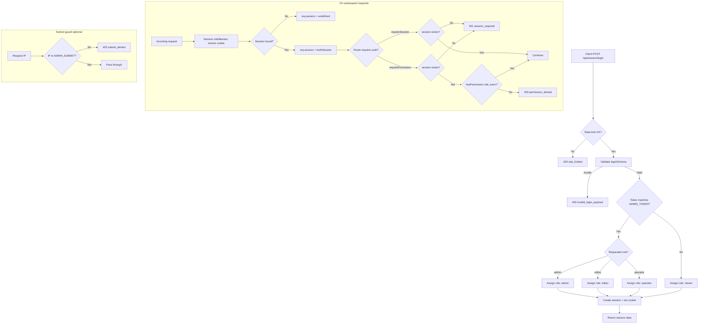
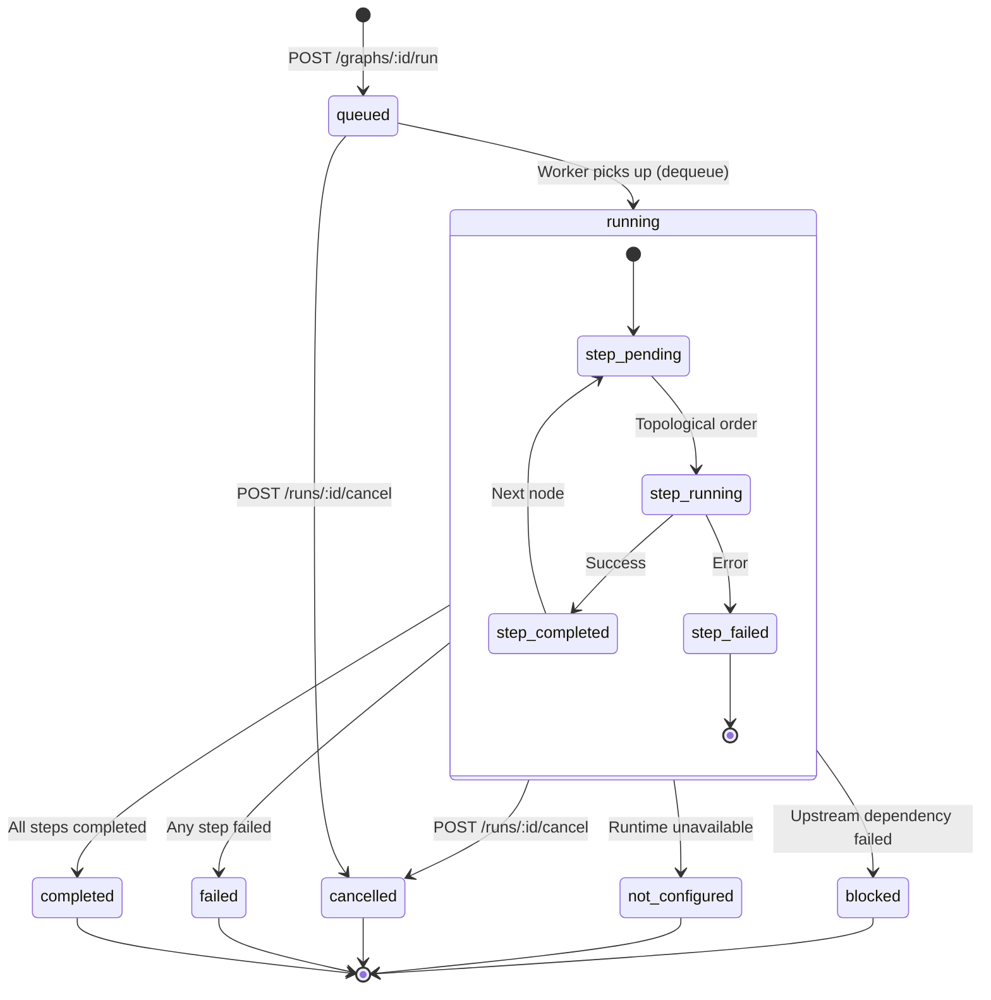
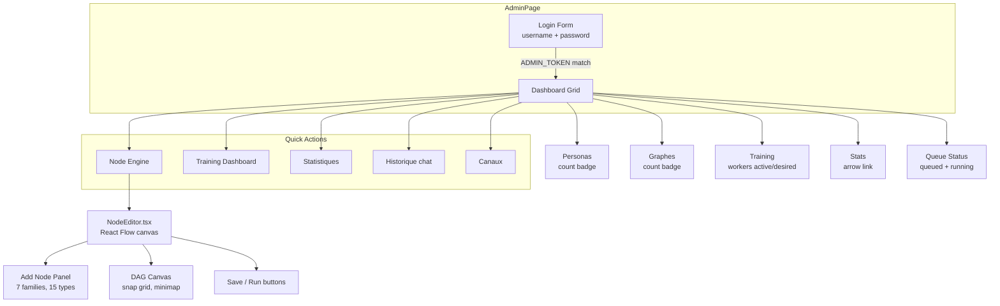
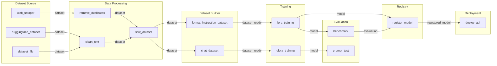

# SPEC_ADMIN — Administration, RBAC & Node Engine

> Specification document for the KXKM_Clown admin subsystem.
> Generated 2026-03-20. Source of truth: codebase at `apps/api`, `packages/core`, `packages/node-engine`, `apps/web`.

---

## Table of Contents

1. [Authentication Flow](#1-authentication-flow)
2. [RBAC Model](#2-rbac-model)
3. [Admin Dashboard](#3-admin-dashboard)
4. [Persona Management](#4-persona-management)
5. [Node Engine](#5-node-engine)
6. [Chat History & Analytics](#6-chat-history--analytics)
7. [Diagrams](#7-diagrams)

---

## 1. Authentication Flow

### 1.1 Login Endpoint

**`POST /api/session/login`**

| Field      | Type   | Constraints                        | Required |
|------------|--------|------------------------------------|----------|
| `username` | string | 1-40 chars, alphanumeric + `_`     | yes      |
| `role`     | enum   | `admin`, `editor`, `operator`, `viewer` | no (default: `viewer`) |
| `token`    | string | max 256 chars                      | no       |
| `password` | string | max 256 chars (alias for token)    | no       |

Validated by `loginSchema` (Zod) in `apps/api/src/schemas.ts`.

### 1.2 Role Assignment Logic

The server **never trusts the client-supplied role**. Role resolution follows this logic:

1. Default role is always `viewer`.
2. If the client requests `admin` **and** the supplied `token` matches `ADMIN_TOKEN` env var (timing-safe comparison via `crypto.timingSafeEqual`), role is set to `admin`.
3. If the client requests `editor` or `operator` **and** the token matches, the requested role is granted.
4. If the token does not match (or `ADMIN_TOKEN` is unset), the role stays `viewer` regardless of what was requested.

### 1.3 Rate Limiting

- In-memory rate limiter: **5 attempts per IP per 60 seconds**.
- Returns HTTP 429 `rate_limited` when exceeded.
- Disabled in `NODE_ENV=test`.

### 1.4 Session Lifecycle

| Step     | Mechanism                                         |
|----------|---------------------------------------------------|
| Create   | `sessionRepo.create({ username, role, expiresAt })` generates a session with a unique ID. |
| Cookie   | `setSessionCookie(res, sessionId)` sets an **HttpOnly, SameSite=Strict** cookie. |
| Lookup   | On every request, `createSessionMiddleware` extracts the session ID from the cookie (or `Authorization` header), calls `sessionRepo.findById`, and attaches `req.session`. |
| Validate | `GET /api/session` returns the current session or 401. |
| Logout   | `POST /api/session/logout` deletes the session from the repo and clears the cookie. |
| Expiry   | `sessionRepo.deleteExpired()` sweeps stale sessions. |

### 1.5 Session Data Structure

```typescript
interface AuthSession {
  id: string;        // unique session ID (cryptographic)
  username: string;  // user-supplied identifier
  role: UserRole;    // server-assigned role
  createdAt: string; // ISO 8601
  expiresAt: string; // ISO 8601
}
```

---

## 2. RBAC Model

### 2.1 Roles

| Role       | Description                                     |
|------------|-------------------------------------------------|
| `admin`    | Full access. Can manage personas, run training, read ops. |
| `editor`   | Can read/write personas and chat, read node engine and ops. Cannot operate node engine or manage sessions. |
| `operator` | Can chat, read personas, read and **operate** node engine (run graphs, cancel runs). Cannot write personas. |
| `viewer`   | Read-only access to chat, personas, node engine, and ops. |

### 2.2 Permissions

Defined in `packages/core/src/index.ts`:

| Permission            | Description                              |
|-----------------------|------------------------------------------|
| `session:manage`      | Create/destroy sessions                  |
| `chat:read`           | Read chat messages and channels          |
| `chat:write`          | Send chat messages                       |
| `persona:read`        | List/view personas, sources, feedback, proposals, voice samples |
| `persona:write`       | Create/update/toggle personas, upload voice samples, reinforce, revert |
| `node_engine:read`    | View graphs, runs, artifacts, models, overview |
| `node_engine:operate` | Create/update graphs, start/cancel runs, retention sweep |
| `ops:read`            | View analytics, error telemetry, performance metrics |

### 2.3 Permission Matrix

| Permission            | admin | editor | operator | viewer |
|-----------------------|:-----:|:------:|:--------:|:------:|
| `session:manage`      |   X   |        |          |        |
| `chat:read`           |   X   |   X    |    X     |   X    |
| `chat:write`          |   X   |   X    |    X     |        |
| `persona:read`        |   X   |   X    |    X     |   X    |
| `persona:write`       |   X   |   X    |          |        |
| `node_engine:read`    |   X   |   X    |    X     |   X    |
| `node_engine:operate` |   X   |        |    X     |        |
| `ops:read`            |   X   |   X    |    X     |   X    |

### 2.4 Route Protection

Two middleware factories in `apps/api/src/app-middleware.ts`:

- **`createRequireSession()`** -- returns 401 if `req.session` is absent. Used on routes that need any authenticated user (e.g., `GET /api/personas`, chat history browsing).
- **`createRequirePermission(permission)`** -- returns 401 if no session, 403 if `hasPermission(role, permission)` is false. Used on admin routes.

The `hasPermission` function (from `@kxkm/auth`) checks if the role's permission set includes the requested permission, using the `ROLE_PERMISSIONS` map.

### 2.5 Subnet Restrictions

**`createAdminSubnetMiddleware(ADMIN_SUBNET)`** in `app-middleware.ts`:

- If `ADMIN_SUBNET` env var is set (e.g., `192.168.1.0/24`), only requests from that CIDR range are allowed.
- Supports IPv4 and IPv6 with full CIDR prefix matching.
- Handles IPv4-mapped IPv6 addresses (`::ffff:x.x.x.x`).
- Returns 403 `subnet_denied` for requests outside the subnet.
- If `ADMIN_SUBNET` is unset, the middleware is not applied (returns `null`).

---

## 3. Admin Dashboard

### 3.1 Entry Point

The admin dashboard is rendered by `apps/web/src/components/AdminPage.tsx`. It is accessible via the "Connexion" link in the Sommaire (home) menu.

### 3.2 Authentication Gate

- If `session.role` is `admin` or `operator`, the dashboard is displayed.
- Otherwise, a login form is shown with username and password fields.
- The login form calls `api.login(username, "admin", password)`.

### 3.3 Dashboard Statistics

On load, the dashboard fetches:

| Stat           | Source                                   | Display          |
|----------------|------------------------------------------|------------------|
| Personas count | `api.listPersonas()` -> `length`         | Card "Personas"  |
| Graphs count   | `api.getOverview()` -> `registry.graphs` | Card "Graphes"   |
| Queued runs    | `api.getOverview()` -> `queue.queuedRuns`  | Queue section    |
| Running runs   | `api.getOverview()` -> `queue.runningRuns` | Queue section    |
| Active workers | `api.getOverview()` -> `queue.activeWorkers` | Card "Training"  |
| Desired workers| `api.getOverview()` -> `queue.desiredWorkers`| Card "Training"  |

### 3.4 Navigation

The dashboard provides navigation cards and quick-action buttons to:

| Target           | Route/Page      | Description                        |
|------------------|-----------------|------------------------------------|
| Personas         | `personas`      | Persona CRUD list                  |
| Node Engine      | `node-engine`   | Graph editor and run management    |
| Training         | `training`      | Training dashboard (workers/runs)  |
| Analytics/Stats  | `analytics`     | Chat analytics and metrics         |
| Chat History     | `history`       | Browse/search past conversations   |
| Channels         | `channels`      | Chat channel management            |

### 3.5 Supporting API Endpoints

| Endpoint                   | Auth              | Description                     |
|----------------------------|-------------------|---------------------------------|
| `GET /api/v2/health`       | None              | Service health (Ollama, DB, uptime) |
| `GET /api/v2/status`       | None              | Public status strip (personas, runs) |
| `GET /api/v2/perf`         | `ops:read`        | Performance metrics (latency, memory) |
| `GET /api/v2/errors`       | `ops:read`        | Recent tracked errors and counts |
| `GET /api/chat/channels`   | `requireSession`  | Available chat channels          |

---

## 4. Persona Management

### 4.1 Data Model

```typescript
interface PersonaRecord {
  id: string;         // e.g. "persona_m1abc_deadbeef"
  name: string;       // display name (1-50 chars)
  model: string;      // Ollama model tag (default: "qwen3:8b")
  summary: string;    // system prompt / personality description (max 2000 chars)
  editable: boolean;  // whether admin can modify
  enabled?: boolean;  // active/inactive toggle
}
```

### 4.2 CRUD Operations

| Method | Endpoint                          | Permission       | Zod Schema              | Description              |
|--------|-----------------------------------|------------------|-------------------------|--------------------------|
| GET    | `/api/personas`                   | `requireSession` | --                      | List all personas        |
| GET    | `/api/personas/:id`               | `requireSession` | --                      | Get single persona       |
| POST   | `/api/admin/personas`             | `persona:write`  | `createPersonaSchema`   | Create new persona       |
| PUT    | `/api/admin/personas/:id`         | `persona:write`  | `updatePersonaSchema`   | Update persona fields    |
| POST   | `/api/admin/personas/:id/toggle`  | `persona:write`  | `togglePersonaSchema`   | Enable/disable persona   |

#### Zod Validation Schemas

**createPersonaSchema:**
- `name`: string, 1-50 chars (required)
- `model`: string, 1-100 chars (optional, default: `"qwen3:8b"`)
- `summary`: string, max 2000 chars (optional, default: `""`)
- `enabled`: boolean (optional, default: `true`)

**updatePersonaSchema:**
- `name`: string, 1-50 chars (optional)
- `model`: string, 1-100 chars (optional)
- `summary`: string, max 2000 chars (optional)
- `enabled`: boolean (optional)

**togglePersonaSchema:**
- `enabled`: boolean (optional; if absent, toggles current state)

### 4.3 Source (System Prompt) Management

| Method | Endpoint                              | Permission      | Schema                       |
|--------|---------------------------------------|-----------------|------------------------------|
| GET    | `/api/admin/personas/:id/source`      | `persona:read`  | --                           |
| PUT    | `/api/admin/personas/:id/source`      | `persona:write` | `updatePersonaSourceSchema`  |

```typescript
interface PersonaSourceRecord {
  personaId: string;
  subjectName: string;   // max 200 chars
  summary: string;       // max 5000 chars
  references: string[];  // max 100 items, each max 500 chars
}
```

If no source exists for a persona, a default is synthesized: `{ subjectName: persona.name, summary: "Aucune source structuree pour le moment.", references: [] }`.

### 4.4 Voice Sample Management

For XTTS-v2 voice cloning.

| Method | Endpoint                                  | Permission      | Schema              | Description            |
|--------|-------------------------------------------|-----------------|---------------------|------------------------|
| POST   | `/api/admin/personas/:id/voice-sample`    | `persona:write` | `voiceSampleSchema` | Upload base64 audio    |
| DELETE | `/api/admin/personas/:id/voice-sample`    | `persona:write` | --                  | Delete voice sample    |
| GET    | `/api/admin/personas/:id/voice-sample`    | `persona:read`  | --                  | Check if sample exists |

**Upload constraints:**
- Input: `{ audio: string }` (base64-encoded)
- Max decoded size: **10 MB**
- Storage: filesystem at `data/voice-samples/<persona-name>.wav`
- Path traversal protection via `resolveVoiceSamplePath` (returns `null` for invalid names)

### 4.5 Feedback Collection

| Method | Endpoint                                  | Permission      | Description                |
|--------|-------------------------------------------|-----------------|----------------------------|
| GET    | `/api/admin/personas/:id/feedback`        | `persona:read`  | List feedback for persona  |

Feedback records are created automatically on admin actions (create, edit, toggle) with type `admin_edit` and a description of who performed the action.

```typescript
interface PersonaFeedbackRecord {
  id: string;
  personaId: string;
  type: string;       // e.g., "admin_edit", "user_feedback"
  comment: string;
  createdAt: string;
}
```

### 4.6 Proposals (Reinforcement & Revert)

| Method | Endpoint                                  | Permission      | Schema                    | Description             |
|--------|-------------------------------------------|-----------------|---------------------------|-------------------------|
| GET    | `/api/admin/personas/:id/proposals`       | `persona:read`  | --                        | List proposals          |
| POST   | `/api/admin/personas/:id/reinforce`       | `persona:write` | `reinforcePersonaSchema`  | Create reinforcement proposal |
| POST   | `/api/admin/personas/:id/revert`          | `persona:write` | --                        | Revert to last applied proposal |

**Reinforcement flow:**
1. Admin provides optional `{ name, model, summary, apply }`.
2. System builds an "after" state (merging provided fields with existing persona).
3. A `PersonaProposalRecord` is created with `before` (current) and `after` snapshots.
4. If `apply: true`, the persona is updated immediately; otherwise the proposal is saved for later review.
5. The proposal `origin` is set to `reinforce_v2`.

**Revert flow:**
1. Finds the last `applied` proposal for the persona.
2. Restores persona fields (`name`, `model`, `summary`) to the proposal's `before` snapshot.
3. Returns 404 if no applied proposal exists.

---

## 5. Node Engine

### 5.1 Overview

The Node Engine is a DAG-based pipeline system for data processing, model training, evaluation, and deployment. It consists of:

- **Graphs**: directed acyclic graphs of typed nodes connected by edges.
- **Runs**: execution instances of a graph, progressing through a state machine.
- **Workers**: runtime executors (CPU, GPU, cluster) that process graph steps.
- **Registry**: a catalog of available node types organized by family.

### 5.2 Graph Data Model

```typescript
interface NodeGraph {
  id: string;           // e.g. "graph_m1abc_deadbeef"
  name: string;
  description: string;
  nodes: GraphNode[];
  edges: GraphEdge[];
  createdAt: string;
  updatedAt: string;
}

interface GraphNode {
  id: string;
  type: string;         // references NodeTypeDefinition.id
  runtime: string;      // e.g. "local_cpu", "local_gpu"
  params: Record<string, unknown>;
  x?: number;           // canvas position
  y?: number;
}

interface GraphEdge {
  from: { node: string; output: string };
  to:   { node: string; input: string };
}
```

### 5.3 Graph CRUD

| Method | Endpoint                                | Permission            | Schema              |
|--------|-----------------------------------------|-----------------------|---------------------|
| GET    | `/api/admin/node-engine/overview`       | `node_engine:read`    | --                  |
| GET    | `/api/admin/node-engine/graphs`         | `node_engine:read`    | --                  |
| POST   | `/api/admin/node-engine/graphs`         | `node_engine:operate` | `createGraphSchema` |
| PUT    | `/api/admin/node-engine/graphs/:id`     | `node_engine:operate` | `updateGraphSchema` |

**createGraphSchema:** `{ name: string (1-100), description?: string (max 2000) }`
**updateGraphSchema:** `{ name?: string (1-100), description?: string (max 2000) }`

The overview endpoint returns:

```typescript
interface NodeEngineOverview {
  queue: {
    desiredWorkers: number;
    activeWorkers: number;
    queuedRuns: number;
    runningRuns: number;
  };
  registry: {
    graphs: number;
    models: number;
  };
  storage: {
    backend: "postgres";
    artifacts: "filesystem";
  };
}
```

### 5.4 Node Type Registry

15 node types organized into 7 families:

| Family            | Node Types                                          | Color   |
|-------------------|-----------------------------------------------------|---------|
| **Dataset Source** | `dataset_file`, `dataset_folder`, `huggingface_dataset`, `web_scraper` | #4a90d9 |
| **Data Processing**| `clean_text`, `remove_duplicates`, `split_dataset`  | #50b83c |
| **Dataset Builder**| `format_instruction_dataset`, `chat_dataset`        | #9c6ade |
| **Training**       | `lora_training`, `qlora_training`                   | #de3618 |
| **Evaluation**     | `benchmark`, `prompt_test`                          | #f49342 |
| **Model Registry** | `register_model`                                    | #47c1bf |
| **Deployment**     | `deploy_api`                                        | #212b36 |

Each node type defines:
- **Inputs/Outputs**: typed ports (`dataset`, `dataset_ready`, `model`, `evaluation`, `registered_model`, `deployment`)
- **Params**: typed parameters with optional defaults (`NodeParamDefinition`)
- **Runtimes**: compatible execution targets (`local_cpu`, `local_gpu`, `remote_gpu`, `cluster`, `cloud_api`)

Edge validation enforces that `sourceHandle === targetHandle` (port type compatibility).

### 5.5 Run Lifecycle

#### Run States

| Status            | Description                                      |
|-------------------|--------------------------------------------------|
| `queued`          | Created, waiting for a worker slot               |
| `running`         | Actively executing steps                         |
| `completed`       | All steps finished successfully                  |
| `failed`          | One or more steps failed                         |
| `cancelled`       | Manually cancelled by an operator                |
| `not_configured`  | A required runtime is not configured             |
| `blocked`         | Upstream dependency failure blocks execution      |

#### Step States

| Status            | Description                                      |
|-------------------|--------------------------------------------------|
| `pending`         | Not yet started                                  |
| `running`         | Currently executing                              |
| `completed`       | Finished successfully                            |
| `failed`          | Execution error                                  |
| `blocked`         | Cannot proceed (upstream failure)                |
| `not_configured`  | Runtime not available                            |

#### Run API

| Method | Endpoint                                       | Permission            | Schema          |
|--------|------------------------------------------------|-----------------------|-----------------|
| POST   | `/api/admin/node-engine/graphs/:id/run`        | `node_engine:operate` | `runGraphSchema`|
| GET    | `/api/admin/node-engine/runs/:id`              | `node_engine:read`    | --              |
| POST   | `/api/admin/node-engine/runs/:id/cancel`       | `node_engine:operate` | --              |
| POST   | `/api/v2/node-engine/runs/:id/cancel`          | `node_engine:operate` | --              |
| GET    | `/api/admin/node-engine/artifacts/:runId`      | `node_engine:read`    | --              |
| GET    | `/api/admin/node-engine/models`                | `node_engine:read`    | --              |

**runGraphSchema:** `{ hold?: boolean }` -- if `hold: true`, the run is created in `queued` state without auto-dequeue.

#### Run Creation

1. Graph existence is validated.
2. A `NodeRunRecord` is created with status `queued`.
3. Unless `hold: true`, `enqueueRunTransition(runId, runRepo)` is called to start the execution pipeline.

#### Cancellation

Two cancel endpoints exist:
- Legacy: `/api/admin/.../cancel` -- directly sets status to `cancelled`.
- V2: `/api/v2/.../cancel` -- calls `runRepo.requestCancel(id)` for graceful shutdown.

#### Run State Resolution

`resolveFinalStatus(stepStatuses, cancelled)` determines the overall run status:
- If `cancelled` flag is set: `cancelled`
- If any step is `failed`: `failed`
- If any step is `not_configured`: `not_configured`
- If any step is `blocked`: `blocked`
- Otherwise: `completed`

### 5.6 Queue System

Pure state machine in `packages/node-engine/src/index.ts`:

```typescript
interface QueueState {
  queued: string[];     // run IDs waiting
  running: string[];    // run IDs in progress
  maxConcurrency: number;
}
```

- `enqueue(state, runId)` -- adds to queue (no duplicates).
- `canDequeue(state)` -- true if `running.length < maxConcurrency && queued.length > 0`.
- `dequeue(state)` -- pops from queue to running.
- `markComplete(state, runId)` -- removes from running.

### 5.7 Graph Execution (Topological)

1. **Topological Sort**: Kahn's algorithm orders nodes. Throws on cycle detection.
2. **Edge Validation**: `validateEdgeContracts(graph, registry)` verifies every edge references valid input/output ports per the registry.
3. **Input Collection**: `collectNodeInputs(graph, nodeId, outputsByNode)` walks edges to gather upstream outputs as the current node's inputs.
4. **Step-by-step Execution**: Each node runs in topological order; outputs are stored in `outputsByNode` map for downstream consumption.

### 5.8 Worker Execution

#### Runtime Definitions

| Runtime      | Mode      | Configured | Description                        |
|--------------|-----------|:----------:|------------------------------------|
| `local_cpu`  | `direct`  | yes        | Built-in CPU execution             |
| `local_gpu`  | `mixed`   | yes        | GPU execution with training adapters |
| `remote_gpu` | `adapter` | no         | External command via adapter       |
| `cluster`    | `adapter` | no         | Cluster execution via adapter      |
| `cloud_api`  | `adapter` | no         | Cloud API via adapter              |

#### Sandbox Configuration

Workers execute in a sandboxed environment (`packages/node-engine/src/sandbox.ts`):

| Mode          | Mechanism                                                |
|---------------|----------------------------------------------------------|
| `none`        | Passthrough, no isolation                                |
| `subprocess`  | `timeout` + `ulimit -v` for time/memory limits           |
| `container`   | `docker run --rm` with `--memory`, `--cpus`, `--network` |

Default sandbox: `subprocess`, 30 min timeout, 4 GB memory, no network, workdir `/tmp/kxkm-sandbox`.

### 5.9 Training Adapters

Two training backends for LoRA/QLoRA fine-tuning:

#### TRL (Transformer Reinforcement Learning)

Command: `python -m trl sft --model_name <model> --dataset_path <path> ...`

#### Unsloth

Command: `python scripts/train_unsloth.py --model <model> --data <path> ...`

#### Hyperparameters

| Parameter       | Default | Min    | Max    |
|-----------------|---------|--------|--------|
| `learningRate`  | 2e-4    | 1e-7   | 1      |
| `epochs`        | 3       | 1      | 100    |
| `batchSize`     | 4       | 1      | 256    |
| `loraRank`      | 16      | 1      | 256    |
| `loraAlpha`     | 32      | 1      | 512    |
| `warmupSteps`   | 10      | 0      | 10000  |
| `maxSeqLength`  | 2048    | 32     | 8192   |

QLoRA adds `--load_in_4bit` (TRL) or `--quantize 4bit` (Unsloth).

#### Training Output

```typescript
interface TrainingResult {
  status: "completed" | "failed" | "cancelled";
  modelName?: string;
  adapterPath?: string;
  metrics?: { trainLoss: number; evalLoss?: number; duration: number };
  error?: string;
}
```

Metrics are parsed from stdout via `parseTrainingMetrics()`, supporting both JSON-dict and plain `key: value` formats.

### 5.10 Visual Editor (Frontend)

`apps/web/src/components/NodeEditor.tsx` + `apps/web/src/hooks/useNodeEditor.ts`:

- Built on **@xyflow/react** (React Flow).
- Canvas with snap-to-grid (20px), minimap, controls, background.
- **Add Node panel**: grouped by family with color-coded labels.
- **Edge validation**: same-type ports only (`sourceHandle === targetHandle`), no self-loops.
- **Save**: serializes React Flow nodes/edges back to `GraphNodeRecord[]` / `GraphEdgeRecord[]` and calls `api.updateGraph`.
- **Run**: calls `api.startRun(graphId)` and displays run ID + status.

---

## 6. Chat History & Analytics

### 6.1 Chat History Browsing

| Method | Endpoint                      | Auth              | Description                     |
|--------|-------------------------------|-------------------|---------------------------------|
| GET    | `/api/v2/chat/history`        | `requireSession`  | List available log files (date, lines, size) |
| GET    | `/api/v2/chat/history/:date`  | `requireSession`  | Read messages for a specific date |
| GET    | `/api/v2/chat/search`         | `requireSession`  | Full-text search across logs    |

#### Log File Format

- Location: `data/chat-logs/v2-YYYY-MM-DD.jsonl`
- One JSON object per line: `{ type, ts, nick, text, ... }`

#### History List Response

```json
{
  "ok": true,
  "data": {
    "files": [
      { "date": "2026-03-20", "lines": 142, "size": 28400 }
    ]
  }
}
```

#### History Detail

- Supports pagination: `?limit=200&offset=0` (limit capped at 1000).
- Date format validated: `YYYY-MM-DD`.
- Returns 404 for missing log files.

#### Search

- `GET /api/v2/chat/search?q=<query>&limit=50`
- Minimum query length: 2 characters.
- Searches `text` and `nick` fields (case-insensitive).
- Results capped at `limit` (max 200).
- Scans files newest-first; stops at limit.

### 6.2 Export Formats

#### HTML Export

**`GET /api/v2/export/html?channel=<channel>`** (`requireSession`)

- Generates a standalone HTML document with monospace dark-theme styling.
- Content-Disposition: `attachment; filename="kxkm-export-<channel>.html"`
- HTML-escapes all dynamic content via `escapeForHtml`.

#### DPO Export

**`GET /api/v2/export/dpo?persona_id=<id>`** (`persona:read`)

- Generates JSONL (application/x-ndjson) with DPO training pairs.
- Each line: `{ prompt, chosen, rejected, persona_id }`.
- Pairs extracted from persona feedback via `extractDPOPairs(feedback, persona)`.
- Optional `persona_id` filter; returns 404 if the filter matches no persona.
- Content-Disposition: `attachment; filename="dpo-pairs-YYYY-MM-DD.jsonl"`

### 6.3 Retention Sweep

**`POST /api/v2/admin/retention-sweep`** (`node_engine:operate`)

| Field        | Type   | Default | Constraints     |
|--------------|--------|---------|-----------------|
| `maxAgeDays` | number | 30      | 1-365, integer  |

- Deletes completed/failed/cancelled runs older than `maxAgeDays`.
- Calls `runRepo.deleteOlderThan(cutoffISO)`.
- Returns `{ ok: true, deleted: <count> }`.

### 6.4 Analytics

**`GET /api/v2/analytics`** (`ops:read`)

Scans the last 30 days of chat log files and returns:

```typescript
{
  totalMessages: number;
  totalDays: number;
  personaMessages: Record<string, number>;  // nick -> count
  userMessages: number;
  systemMessages: number;
  uploadsCount: number;
  messagesPerDay: Array<{ date: string; count: number }>;
  topPersonas: Array<{ nick: string; count: number }>;  // sorted desc
}
```

User messages are identified by `nick` starting with `user_`.

---

## 7. Diagrams

### 7.1 RBAC Flow



### 7.2 Node Engine Run Lifecycle



### 7.3 Admin Page Structure



### 7.4 Node Engine Pipeline (DAG)



---

## Appendix: File References

| File | Purpose |
|------|---------|
| `packages/core/src/index.ts` | Roles, permissions, `ROLE_PERMISSIONS` matrix, `AuthSession`, `ApiEnvelope` |
| `apps/api/src/app-middleware.ts` | Session middleware, `requireSession`, `requirePermission`, subnet guard, perf tracker |
| `apps/api/src/schemas.ts` | Zod schemas for all admin routes |
| `apps/api/src/routes/session.ts` | Login, logout, health, status, analytics, errors |
| `apps/api/src/routes/personas.ts` | Persona CRUD, voice samples, feedback, proposals, reinforce, revert |
| `apps/api/src/routes/node-engine.ts` | Graph CRUD, run management, artifacts, models |
| `apps/api/src/routes/chat-history.ts` | Chat browsing, search, HTML/DPO export, retention sweep |
| `packages/node-engine/src/index.ts` | Graph types, topological sort, run state machine, queue logic, runtime defs |
| `packages/node-engine/src/registry.ts` | 15 node type definitions, 7 families, `NodeEngineRegistry` |
| `packages/node-engine/src/training.ts` | Training job specs, TRL/Unsloth command builders, hyperparams validation |
| `packages/node-engine/src/sandbox.ts` | Sandbox modes (none/subprocess/container), command wrapping |
| `apps/web/src/components/AdminPage.tsx` | Admin login form + dashboard UI |
| `apps/web/src/components/NodeEditor.tsx` | React Flow graph editor |
| `apps/web/src/hooks/useNodeEditor.ts` | Node editor state management, 15 node type defs, serialization |
