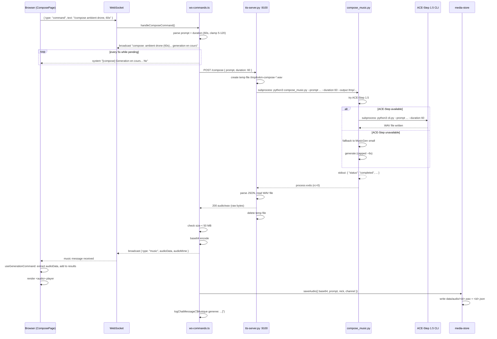

# SPEC: Compose (Music Generation) Module

> Date: 2026-03-20
> Status: Implemented (Lot actif)
> Stack: TypeScript (API) / Python (TTS sidecar + GPU worker) / React (UI)

---

## 1. User Flow

### 1.1 ComposePage UI

The dedicated page (`apps/web/src/components/ComposePage.tsx`) presents a Minitel-themed form with three inputs:

| Control            | Type       | Values                                          | Default        |
|--------------------|------------|--------------------------------------------------|----------------|
| Description musicale | `<textarea>` | Free text, max 500 chars                       | —              |
| Style              | `<select>` | experimental, ambient, electronic, concrete, drone, noise, classical, jazz, hiphop, folk | experimental |
| Duree              | `<select>` | 10s, 30s, 60s, 120s (2min)                      | 30s            |

The form is disabled while a generation is in progress (`generating` flag). A simulated VIDEOTEX progress bar (block character fill) shows estimated progress, ticking every 200 ms with a random increment capped at 92% until the real result arrives.

Results accumulate in a list (max 10). Each track can be expanded to reveal an inline `<audio>` player using a base64 data-URI.

### 1.2 /compose Command Syntax

The UI builds the WebSocket command as:

```
/compose <prompt>, <style> style, <duration>s
```

Example:

```
/compose ambient drone with deep bass, musique concrete style, 60s
```

The backend parser (`ws-commands.ts` line 432) applies a regex on the raw text after `/compose `:

```
/(\d+)s\s*$/
```

- **Duration** is extracted from the trailing `<N>s` token.
- Clamped to range **5 -- 120 seconds**.
- Default **30s** if no duration token found.
- The duration token (and any preceding comma/whitespace) is stripped from the prompt before forwarding.

### 1.3 WebSocket Command Dispatch

1. Client sends `{ type: "command", text: "/compose ..." }` over the shared WebSocket.
2. `ws-commands.ts` `handleCommand()` matches `case "/compose"` and delegates to `handleComposeCommand()`.
3. The hook `useGenerationCommand` listens for messages with `type: "music"` and extracts `audioData` + `audioMime`.
4. Error detection matches the substring `"Composition echouee"` in system messages.

---

## 2. Backend Pipeline

### 2.1 ws-commands.ts (API server, Node.js)

`handleComposeCommand()` performs the following steps:

1. **Parse** prompt and duration from the raw text.
2. **Broadcast** a progress system message to the channel: `<nick> compose: "<prompt>" (<duration>s)... generation en cours`.
3. **Start progress ticker** -- sends a `[compose] Generation en cours... <elapsed>s` system message to the requesting client every 5 seconds.
4. **HTTP POST** to the TTS sidecar:
   - URL: `${TTS_URL}/compose` (default `http://127.0.0.1:9100/compose`)
   - Body: `{ "prompt": "<musicPrompt>", "duration": <number> }`
   - Content-Type: `application/json`
   - AbortController timeout: **300 000 ms (5 min)**
5. **Receive** raw `audio/wav` bytes from the sidecar response.

### 2.2 TTS Sidecar (tts-server.py, port 9100)

The `_handle_compose()` method on the `TTSHandler` class:

1. Reads `prompt` and `duration` from the JSON body. Returns HTTP 400 if prompt is empty.
2. Creates a temp file path (`/tmp/kxkm-compose-*.wav`).
3. Spawns `compose_music.py` as a **subprocess**:
   ```
   python3 compose_music.py --prompt <prompt> --duration <duration> --output <tmpfile>
   ```
   - Timeout: **300 seconds** (matching the API-side timeout).
   - Environment: inherits host env + `COQUI_TOS_AGREED=1`.
4. Parses the **last line** of stdout as JSON (the script emits metadata JSON on stdout).
5. On success (`status == "completed"`), reads the WAV file and returns it as `audio/wav` with Content-Length.
6. On failure, returns HTTP 500 with `{ "error": "..." }`.
7. On subprocess timeout, returns HTTP 504 with `{ "error": "Timeout (5min)" }`.
8. **Cleanup**: always deletes the temp WAV file in the `finally` block.

### 2.3 compose_music.py (GPU Worker)

Dual-backend music generator with automatic fallback:

#### Primary: ACE-Step 1.5

- Directory: `$ACE_STEP_DIR` (default `/home/kxkm/ACE-Step-1.5`)
- Invokes `cli.py` with: `--prompt`, `--duration`, `--output_dir`, `--num_inference_steps` (default 100), optional `--seed`.
- Prompt is capped at **2000 chars** and gets `, <style> style` appended.
- Duration capped at **300s** on the Python side (API already clamps to 120s).
- Subprocess timeout: **600 seconds**.
- Output discovery: scans output directory for most recent `.wav`/`.mp3` containing "ace" in filename; renames to target path.

#### Fallback: MusicGen (Meta)

- Model: `facebook/musicgen-small` (HuggingFace Transformers).
- Auto-detects CUDA; falls back to CPU.
- Token budget: `min(duration * 256, 1536)` -- effectively capped at ~6 seconds of audio.
- Outputs 16-bit PCM WAV via `scipy.io.wavfile`.

#### Output Protocol

The script prints JSON to **stdout** (last line):

```json
{
  "status": "completed",
  "outputFile": "/tmp/kxkm-compose-xxx.wav",
  "duration": 42.3,
  "fileSize": 1234567,
  "prompt": "ambient drone...",
  "generator": "ace-step-1.5",
  "steps": 100
}
```

On error:

```json
{
  "status": "failed",
  "error": "ACE-Step failed: ..."
}
```

Diagnostic messages go to **stderr**.

### 2.4 Timeouts Summary

| Layer                  | Timeout   | Mechanism                        |
|------------------------|-----------|----------------------------------|
| API -> sidecar HTTP    | 300s      | AbortController                  |
| Sidecar -> subprocess  | 300s      | `subprocess.run(timeout=300)`    |
| compose_music.py -> ACE-Step CLI | 600s | nested `subprocess.run(timeout=600)` |

### 2.5 Audio Size Limit

The API enforces a **50 MB** cap on the received audio buffer. If exceeded, the user gets: `"Audio trop volumineux (>50MB) -- essaie une duree plus courte."` and no broadcast occurs.

---

## 3. Response Flow

### 3.1 Progress Broadcast

While the HTTP request to the sidecar is pending, the API sends periodic system messages to the requesting WebSocket client:

```
[compose] Generation en cours... 15s
```

Interval: every **5 seconds**. Cleared on success, failure, or timeout.

### 3.2 Audio Broadcast

On successful generation, the API:

1. Converts the raw audio buffer to **base64**.
2. Broadcasts to the entire channel an `OutboundMessage` of type `"music"`:

```typescript
{
  type: "music",
  nick: "<requester>",
  text: "[Musique: \"<prompt>\" -- <elapsed>s]",
  audioData: "<base64>",
  audioMime: "audio/wav"
}
```

All connected clients on the channel receive the music message, not just the requester.

### 3.3 Media Store Persistence

`saveAudio()` from `media-store.ts` is called fire-and-forget (`.catch(() => {})`):

- Generates a unique ID.
- Writes the WAV file to `data/audio/<id>.wav`.
- Writes metadata JSON to `data/audio/<id>.json`:
  ```json
  {
    "id": "...",
    "type": "audio",
    "prompt": "...",
    "nick": "...",
    "channel": "#general",
    "createdAt": "2026-03-20T...",
    "mime": "audio/wav",
    "filename": "<id>.wav"
  }
  ```

### 3.4 Chat Log Entry

A chat log entry is recorded via `logChatMessage()`:

```typescript
{
  ts: "2026-03-20T...",
  channel: "#general",
  nick: "user1",
  type: "system",
  text: "[Musique generee: \"ambient drone\" (42s)]"
}
```

### 3.5 Error Handling

| Scenario                          | HTTP status from sidecar | User message                                        |
|-----------------------------------|--------------------------|------------------------------------------------------|
| Sidecar returns non-200           | 4xx/5xx                  | `Composition echouee (<elapsed>s): <error>`          |
| JSON parse fails on error body    | —                        | Falls back to `HTTP <status>`                        |
| Audio > 50 MB                     | 200                      | `Audio trop volumineux (>50MB)`                      |
| AbortController timeout (5 min)   | —                        | `Composition timeout apres <elapsed>s`               |
| Network / other error             | —                        | `Erreur composition (<elapsed>s): <message>`         |
| Sidecar subprocess timeout        | 504                      | `Composition echouee: Timeout (5min)`                |
| Missing prompt (backend)          | 400                      | `Missing prompt`                                     |

Timeout detection heuristic: checks if the error message contains `"abort"` or `"timeout"`.

---

## 4. Configuration

### 4.1 Environment Variables

| Variable          | Default                   | Description                                      |
|-------------------|---------------------------|--------------------------------------------------|
| `TTS_URL`         | `http://127.0.0.1:9100`  | TTS sidecar base URL (used by API server)        |
| `ACE_STEP_DIR`    | `/home/kxkm/ACE-Step-1.5`| Path to ACE-Step 1.5 clone on GPU host           |
| `TTS_BACKEND`     | `piper`                   | TTS backend (irrelevant for compose, but same server) |

### 4.2 Duration Defaults

| Context         | Default | Min | Max  |
|-----------------|---------|-----|------|
| API (clamp)     | 30s     | 5s  | 120s |
| compose_music.py| 30s     | —   | 300s |
| MusicGen tokens | —       | —   | 1536 (~6s effective) |
| UI selector     | 30s     | 10s | 120s |

### 4.3 VRAM Requirements

| Generator       | VRAM       | Notes                                    |
|-----------------|------------|------------------------------------------|
| ACE-Step 1.5    | ~4-7 GB   | Diffusion model, 100 steps default       |
| MusicGen small  | ~2-3 GB   | Transformer, but capped at ~6s output    |
| Concurrent with Ollama | Requires scheduling | ACE-Step + 8B LLM may saturate a 24GB GPU |

Production server: RTX 4090 (24 GB VRAM). ACE-Step and Ollama must time-share; no concurrent execution assumed.

---

## 5. Sequence Diagram



---

## 6. Known Limitations and Future Work

- **MusicGen fallback is capped at ~6 seconds** regardless of requested duration (token limit 1536). Users requesting 30-120s will get truncated audio if ACE-Step is unavailable.
- **No queue or concurrency control**: two simultaneous `/compose` requests will compete for GPU VRAM. A job queue with VRAM reservation would prevent OOM.
- **No streaming**: the full WAV is buffered in memory (API + base64 copy). For 120s stereo 44.1kHz, this is ~20 MB raw + ~27 MB base64.
- **Style is concatenated into the prompt** as free text (`"<prompt>, <style> style"`). ACE-Step may or may not interpret style tokens consistently.
- **OutboundMessage "music" type** is cast via `as OutboundMessage` because the union type already includes the music variant, but the broadcast function type signature uses the generic union.
- **Progress bar is simulated** (random increments) -- no real progress is reported from the GPU worker.
