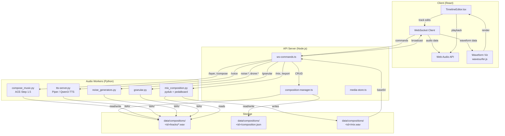
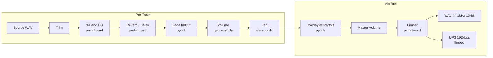
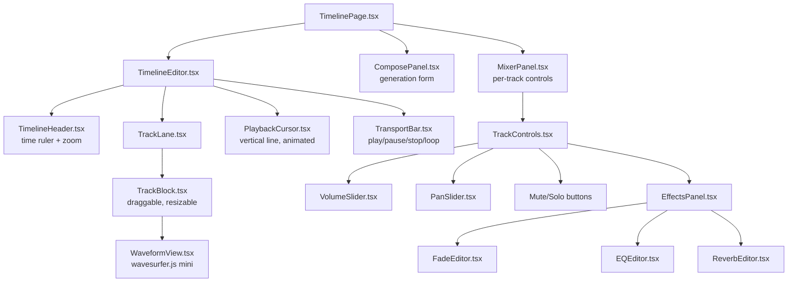

# SPEC: Advanced Music Composition Features

> Date: 2026-03-20
> Status: Planned (Phase 1 target: lots 180-185)
> Depends on: SPEC_COMPOSE.md (current single-generation pipeline)
> Stack: TypeScript (API) / Python (audio processing, GPU worker) / React (timeline UI)

---

## 0. Current State Summary

The existing `/compose` command (SPEC_COMPOSE.md) provides single-shot music generation:
- ACE-Step 1.5 (primary) or MusicGen-small (fallback) on RTX 4090
- Single prompt -> single WAV file -> base64 broadcast via WebSocket
- No multi-track, no mixing, no post-processing
- ComposePage.tsx: form + result list with inline `<audio>` players
- Storage: `data/audio/<id>.wav` + `<id>.json` metadata

This spec extends the system into a multi-track composition workstation.

---

## 1. Timeline Composition

### 1.1 Data Model

```typescript
interface Composition {
  id: string;                    // uuid
  name: string;                  // user-defined title
  createdAt: string;             // ISO 8601
  updatedAt: string;
  bpm?: number;                  // optional tempo reference
  tracks: Track[];
  masterVolume: number;          // 0.0 - 1.0
  owner: string;                 // nick
  channel: string;
}

interface Track {
  id: string;                    // uuid
  type: "music" | "voice" | "sfx" | "noise";
  label: string;                 // user-defined or auto from prompt
  audioId: string;               // reference to data/audio/<id>.wav
  prompt?: string;               // generation prompt (if generated)
  style?: string;
  startMs: number;               // offset from composition start
  endMs: number;                 // startMs + trimmed duration
  trimStartMs: number;           // trim from source start
  trimEndMs: number;             // trim from source end
  volume: number;                // 0.0 - 1.0
  pan: number;                   // -1.0 (left) to 1.0 (right)
  muted: boolean;
  solo: boolean;
  effects: TrackEffect[];
}

interface TrackEffect {
  type: "fadeIn" | "fadeOut" | "reverb" | "delay" | "eqLow" | "eqMid" | "eqHigh";
  params: Record<string, number>;  // effect-specific (e.g., { durationMs: 2000 } for fade)
}
```

### 1.2 Timeline React Component

New component: `apps/web/src/components/TimelineEditor.tsx`

Features:
- Horizontal scrollable timeline (1px = configurable ms, default 10ms/px)
- Vertical stack of track lanes
- Drag to move tracks on the timeline (snap to grid optional)
- Drag edges to trim start/end
- Overlap detection with crossfade hint
- Playback cursor with real-time position (requestAnimationFrame)
- Zoom controls (fit-to-view, zoom in/out)
- Minitel phosphor theme (pink waveforms on dark background)

```
+---------------------------------------------------------------+
| TIMELINE EDITOR                              [+Track] [Export] |
+---------------------------------------------------------------+
| 0:00    0:10    0:20    0:30    0:40    0:50    1:00           |
| |-------|-------|-------|-------|-------|-------|               |
|                                                                |
| [M] Drone bass     [====█████████████████====]    vol ██░░ 60% |
| [V] Narration P1        [===█████████===]          vol ████ 90% |
| [M] Percussions              [====████████████████] vol ███░ 75% |
| [S] Rain ambience  [████████████████████████████]  vol █░░░ 25% |
|                                                                |
| [>] 0:23.4 / 1:00.0                    [Zoom -] [Fit] [Zoom +]|
+---------------------------------------------------------------+
```

### 1.3 Client-Side Playback

Use the Web Audio API for real-time multi-track preview:
- Each track loaded as AudioBuffer
- Per-track GainNode (volume), StereoPannerNode (pan)
- Shared AudioContext with single destination
- Playback position synced across all tracks via a shared start time
- No server round-trip needed for preview playback

### 1.4 Storage

```
data/compositions/<composition-id>/
  composition.json           # Composition metadata + track list
  tracks/
    <track-id>.wav           # individual track audio files
  mix.wav                    # exported final mix (generated on demand)
  mix.mp3                    # optional compressed export
```

---

## 2. TTS Integration in Composition

### 2.1 Voice Track Generation

Extend `/compose` pipeline to accept voice tracks via persona TTS:

```
/voice <persona> "<text>" [at <time>]
```

Examples:
```
/voice Professeur "Bienvenue dans cette composition experimentale" at 0:05
/voice Clown "Ha ha ha, la musique c'est rigolo!" at 0:30
```

### 2.2 Persona Voice Styles

Each persona's voice configuration (from `persona-voices.ts`) maps to TTS parameters:

| Persona     | TTS Backend | Voice       | Speed | Pitch Shift |
|-------------|-------------|-------------|-------|-------------|
| Professeur  | Piper       | fr_FR-siwis | 0.9   | 0           |
| Clown       | Qwen3-TTS   | clown-v1    | 1.1   | +2 semitones|
| Poete       | Piper       | fr_FR-gilles| 0.8   | -1 semitone |
| Musicien    | Qwen3-TTS   | musician-v1 | 1.0   | 0           |

### 2.3 Timing Synchronization

Voice tracks are positioned on the timeline like any other track:
- `startMs` defines when the voice begins relative to composition start
- TTS audio is generated server-side, returned as WAV
- Client places it on the timeline at the specified offset
- If no `at` time specified, voice starts at current playback cursor position

### 2.4 Spoken Word + Music Layering

Automatic ducking: when a voice track overlaps a music track, the music track volume is reduced by a configurable amount (default -6dB) via a sidechain-style envelope. This is applied at mix time by the server-side mixer.

---

## 3. Mixing & Effects

### 3.1 Per-Track Controls

| Control     | Range          | Default | Implementation          |
|-------------|----------------|---------|-------------------------|
| Volume      | 0.0 - 1.0     | 0.8     | Web Audio GainNode / ffmpeg |
| Pan         | -1.0 to 1.0   | 0.0     | StereoPannerNode / sox  |
| Mute        | boolean        | false   | GainNode = 0           |
| Solo        | boolean        | false   | mute all others         |

### 3.2 Effects Chain (Server-Side)

Effects are applied during server-side mix export using Python libraries:

```
Track WAV -> [Trim] -> [EQ] -> [Reverb/Delay] -> [Fade] -> [Volume] -> [Pan] -> Mix Bus
```

#### Library Selection

| Effect      | Library       | Rationale                                    |
|-------------|---------------|----------------------------------------------|
| Trim        | ffmpeg        | Fast, reliable, no Python overhead           |
| Fade in/out | pydub         | Simple amplitude envelope                    |
| EQ (3-band) | pedalboard    | Spotify's plugin host, GPU-friendly          |
| Reverb      | pedalboard    | High-quality convolution reverb              |
| Delay       | pedalboard    | Feedback delay with configurable taps        |
| Pan         | sox / ffmpeg  | Stereo field manipulation                    |
| Final mix   | ffmpeg        | amerge + amix filters for multi-track        |

#### Effect Parameters

```typescript
// Fade
{ type: "fadeIn",  params: { durationMs: 2000 } }
{ type: "fadeOut", params: { durationMs: 3000 } }

// EQ (gain in dB, -12 to +12)
{ type: "eqLow",  params: { gainDb: 3.0, freqHz: 200 } }
{ type: "eqMid",  params: { gainDb: -2.0, freqHz: 1000 } }
{ type: "eqHigh", params: { gainDb: 1.5, freqHz: 5000 } }

// Reverb
{ type: "reverb", params: { roomSize: 0.6, damping: 0.5, wet: 0.3 } }

// Delay
{ type: "delay", params: { delayMs: 250, feedback: 0.4, wet: 0.25 } }
```

### 3.3 Server-Side Mix Pipeline (Python)

New script: `scripts/mix_composition.py`

```python
# Pseudocode
def mix_composition(composition_json_path, output_path):
    comp = load_composition(composition_json_path)

    # 1. Determine total duration
    total_ms = max(t.endMs for t in comp.tracks)

    # 2. Process each track
    processed = []
    for track in comp.tracks:
        if track.muted:
            continue
        audio = load_wav(track.audioId)
        audio = trim(audio, track.trimStartMs, track.trimEndMs)
        for effect in track.effects:
            audio = apply_effect(audio, effect)
        audio = set_volume(audio, track.volume)
        audio = set_pan(audio, track.pan)
        processed.append((track.startMs, audio))

    # 3. Mix down to stereo
    mix = create_silent(total_ms, stereo=True)
    for start_ms, audio in processed:
        mix = overlay(mix, audio, position=start_ms)

    # 4. Apply master volume
    mix = set_volume(mix, comp.masterVolume)

    # 5. Export
    export_wav(mix, output_path)
    export_mp3(mix, output_path.replace('.wav', '.mp3'))
```

---

## 4. Generation Modes & Commands

### 4.1 Command Reference

| Command | Syntax | Description |
|---------|--------|-------------|
| `/compose` | `/compose <prompt>, <style>, <duration>s` | Single generation (existing) |
| `/layer` | `/layer <prompt>, <style>, <duration>s` | Add a track to active composition |
| `/voice` | `/voice <persona> "<text>" [at <time>]` | Add TTS voice track |
| `/remix` | `/remix <track-id> [<new-prompt>]` | Re-generate a specific track |
| `/mix` | `/mix [<composition-id>]` | Server-side mix of all active tracks |
| `/export` | `/export [wav\|mp3] [<composition-id>]` | Download final mix |
| `/comp new` | `/comp new <name>` | Create new composition |
| `/comp list` | `/comp list` | List user's compositions |
| `/comp load` | `/comp load <id>` | Load composition into timeline |
| `/comp delete` | `/comp delete <id>` | Delete composition |

### 4.2 /layer Flow

```
User: /layer rain and thunder ambience, ambient style, 60s

1. API checks for active composition (creates one if none)
2. Generates audio via existing compose pipeline (ACE-Step / MusicGen)
3. Creates new Track entry with type="sfx"
4. Adds track to composition at startMs=0 (or cursor position)
5. Saves audio to data/compositions/<id>/tracks/<track-id>.wav
6. Broadcasts track-added event to channel
7. Client adds track to TimelineEditor
```

### 4.3 /remix Flow

```
User: /remix abc123 "heavier bass, more distortion"

1. API looks up track abc123 in active composition
2. Preserves track position (startMs, endMs) and effects
3. Re-runs compose pipeline with new prompt
4. Replaces track audio file
5. Broadcasts track-updated event
6. Client reloads the track waveform
```

---

## 5. Sound Design

### 5.1 Noise Generators

Built-in Python generators (no GPU needed) for layering:

```
/layer noise:white 30s         # white noise, 30 seconds
/layer noise:pink 60s          # pink noise (1/f)
/layer noise:brown 120s        # brown noise (1/f^2)
/layer drone:sine 60s 110hz    # sine drone at 110Hz
/layer drone:evolving 120s     # slowly modulating drone (LFO on frequency + filter)
```

Implementation in `scripts/noise_generators.py`:

```python
import numpy as np
import scipy.io.wavfile

def white_noise(duration_s, sr=44100):
    return np.random.randn(int(duration_s * sr)).astype(np.float32) * 0.3

def pink_noise(duration_s, sr=44100):
    # Voss-McCartney algorithm
    ...

def brown_noise(duration_s, sr=44100):
    white = np.random.randn(int(duration_s * sr))
    return np.cumsum(white).astype(np.float32) / (duration_s * sr) * 10

def sine_drone(duration_s, freq_hz=110, sr=44100):
    t = np.linspace(0, duration_s, int(duration_s * sr), endpoint=False)
    return (np.sin(2 * np.pi * freq_hz * t) * 0.5).astype(np.float32)

def evolving_drone(duration_s, base_freq=80, sr=44100):
    t = np.linspace(0, duration_s, int(duration_s * sr), endpoint=False)
    lfo = np.sin(2 * np.pi * 0.05 * t) * 20  # slow LFO, +/- 20Hz
    return (np.sin(2 * np.pi * (base_freq + lfo) * t) * 0.4).astype(np.float32)
```

### 5.2 Granular Synthesis

Process uploaded audio samples into granular textures:

```
/granular <audio-id> grains=50ms density=10 spread=0.8 pitch_var=0.3 duration=60s
```

Parameters:
- `grains`: grain size in ms (10-500ms)
- `density`: grains per second (1-100)
- `spread`: random position spread in source (0.0-1.0)
- `pitch_var`: random pitch variation (0.0 = none, 1.0 = +/- octave)
- `duration`: output duration

Implementation via `scripts/granular.py` using numpy slicing + overlap-add.

### 5.3 Field Recording Processing

When users upload audio files (future: drag-and-drop onto timeline), processing options:

| Processing     | Command                         | Backend         |
|----------------|---------------------------------|-----------------|
| Reverse        | `/fx reverse <track-id>`        | pydub           |
| Time stretch   | `/fx stretch <track-id> 0.5`    | librosa / sox   |
| Pitch shift    | `/fx pitch <track-id> +3`       | pedalboard      |
| Normalize      | `/fx normalize <track-id>`      | pydub           |
| Spectral freeze| `/fx freeze <track-id> at 0:15` | librosa STFT    |

---

## 6. Integration with Chat

### 6.1 Persona Musical Suggestions

When a persona detects music-related conversation, it can suggest compositions:

```
System prompt injection (for music-aware personas):
"Si la conversation aborde un theme emotionnel ou atmospherique fort,
tu peux suggerer une composition musicale avec la syntaxe:
[SUGGEST_MUSIC: prompt='<description>', style='<style>', duration=<seconds>]"
```

The API parser detects `[SUGGEST_MUSIC: ...]` in persona responses and renders it as a clickable suggestion in the chat UI. Clicking triggers the `/compose` command.

### 6.2 Auto-Ambient Background

Per-channel ambient mode:

```
/ambient on "dark ambient forest with distant thunder"
/ambient off
/ambient volume 0.3
```

- Generates a long-form ambient loop (120s) via ACE-Step
- Loops seamlessly on the client (crossfade last 5s with first 5s)
- Low default volume (0.2)
- Persists per channel (stored in channel metadata)
- Auto-pauses during voice track playback

### 6.3 Mood-Based Auto-Compose

Sentiment analysis on the last N messages to derive a musical mood:

```
Conversation mood mapping:
  joyful    -> upbeat electronic, major key, 120bpm
  melancholy-> ambient piano, minor key, 70bpm
  aggressive-> noise, industrial, distorted
  calm      -> drone, ambient pads, slow evolution
  absurd    -> experimental, concrete, chaotic
```

Trigger: automatic (if `/ambient auto` is on) or manual (`/mood-music`).

Implementation:
1. Last 20 messages -> LLM prompt: "Analyse le mood de cette conversation en un mot"
2. Mood word -> style mapping table
3. Style -> `/compose` auto-trigger
4. Result set as channel ambient

---

## 7. Technical Architecture

### 7.1 Composition Pipeline



### 7.2 Mixing Flow



### 7.3 Timeline UI Component Tree



### 7.4 WebSocket Protocol Extensions

New message types for composition state sync:

```typescript
// Server -> Client
interface CompositionSync {
  type: "composition_sync";
  composition: Composition;          // full state
}

interface TrackAdded {
  type: "track_added";
  compositionId: string;
  track: Track;
  audioData?: string;                // base64 WAV (for immediate playback)
}

interface TrackUpdated {
  type: "track_updated";
  compositionId: string;
  trackId: string;
  changes: Partial<Track>;
}

interface TrackRemoved {
  type: "track_removed";
  compositionId: string;
  trackId: string;
}

interface MixReady {
  type: "mix_ready";
  compositionId: string;
  audioData: string;                 // base64 WAV or MP3
  audioMime: string;
  fileSize: number;
  durationMs: number;
}

// Client -> Server
interface TrackEdit {
  type: "track_edit";
  compositionId: string;
  trackId: string;
  changes: Partial<Track>;          // startMs, volume, pan, effects, etc.
}
```

### 7.5 Waveform Visualization

Use wavesurfer.js (v7+) for waveform rendering:

- Mini waveforms in track blocks (static, pre-rendered peaks)
- Full waveform in focused track detail view
- Regions plugin for trim selection
- Timeline plugin for ruler
- Spectrogram plugin (optional, for sound design view)
- Minitel theme: pink waveform (#FF66B2), dark background (#1A0011)

### 7.6 VRAM Scheduling

Composition operations compete for GPU VRAM with Ollama (LLM) and other generators:

```
Priority queue:
  1. Active chat LLM response (Ollama) — cannot interrupt
  2. TTS voice generation (Piper: CPU-only, Qwen3-TTS: GPU)
  3. Music generation (ACE-Step: GPU)
  4. Image generation (ComfyUI: GPU)
  5. Mixing/effects (pedalboard: CPU, minimal GPU)
  6. Noise/drone generation (numpy: CPU only)

Strategy:
  - CPU-only tasks (noise, pydub mix, Piper TTS) run immediately, no queuing
  - GPU tasks enter a FIFO queue with estimated VRAM
  - ACE-Step (~5GB) + Ollama 8B (~5GB) can coexist on 24GB RTX 4090
  - ACE-Step + ComfyUI SDXL (~8GB) cannot coexist; sequential only
  - Queue broadcasts position updates to clients
```

---

## 8. Implementation Phases

### Phase 1 — Multi-Track Foundation (lots 180-185)

| Lot | Title | Scope | Tests |
|-----|-------|-------|-------|
| 180 | Composition data model + CRUD | `composition-manager.ts`: create, load, save, delete, list compositions. Storage in `data/compositions/`. | 12 unit tests |
| 181 | `/layer` command | Parse `/layer`, generate via existing pipeline, add track to active composition. Auto-create composition if none. | 8 integration tests |
| 182 | `/comp` commands | `/comp new`, `/comp list`, `/comp load`, `/comp delete`. WebSocket handlers. | 10 unit tests |
| 183 | Basic TimelineEditor UI | React component: track lanes, static blocks (no drag yet), playback via Web Audio API. | 6 component tests |
| 184 | Volume + pan controls | Per-track volume slider + pan knob in MixerPanel. Client-side via Web Audio GainNode + StereoPannerNode. | 4 tests |
| 185 | `/mix` + `/export` | Server-side mix via `mix_composition.py` (pydub). Export as WAV. Base64 broadcast + file download endpoint. | 8 integration tests |

**Phase 1 deliverable**: Users can generate multiple tracks, see them in a timeline, adjust volume/pan, preview in browser, and export a mixed WAV.

### Phase 2 — Voice Tracks & Timeline Interaction (lots 186-190)

| Lot | Title | Scope | Tests |
|-----|-------|-------|-------|
| 186 | `/voice` command + TTS track | Generate persona voice via Piper/Qwen3-TTS, add as voice track with `at` positioning. | 8 tests |
| 187 | Timeline drag & trim | Track blocks become draggable (startMs) and edge-resizable (trim). React DnD or pointer events. | 6 tests |
| 188 | Fade in/out effects | FadeEditor UI component. Server-side via pydub. Preview on client with GainNode ramp. | 4 tests |
| 189 | Voice ducking | Auto-reduce music volume when voice track overlaps. Configurable dB reduction. Applied at mix time. | 4 tests |
| 190 | Waveform visualization | Integrate wavesurfer.js for mini-waveforms in track blocks. Peak data generated server-side. | 4 tests |

**Phase 2 deliverable**: Voice narration layered over music, interactive timeline editing, visual waveforms.

### Phase 3 — Effects & Sound Design (lots 191-195)

| Lot | Title | Scope | Tests |
|-----|-------|-------|-------|
| 191 | pedalboard integration | Install pedalboard in Python venv. EQ, reverb, delay applied via `mix_composition.py`. | 6 tests |
| 192 | EQ editor UI | 3-band EQ knobs (low/mid/high) per track in EffectsPanel. Real-time preview via Web Audio BiquadFilterNode. | 4 tests |
| 193 | Reverb + delay UI | ReverbEditor component. Wet/dry, room size, damping, delay time, feedback. | 4 tests |
| 194 | Noise & drone generators | `noise_generators.py`: white, pink, brown noise + sine/evolving drone. `/layer noise:*` and `/layer drone:*` commands. | 8 tests |
| 195 | Granular synthesis | `granular.py`: grain extraction + overlap-add resynthesis. `/granular` command. | 6 tests |

**Phase 3 deliverable**: Full effects chain, built-in sound generators, granular processing.

### Phase 4 — Intelligence & Polish (lots 196-200)

| Lot | Title | Scope | Tests |
|-----|-------|-------|-------|
| 196 | `/remix` command | Re-generate a track with new prompt, preserving timeline position and effects. | 6 tests |
| 197 | Persona music suggestions | `[SUGGEST_MUSIC]` tag detection in LLM responses. Clickable suggestion UI in chat. | 4 tests |
| 198 | `/ambient` auto-loop | Channel ambient mode: generate, loop with crossfade, low volume background. | 6 tests |
| 199 | Mood-based auto-compose | Sentiment analysis -> style mapping -> auto-generate ambient. `/ambient auto` toggle. | 6 tests |
| 200 | Spectrogram view + polish | wavesurfer.js spectrogram plugin. Keyboard shortcuts (space=play, delete=remove track). Final UX polish. | 4 tests |

**Phase 4 deliverable**: AI-assisted composition, mood-reactive music, full DAW-like experience.

---

## 9. Dependencies & Installation

### Python packages (add to `requirements.txt`)

```
pydub>=0.25.1           # audio manipulation, overlay, fade
pedalboard>=0.9.0       # Spotify audio effects (EQ, reverb, delay, limiter)
librosa>=0.10.0         # time stretch, pitch shift, spectral analysis
soundfile>=0.12.0       # audio I/O (WAV, FLAC, OGG)
numpy>=1.24.0           # already present (noise generators, granular)
scipy>=1.10.0           # already present (MusicGen output)
```

### System packages

```bash
sudo apt install ffmpeg sox libsox-fmt-all   # already on kxkm-ai
```

### npm packages (add to `apps/web/package.json`)

```json
{
  "wavesurfer.js": "^7.8.0"
}
```

### VRAM Budget (RTX 4090, 24GB)

| Concurrent Operation | VRAM | Status |
|---------------------|------|--------|
| Ollama 8B (quantized) | ~5GB | Always loaded |
| ACE-Step 1.5 | ~5GB | On demand, unloads after |
| pedalboard effects | ~0GB | CPU only |
| pydub mixing | ~0GB | CPU only |
| Noise generators | ~0GB | CPU only |
| Qwen3-TTS | ~2GB | On demand |
| **Total peak** | **~12GB** | Comfortable headroom |

---

## 10. Open Questions

1. **Collaborative editing**: Should multiple users on the same channel be able to edit the same composition simultaneously? (WebSocket sync complexity vs. single-editor lock)
2. **Audio upload**: Allow users to upload their own WAV/MP3 files as tracks? (Security: file validation, size limits, malware scanning)
3. **Loop mode**: Should tracks support looping (repeat N times or infinite)?
4. **Undo/redo**: Full undo stack for timeline edits? (Memory cost vs. UX benefit)
5. **MIDI integration**: Accept MIDI files as rhythm/melody guides for ACE-Step? (ACE-Step 1.5 does not natively support MIDI conditioning)
6. **Streaming preview**: Can we stream partial mixes via WebSocket for real-time effect preview without full re-export? (Latency vs. quality tradeoff)

---

## 11. References

- [ACE-Step 1.5](https://github.com/ACE-Step/ACE-Step) — primary music generator
- [pedalboard](https://github.com/spotify/pedalboard) — Spotify audio effects
- [pydub](https://github.com/jiaaro/pydub) — audio manipulation
- [wavesurfer.js](https://wavesurfer.xyz/) — waveform visualization
- [Web Audio API](https://developer.mozilla.org/en-US/docs/Web/API/Web_Audio_API) — client-side playback
- SPEC_COMPOSE.md — current single-generation pipeline
- TIMING_RECOMMENDATIONS_2026-03-19.md — latency targets
