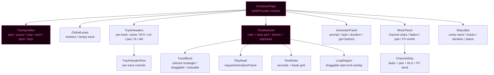
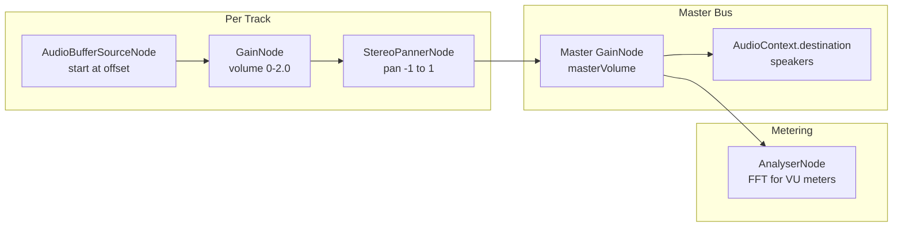
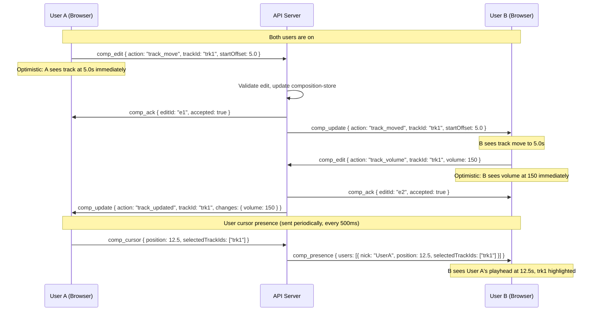
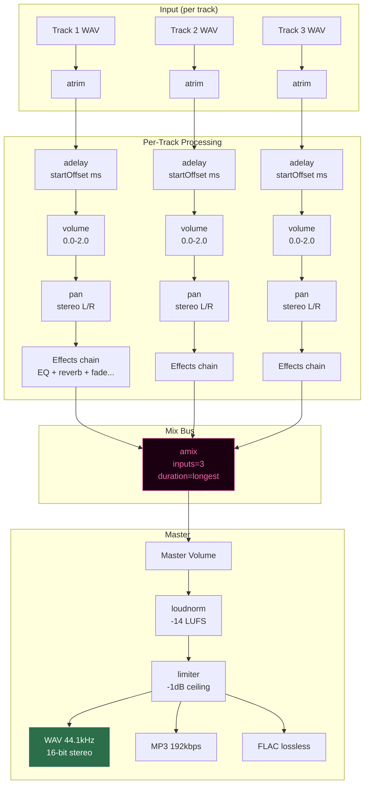

# SPEC: 3615 J'ai pete — Full Web DAW

> Date: 2026-03-21
> Status: Planned (lots 250-300)
> Level: C — Full DAW (BandLab/Soundtrap level)
> Depends on: SPEC_COMPOSE.md, SPEC_COMPOSE_ADVANCED.md
> Stack: TypeScript (API) / Python (audio processing, GPU worker) / React (DAW UI) / Web Audio API (playback)

---

## 0. Context & Decisions

The current `ComposePage.tsx` is a flat form + static colored blocks + per-track `<audio>` elements. There is no real-time playback, no drag/move, no waveforms, no collaboration. This spec defines the full DAW that replaces it.

**User decisions:**

| Question | Answer | Consequence |
|----------|--------|-------------|
| Real-time playback? | YES | Web Audio API with AudioContext, per-track routing |
| Waveforms? | NO | Colored blocks (no wavesurfer.js dependency, lighter bundle) |
| Sub-components? | YES | 7 sub-components, each testable in isolation |
| Multi-user collaboration? | YES | WebSocket sync, optimistic UI, user cursors |
| Level? | C (full DAW) | Transport, mixer, tools, context menus, keyboard shortcuts, automation |

**Key constraint:** No waveform rendering. Tracks are represented as colored blocks with text labels (prompt excerpt), similar to the current `timeline-block` elements but interactive (draggable, resizable, splittable).

---

## 1. Component Architecture

```
ComposePage (router/layout, state provider)
├── TransportBar
│   Play/Pause/Stop/Seek/BPM/Time display/Loop toggle
│
├── GlobalLanes
│   Arrangement markers, tempo changes (future)
│
├── TrackHeaders (left panel, per-track)
│   Name (editable), Mute/Solo buttons, Volume slider,
│   Pan knob, FX dropdown, Color indicator, Delete button
│
├── TimelineGrid (center panel, scrollable)
│   Time ruler (beats/seconds), beat grid lines,
│   Track blocks (colored, draggable, resizable),
│   Playhead (animated vertical line), Loop region overlay
│
├── GeneratorPanel (bottom-left)
│   Prompt textarea, Style select, Duration select,
│   Generate buttons (Music/Voice/Drone/Pink/White/Sine/Brown),
│   FX buttons (Reverse/Reverb/Echo/Distortion/Stutter)
│
├── MixerPanel (bottom-right, togglable)
│   Channel strip per track: vertical volume fader,
│   pan knob, solo/mute, FX send level, VU meter
│
└── StatusBar
    Composition name, track count, total duration,
    generation status, cursor position, zoom level
```

### 1.1 Component Diagram



### 1.2 File Structure

```
apps/web/src/components/daw/
├── DAWProvider.tsx          # React context: DAWState + dispatch
├── ComposePage.tsx           # Layout shell (replaces current ComposePage)
├── TransportBar.tsx          # Play/pause/stop/seek/loop/bpm/time
├── GlobalLanes.tsx           # Arrangement markers, tempo (phase 4)
├── TrackHeaders.tsx          # Left panel: per-track name/M/S/vol/pan/fx
├── TimelineGrid.tsx          # Center: ruler + grid + blocks + playhead
├── TrackBlock.tsx            # Individual colored block (drag/resize/split)
├── GeneratorPanel.tsx        # Bottom: prompt form + gen buttons
├── MixerPanel.tsx            # Bottom: channel strips
├── StatusBar.tsx             # Footer info bar
├── ContextMenu.tsx           # Right-click menu on blocks
├── useDAWAudio.ts            # Web Audio API hook (context, routing, playback)
├── useDAWKeyboard.ts         # Keyboard shortcut hook
├── useDAWCollaboration.ts    # WebSocket sync hook
└── daw-types.ts              # All TypeScript interfaces
```

---

## 2. Data Model

### 2.1 Full State

```typescript
// daw-types.ts

interface DAWState {
  composition: Composition;
  playback: PlaybackState;
  ui: UIState;
  collaboration: CollaborationState;
}

interface PlaybackState {
  playing: boolean;
  position: number;          // seconds from timeline start
  loop: {
    enabled: boolean;
    start: number;           // seconds
    end: number;             // seconds
  } | null;
  bpm: number;               // beats per minute (display grid)
  timeSignature: [number, number]; // e.g. [4, 4]
}

interface UIState {
  zoom: number;              // pixels per second (20-500, default 80)
  scrollX: number;           // horizontal scroll offset in pixels
  scrollY: number;           // vertical scroll offset in pixels
  selectedTrackIds: string[];
  tool: "select" | "move" | "trim" | "split";
  snapToGrid: boolean;       // snap to beat subdivisions
  snapResolution: number;    // beats (1 = bar, 0.25 = sixteenth note)
  mixerVisible: boolean;
  generatorVisible: boolean;
}

interface CollaborationState {
  users: RemoteUser[];
  pendingEdits: PendingEdit[];
}

interface RemoteUser {
  nick: string;
  color: string;
  playheadPosition: number;  // seconds
  selectedTrackIds: string[];
  lastSeen: number;          // timestamp
}

interface PendingEdit {
  id: string;
  type: string;
  timestamp: number;
  confirmed: boolean;
}
```

### 2.2 Composition & Track

```typescript
interface Composition {
  id: string;                // server-generated uuid
  name: string;
  channel: string;
  nick: string;              // owner
  bpm: number;               // default 120
  tracks: Track[];
  masterVolume: number;      // 0-200 (100 = unity)
  createdAt: string;         // ISO 8601
  updatedAt: string;
}

interface Track {
  id: string;
  name: string;              // user-editable label
  type: "music" | "voice" | "sfx" | "silence";
  prompt: string;            // original generation prompt
  style: string;             // generation style
  duration: number;          // seconds (actual audio length)
  startOffset: number;       // seconds from timeline start
  volume: number;            // 0-200 (100 = unity, 200 = +6dB)
  pan: number;               // -1.0 (full left) to 1.0 (full right)
  muted: boolean;
  solo: boolean;
  color: string;             // hex color for block display
  effects: AppliedEffect[];
  audioBuffer?: AudioBuffer; // decoded Web Audio buffer (client-only, not serialized)
  filePath?: string;         // server path to WAV file
  audioId?: string;          // media-store ID
}

interface AppliedEffect {
  type: EffectType;
  params: Record<string, number>;
  bypass: boolean;           // true = effect is present but inactive
}

type EffectType =
  | "reverb"      // { roomSize: 0-1, damping: 0-1, wet: 0-1 }
  | "echo"        // { delayMs: 50-2000, feedback: 0-0.95, wet: 0-1 }
  | "distortion"  // { amount: 0-100, tone: 0-1 }
  | "pitch"       // { semitones: -24 to 24 }
  | "speed"       // { rate: 0.25-4.0 }
  | "fade-in"     // { durationMs: 100-10000 }
  | "fade-out"    // { durationMs: 100-10000 }
  | "stutter"     // { slices: 2-32, interval: "8n"|"16n"|"32n" }
  | "normalize"   // { targetDb: -6 to 0 }
  | "eq-low"      // { gainDb: -12 to 12, freqHz: 60-500 }
  | "eq-mid"      // { gainDb: -12 to 12, freqHz: 500-5000 }
  | "eq-high"     // { gainDb: -12 to 12, freqHz: 5000-16000 }
  ;
```

### 2.3 Compatibility with Existing Backend

The existing `composition-store.ts` defines a simpler `Track` interface. The DAW extends it:

| Existing field | DAW field | Migration |
|---|---|---|
| `startMs: number` | `startOffset: number` (seconds) | `startOffset = startMs / 1000` |
| `volume: number` (0-100) | `volume: number` (0-200) | `volume = oldVolume * 2` |
| `filePath?: string` | `filePath?: string` | No change |

New fields (`pan`, `muted`, `solo`, `color`, `effects`, `name`, `audioBuffer`) are added with defaults. The backend `composition-store.ts` will be extended to persist the full Track schema. Existing compositions are migrated on load (missing fields get defaults).

---

## 3. Web Audio API Playback Engine

### 3.1 Audio Graph

```
AudioContext (44100 Hz, latencyHint: "playback")
│
├── Track 1 chain:
│   AudioBufferSourceNode
│   → GainNode (volume: 0-2.0)
│   → StereoPannerNode (pan: -1 to 1)
│   → masterGain
│
├── Track 2 chain:
│   AudioBufferSourceNode
│   → GainNode
│   → StereoPannerNode
│   → masterGain
│
├── Track N chain: ...
│
└── masterGain (GainNode, composition masterVolume)
    → AudioContext.destination
```

### 3.2 Signal Flow Diagram



### 3.3 Playback Operations

**Play:**
```typescript
function play(position: number): void {
  // 1. Resume AudioContext if suspended (browser autoplay policy)
  await ctx.resume();

  // 2. Record the wall-clock time when playback starts
  startWallTime = ctx.currentTime;
  startPosition = position;

  // 3. For each non-muted track (respecting solo):
  for (const track of getActiveTracks()) {
    const source = ctx.createBufferSource();
    source.buffer = track.audioBuffer;

    // Calculate when this track starts relative to play position
    const trackStart = track.startOffset;
    const trackEnd = trackStart + track.duration;

    if (trackEnd <= position) continue; // track already finished
    if (trackStart >= position) {
      // Track starts in the future — schedule it
      const delay = trackStart - position;
      source.connect(trackGain).connect(trackPan).connect(masterGain);
      source.start(ctx.currentTime + delay);
    } else {
      // Track is mid-playback — start with offset
      const offset = position - trackStart;
      source.connect(trackGain).connect(trackPan).connect(masterGain);
      source.start(ctx.currentTime, offset);
    }
    activeSources.push(source);
  }

  // 4. Start playhead animation
  requestAnimationFrame(updatePlayhead);
}
```

**Pause:**
```typescript
function pause(): void {
  // Save current position
  currentPosition = getCurrentPosition();
  // Stop all sources
  activeSources.forEach(s => s.stop());
  activeSources = [];
}
```

**Stop:**
```typescript
function stop(): void {
  activeSources.forEach(s => s.stop());
  activeSources = [];
  currentPosition = 0;
}
```

**Seek:**
```typescript
function seek(position: number): void {
  const wasPlaying = state.playback.playing;
  stop();
  currentPosition = position;
  if (wasPlaying) play(position);
}
```

**Loop:**
```typescript
// Inside updatePlayhead():
if (loop && getCurrentPosition() >= loop.end) {
  seek(loop.start);
}
```

### 3.4 Playhead Animation

```typescript
function updatePlayhead(): void {
  if (!state.playback.playing) return;

  const elapsed = ctx.currentTime - startWallTime;
  const position = startPosition + elapsed;

  dispatch({ type: "SET_POSITION", position });

  // Check loop boundary
  if (state.playback.loop?.enabled) {
    const { start, end } = state.playback.loop;
    if (position >= end) {
      seek(start); // restart at loop start
      return;
    }
  }

  // Check end of composition
  const totalDuration = getCompositionDuration();
  if (position >= totalDuration) {
    dispatch({ type: "STOP" });
    return;
  }

  animFrameId = requestAnimationFrame(updatePlayhead);
}
```

### 3.5 Audio Buffer Loading

When a track is added or the composition is loaded:

```typescript
async function loadTrackAudio(track: Track): Promise<AudioBuffer> {
  // Option 1: audio data already in base64 (from WebSocket broadcast)
  if (track.audioData) {
    const binary = atob(track.audioData);
    const buffer = new Uint8Array(binary.length);
    for (let i = 0; i < binary.length; i++) buffer[i] = binary.charCodeAt(i);
    return ctx.decodeAudioData(buffer.buffer);
  }

  // Option 2: fetch from server by audioId
  if (track.audioId) {
    const response = await fetch(`/api/v2/media/${track.audioId}`);
    const arrayBuffer = await response.arrayBuffer();
    return ctx.decodeAudioData(arrayBuffer);
  }

  // Option 3: silence track — create empty buffer
  return ctx.createBuffer(2, Math.ceil(track.duration * 44100), 44100);
}
```

### 3.6 Mute / Solo Logic

```typescript
function getActiveTracks(): Track[] {
  const hasSolo = composition.tracks.some(t => t.solo);
  return composition.tracks.filter(t => {
    if (t.muted) return false;
    if (hasSolo && !t.solo) return false;
    return true;
  });
}
```

Volume mapping: `track.volume` range 0-200 maps to GainNode value 0.0-2.0. Value 100 = unity (1.0). Value 200 = +6dB (2.0).

---

## 4. TimelineGrid — Block-Based UI (No Waveforms)

### 4.1 Visual Design

No waveform rendering. Each track is a colored rectangular block. The aesthetic matches the Minitel phosphor theme.

```
┌─ Time Ruler ──────────────────────────────────────────────────────┐
│ 0:00   0:05   0:10   0:15   0:20   0:25   0:30   0:35   0:40    │
├───────────────────────────────────────────────────────────────────┤
│ ┌──────────────────────────────────┐                              │ Track 1
│ │ ████  ambient drone with deep... │                              │
│ └──────────────────────────────────┘                              │
│         ┌─────────────────────┐                                   │ Track 2
│         │ ████  bass pulse    │                                   │
│         └─────────────────────┘                                   │
│                    ┌────────────────────────────────────────┐     │ Track 3
│                    │ ████  rain ambience, field recording   │     │
│                    └────────────────────────────────────────┘     │
│ ┌───────┐                                                         │ Track 4
│ │ VOICE │                                                         │
│ └───────┘                                                         │
│      ▼ ← playhead (animated pink vertical line)                   │
└───────────────────────────────────────────────────────────────────┘
```

### 4.2 Block Rendering

Each `TrackBlock` is a `<div>` with:

| Property | Source | CSS |
|----------|--------|-----|
| Left position | `track.startOffset * zoom` px from timeline start | `left` |
| Width | `track.duration * zoom` px | `width` |
| Color | `track.color` (per-track hex) | `backgroundColor` with opacity |
| Opacity | `track.volume / 200` (scaled to 0.3-1.0, never invisible) | `opacity` |
| Label | `track.name` or `track.prompt.slice(0, 30)` | Inner text, ellipsis overflow |
| Type icon | M (music), V (voice), N (sfx), S (silence) | Left badge |

### 4.3 Block Colors

Auto-assigned from palette, cycling per track index:

```typescript
const TRACK_COLORS = [
  "#c84c0c", // burnt orange
  "#2c6e49", // forest green
  "#7c3aed", // violet
  "#0f766e", // teal
  "#b45309", // amber
  "#1d4ed8", // blue
  "#be185d", // pink
  "#65a30d", // lime
  "#9333ea", // purple
  "#dc2626", // red
];
```

### 4.4 Zoom and Scroll

- Zoom range: 20-500 px/sec. Default: 80 px/sec.
- Zoom via `+`/`-` keys or scroll wheel with Cmd held.
- Horizontal scroll via scroll wheel (without modifier), or Shift+scroll.
- Vertical scroll for many tracks (track lane height: 48px).
- "Fit to view" button: calculates zoom to fit entire composition width.

```typescript
const fitZoom = containerWidth / getCompositionDuration();
```

### 4.5 Beat Grid

When `bpm` is set, vertical grid lines are drawn at beat intervals:

```typescript
const beatInterval = 60 / bpm; // seconds per beat
const barInterval = beatInterval * timeSignature[0]; // seconds per bar

// Draw bar lines (stronger) and beat lines (lighter)
for (let t = 0; t < totalDuration; t += beatInterval) {
  const x = t * zoom;
  const isBar = Math.round(t / barInterval) * barInterval === t;
  // Draw line at x with appropriate opacity
}
```

---

## 5. UI Tools

### 5.1 Select Tool (key: 1)

- **Click** on a block: select that track (deselect others).
- **Shift+Click**: add to selection (multi-select).
- **Cmd+Click**: toggle selection.
- **Click on empty area**: deselect all.
- **Drag on empty area**: rubber-band selection (selects all blocks intersecting the rectangle).
- Selected blocks show a highlight border (2px solid #ff66b2).

### 5.2 Move Tool (key: 2)

- **Drag** a selected block horizontally: changes `startOffset`.
- Multiple selected blocks move together (preserving relative offsets).
- Visual feedback: ghost block at new position while dragging.
- Snap to grid: if enabled, rounds `startOffset` to nearest beat subdivision.
- Vertical drag: moves track to a different lane (reorders `tracks` array).

```typescript
function handleBlockDrag(trackId: string, deltaX: number): void {
  const deltaSec = deltaX / zoom;
  const newOffset = Math.max(0, track.startOffset + deltaSec);
  const snapped = snapToGrid
    ? Math.round(newOffset / snapResolution) * snapResolution
    : newOffset;
  dispatch({ type: "MOVE_TRACK", trackId, startOffset: snapped });
}
```

### 5.3 Trim Tool (key: 3)

- **Drag left edge** of a block: adjusts `startOffset` and trims audio from the beginning.
- **Drag right edge**: adjusts `duration` (trims audio from the end).
- Minimum block width: 0.5 seconds.
- Cursor changes to `col-resize` when hovering edges (8px hit zone).

```typescript
function handleTrimLeft(trackId: string, deltaX: number): void {
  const deltaSec = deltaX / zoom;
  const newOffset = Math.max(0, track.startOffset + deltaSec);
  const newDuration = track.duration - deltaSec;
  if (newDuration < 0.5) return;
  dispatch({ type: "TRIM_TRACK", trackId, startOffset: newOffset, duration: newDuration });
}

function handleTrimRight(trackId: string, deltaX: number): void {
  const deltaSec = deltaX / zoom;
  const newDuration = Math.max(0.5, track.duration + deltaSec);
  dispatch({ type: "TRIM_TRACK", trackId, duration: newDuration });
}
```

### 5.4 Split Tool (key: 4)

- **Click** on a block at position X: splits into two blocks at that point.
- The original block is truncated, a new block is created for the remainder.
- Both blocks reference the same underlying audio but with different trim offsets.
- Visual feedback: vertical dashed line follows cursor position within block bounds.

```typescript
function handleSplit(trackId: string, clickX: number): void {
  const splitSec = track.startOffset + (clickX / zoom);
  const leftDuration = splitSec - track.startOffset;
  const rightDuration = track.duration - leftDuration;

  if (leftDuration < 0.5 || rightDuration < 0.5) return;

  dispatch({ type: "SPLIT_TRACK", trackId, splitAt: splitSec });
  // Creates two tracks:
  // - Original: duration = leftDuration
  // - New: startOffset = splitSec, duration = rightDuration,
  //        audioBuffer trimmed from leftDuration offset
}
```

---

## 6. TransportBar

```
┌──────────────────────────────────────────────────────────────────┐
│ [⏮] [⏪] [▶ Play] [⏩] [⏭]  │  00:12.34 / 01:05.00  │  BPM: 120  │  [🔁 Loop]  │  4/4  │
└──────────────────────────────────────────────────────────────────┘
```

| Control | Action | Shortcut |
|---------|--------|----------|
| Play/Pause | Toggle playback | `Space` |
| Stop | Stop + return to 0:00 | `Enter` |
| Rewind | Jump to start | `Home` |
| Fast Forward | Jump to end | `End` |
| Skip Back | Move -1 bar | `Cmd+Left` |
| Skip Forward | Move +1 bar | `Cmd+Right` |
| Loop | Toggle loop on/off | `L` |
| BPM | Editable input (20-300) | Click to edit |
| Time Signature | Dropdown: 4/4, 3/4, 6/8, 5/4 | Click to change |
| Time Display | Shows `position / totalDuration` | Click to seek |

### 6.1 Loop Region

When loop is enabled:
- Drag on the time ruler to define loop start/end.
- Loop region is highlighted with a semi-transparent pink overlay.
- Playback wraps from loop end to loop start.
- Loop region is draggable (move the whole region) and resizable (drag edges).

---

## 7. TrackHeaders (Left Panel)

Fixed-width left panel (220px) showing per-track controls:

```
┌──────────────────────┐
│ [■] M1  Drone bass   │
│ [M] [S]  ─━━━━━━━ 80%│
│ Pan: ◀━━━●━━━▶  FX▼  │
├──────────────────────┤
│ [■] V2  Narration    │
│ [M] [S]  ━━━━━━━━ 90%│
│ Pan: ◀━━━━●━━▶  FX▼  │
├──────────────────────┤
│ ...                  │
└──────────────────────┘
```

| Control | Widget | Range |
|---------|--------|-------|
| Color indicator | 12x12 colored square | `track.color` |
| Name | Editable text (double-click) | String, 30 chars max |
| Mute (M) | Toggle button | `track.muted` |
| Solo (S) | Toggle button | `track.solo` |
| Volume | Horizontal slider | 0-200 (displays as %) |
| Pan | Horizontal slider with center detent | -1.0 to 1.0 |
| FX | Dropdown menu | Opens effect chain editor |
| Delete | X button (with confirm) | Removes track |

### 7.1 Track Lane Height

Default: 48px per track. Compact mode: 32px (hides pan + FX). Expanded mode: 72px (shows effect chain inline).

---

## 8. MixerPanel

Toggleable bottom panel (shortcut: `M`). Shows channel strips horizontally, one per track, plus a master strip.

```
┌─────┬─────┬─────┬─────┬─────┬──────┐
│ M1  │ V2  │ M3  │ N4  │ M5  │ MSTR │
│     │     │     │     │     │      │
│ ██  │ ██  │ ██  │ ██  │ ██  │ ██   │ ← VU meter
│ ██  │ ██  │ ██  │ ██  │ ██  │ ██   │
│ ██  │ █░  │ ██  │ █░  │ ██  │ ██   │
│ ░░  │ ░░  │ ░░  │ ░░  │ ░░  │ ░░   │
│     │     │     │     │     │      │
│ ●── │ ──● │ ─●─ │ ──● │ ●── │ ─●─  │ ← pan knob
│     │     │     │     │     │      │
│ [M] │ [M] │ [M] │ [M] │ [M] │      │ ← mute
│ [S] │ [S] │ [S] │ [S] │ [S] │      │ ← solo
│     │     │     │     │     │      │
│ FX  │ FX  │ FX  │ FX  │ FX  │ FX   │ ← FX send
└─────┴─────┴─────┴─────┴─────┴──────┘
```

### 8.1 VU Metering

Use `AnalyserNode` per track chain for real-time VU display:

```typescript
const analyser = ctx.createAnalyser();
analyser.fftSize = 256;
// Insert after GainNode, before pan
trackGain.connect(analyser);
analyser.connect(trackPan);

// Read levels in animation frame
const data = new Float32Array(analyser.fftSize);
analyser.getFloatTimeDomainData(data);
const rms = Math.sqrt(data.reduce((sum, v) => sum + v * v, 0) / data.length);
const db = 20 * Math.log10(rms);
```

Display as vertical bar: -60dB (empty) to 0dB (full). Yellow above -6dB, red above -3dB.

---

## 9. GeneratorPanel

Prompt-driven generation integrated into the DAW. Same form as current `ComposePage` but positioned as a collapsible bottom panel.

### 9.1 Generation Flow (Track Addition)

```
1. User fills prompt + style + duration
2. Clicks "Musique" (or "Voix", "Drone", etc.)
3. Panel shows progress spinner + elapsed time
4. WebSocket sends /layer (or /voice, /noise) command
5. Server generates audio, broadcasts result
6. Client receives audio data, creates Track object:
   - startOffset = current playhead position (or 0)
   - duration = actual audio duration
   - color = next in palette
   - audioBuffer = decoded from base64
7. Track appears in timeline at playhead position
8. Web Audio engine hot-adds the track (no restart needed)
```

### 9.2 Generation-to-Timeline Insertion

New tracks are inserted at the **current playhead position** by default. If the user holds `Shift` while clicking "Generate", the track is inserted at position 0:00. The `startOffset` is set accordingly.

---

## 10. Context Menu (Right-Click on TrackBlock)

```
┌─────────────────────┐
│ Cut              ⌘X │
│ Copy             ⌘C │
│ Paste            ⌘V │
│ Delete           ⌫  │
├─────────────────────┤
│ Duplicate        ⌘D │
│ Split at playhead    │
├─────────────────────┤
│ Effects          ▸  │→ Reverb / Echo / Distortion / Pitch /
│                     │  Speed / Fade-in / Fade-out / Stutter /
│                     │  Normalize / EQ Low / EQ Mid / EQ High
├─────────────────────┤
│ Remix (new prompt)   │
│ Properties...        │
└─────────────────────┘
```

### 10.1 Properties Dialog

Modal or side panel showing editable track properties:

- Name
- Prompt (read-only for generated, editable for re-generation)
- Style
- Start offset (editable, seconds)
- Duration (read-only, trimmed)
- Volume (slider 0-200)
- Pan (slider -1 to 1)
- Color (palette picker)
- Effects chain (add/remove/reorder, per-effect params)

---

## 11. Keyboard Shortcuts

| Key | Action | Context |
|-----|--------|---------|
| `Space` | Play / Pause | Global |
| `Enter` | Stop (return to 0:00) | Global |
| `Home` | Jump to start | Global |
| `End` | Jump to end | Global |
| `Cmd+Z` | Undo | Global |
| `Cmd+Shift+Z` | Redo | Global |
| `Cmd+D` | Duplicate selected track(s) | Selection |
| `Delete` / `Backspace` | Delete selected track(s) | Selection |
| `Cmd+A` | Select all tracks | Global |
| `+` / `=` | Zoom in | Global |
| `-` | Zoom out | Global |
| `Cmd+0` | Fit to view | Global |
| `Left` | Nudge selected track(s) left by snap unit | Selection |
| `Right` | Nudge selected track(s) right by snap unit | Selection |
| `Up` | Move selected track(s) up one lane | Selection |
| `Down` | Move selected track(s) down one lane | Selection |
| `1` | Select tool | Global |
| `2` | Move tool | Global |
| `3` | Trim tool | Global |
| `4` | Split tool | Global |
| `M` | Toggle mixer panel | Global |
| `G` | Toggle generator panel | Global |
| `L` | Toggle loop | Global |
| `S` (no selection) | Toggle snap to grid | Global |
| `Cmd+S` | Save composition | Global |
| `Cmd+E` | Export mix | Global |

### 11.1 Implementation

```typescript
// useDAWKeyboard.ts
export function useDAWKeyboard(dispatch: Dispatch<DAWAction>) {
  useEffect(() => {
    function handleKeyDown(e: KeyboardEvent) {
      // Ignore if focus is in an input/textarea
      if ((e.target as HTMLElement).tagName === "INPUT" ||
          (e.target as HTMLElement).tagName === "TEXTAREA") return;

      const cmd = e.metaKey || e.ctrlKey;

      switch (e.code) {
        case "Space":
          e.preventDefault();
          dispatch({ type: "TOGGLE_PLAY" });
          break;
        case "Enter":
          e.preventDefault();
          dispatch({ type: "STOP" });
          break;
        case "KeyZ":
          if (cmd && e.shiftKey) dispatch({ type: "REDO" });
          else if (cmd) dispatch({ type: "UNDO" });
          break;
        case "KeyD":
          if (cmd) { e.preventDefault(); dispatch({ type: "DUPLICATE_SELECTED" }); }
          break;
        case "Delete":
        case "Backspace":
          if (!cmd) dispatch({ type: "DELETE_SELECTED" });
          break;
        case "Digit1": dispatch({ type: "SET_TOOL", tool: "select" }); break;
        case "Digit2": dispatch({ type: "SET_TOOL", tool: "move" }); break;
        case "Digit3": dispatch({ type: "SET_TOOL", tool: "trim" }); break;
        case "Digit4": dispatch({ type: "SET_TOOL", tool: "split" }); break;
        case "Equal":
        case "NumpadAdd":
          dispatch({ type: "ZOOM_IN" }); break;
        case "Minus":
        case "NumpadSubtract":
          dispatch({ type: "ZOOM_OUT" }); break;
        // ... etc
      }
    }

    window.addEventListener("keydown", handleKeyDown);
    return () => window.removeEventListener("keydown", handleKeyDown);
  }, [dispatch]);
}
```

---

## 12. Multi-User Collaboration

### 12.1 Protocol

The existing WebSocket connection is extended with composition-specific messages. All users on the same channel share access to the active composition.

#### Client -> Server Messages

```typescript
// Track edits (optimistic: applied locally before server confirms)
{ type: "comp_edit", compId: string, action: "track_move",    trackId: string, startOffset: number }
{ type: "comp_edit", compId: string, action: "track_trim",    trackId: string, startOffset: number, duration: number }
{ type: "comp_edit", compId: string, action: "track_volume",  trackId: string, volume: number }
{ type: "comp_edit", compId: string, action: "track_pan",     trackId: string, pan: number }
{ type: "comp_edit", compId: string, action: "track_mute",    trackId: string, muted: boolean }
{ type: "comp_edit", compId: string, action: "track_solo",    trackId: string, solo: boolean }
{ type: "comp_edit", compId: string, action: "track_rename",  trackId: string, name: string }
{ type: "comp_edit", compId: string, action: "track_delete",  trackId: string }
{ type: "comp_edit", compId: string, action: "track_fx",      trackId: string, effects: AppliedEffect[] }
{ type: "comp_edit", compId: string, action: "track_reorder", trackIds: string[] }

// User presence
{ type: "comp_cursor", compId: string, position: number, selectedTrackIds: string[] }
```

#### Server -> Client Messages

```typescript
// Broadcasts to all users on the same channel (except sender)
{ type: "comp_update", compId: string, action: "track_added",   track: Track, audioData?: string }
{ type: "comp_update", compId: string, action: "track_removed", trackId: string }
{ type: "comp_update", compId: string, action: "track_moved",   trackId: string, startOffset: number }
{ type: "comp_update", compId: string, action: "track_trimmed", trackId: string, startOffset: number, duration: number }
{ type: "comp_update", compId: string, action: "track_updated", trackId: string, changes: Partial<Track> }
{ type: "comp_update", compId: string, action: "fx_applied",    trackId: string, effects: AppliedEffect[] }
{ type: "comp_update", compId: string, action: "mix_started",   nick: string }
{ type: "comp_update", compId: string, action: "mix_ready",     audioData: string, audioMime: string }
{ type: "comp_update", compId: string, action: "track_reorder", trackIds: string[] }

// Edit confirmations
{ type: "comp_ack", compId: string, editId: string, accepted: boolean }

// User presence
{ type: "comp_presence", compId: string, users: RemoteUser[] }
```

### 12.2 Collaboration Protocol Sequence



### 12.3 Conflict Resolution

**Strategy: Last-Write-Wins (LWW)**

- Each edit carries a server-side timestamp.
- If two users edit the same track property simultaneously, the later timestamp wins.
- The server broadcasts the final state; both clients converge.
- For destructive operations (delete, split), the server applies the first and rejects the second with `comp_ack { accepted: false }`.
- Rejected edits trigger a rollback on the client (revert optimistic update).

**Guardrails:**
- Track deletion requires the track to not be currently selected by another user. Server checks `comp_presence`.
- Split operations lock the track for 2 seconds to prevent simultaneous splits.
- If a user is offline for > 30 seconds, their presence is cleared.

### 12.4 User Cursors

Each remote user's playhead position is shown as a colored vertical line with their nick label:

```css
.remote-cursor {
  position: absolute;
  top: 0;
  bottom: 0;
  width: 2px;
  z-index: 50;
  pointer-events: none;
}
.remote-cursor-label {
  position: absolute;
  top: -18px;
  font-size: 10px;
  padding: 1px 4px;
  border-radius: 2px;
  white-space: nowrap;
}
```

Each user gets a unique cursor color (different from track colors):

```typescript
const CURSOR_COLORS = ["#ff6b6b", "#51cf66", "#339af0", "#fcc419", "#cc5de8", "#ff922b"];
```

---

## 13. Mixing Engine (Server-Side)

### 13.1 Enhanced /mix Command

The existing `/mix` command is enhanced to use the full DAW track model:

```bash
ffmpeg \
  -i track1.wav -i track2.wav -i track3.wav \
  -filter_complex \
  "[0]atrim=start=0:end=30,adelay=0|0,volume=0.8,pan=stereo|c0=c0*0.7|c1=c1*1.3[a0]; \
   [1]atrim=start=0:end=45,adelay=5000|5000,volume=1.2,pan=stereo|c0=c0*1.0|c1=c1*1.0[a1]; \
   [2]atrim=start=2:end=58,adelay=12000|12000,volume=0.5,pan=stereo|c0=c0*1.5|c1=c1*0.5[a2]; \
   [a0][a1][a2]amix=inputs=3:duration=longest:normalize=0[out]" \
  -map "[out]" -ar 44100 -ac 2 -sample_fmt s16 output.wav
```

### 13.2 Filter Chain Per Track

```
Source WAV
  → atrim (trim start/end based on trimStartMs/trimEndMs)
  → adelay (startOffset in milliseconds, applied to both L and R channels)
  → volume (track.volume / 100, range 0.0-2.0)
  → pan (stereo field: pan value maps to L/R gain coefficients)
  → [per-track effects: see 13.3]
  → amix (combine all tracks)
```

### 13.3 Effects via ffmpeg Filters

| Effect | ffmpeg filter | Parameters |
|--------|--------------|------------|
| fade-in | `afade=t=in:d=<sec>` | durationMs / 1000 |
| fade-out | `afade=t=out:st=<start>:d=<sec>` | Calculated from track end |
| reverb | `aecho=0.8:0.88:<delayMs>:0.4` | roomSize maps to delay, damping maps to decay |
| echo | `aecho=0.6:0.3:<delayMs>:<feedback>` | delayMs, feedback |
| distortion | `aeval=sgn(val)*pow(abs(val),1/<amount>)` | amount maps to exponent |
| pitch | `asetrate=44100*2^(<semitones>/12),aresample=44100` | semitones |
| speed | `atempo=<rate>` | rate (0.5-2.0, chained for wider range) |
| normalize | `loudnorm=I=<targetDb>` | targetDb |
| stutter | `asegment=timestamps=...,areverse` + overlay | Custom script |
| eq-low | `equalizer=f=<freq>:width_type=o:width=2:g=<gain>` | freqHz, gainDb |
| eq-mid | `equalizer=f=<freq>:width_type=o:width=2:g=<gain>` | freqHz, gainDb |
| eq-high | `equalizer=f=<freq>:width_type=o:width=2:g=<gain>` | freqHz, gainDb |

### 13.4 Mix Pipeline Diagram



### 13.5 /master Command

Enhanced mastering chain:

```bash
ffmpeg -i mix.wav \
  -af "loudnorm=I=-14:TP=-1:LRA=11,
       acompressor=threshold=-20dB:ratio=4:attack=5:release=50,
       alimiter=limit=-1dB:attack=0.1:release=50,
       aresample=44100:dither_method=triangular" \
  -ar 44100 -ac 2 -sample_fmt s16 master.wav
```

Parameters:
- `loudnorm`: EBU R128 normalization, -14 LUFS integrated, -1 dBTP true peak, 11 LU loudness range
- `acompressor`: gentle bus compression (4:1 above -20dB)
- `alimiter`: brick wall at -1dB to prevent clipping
- `dither_method=triangular`: dithering for 16-bit output quality

---

## 14. Undo/Redo System

### 14.1 Architecture

State history stored as an array of `DAWState` snapshots (or inverse deltas). Max 50 entries.

```typescript
interface UndoStack {
  past: DAWAction[];      // reversed actions
  future: DAWAction[];    // for redo
}

// Every dispatched action is invertible:
function invertAction(action: DAWAction, prevState: DAWState): DAWAction {
  switch (action.type) {
    case "MOVE_TRACK":
      return { ...action, startOffset: prevTrack.startOffset };
    case "TRIM_TRACK":
      return { ...action, startOffset: prevTrack.startOffset, duration: prevTrack.duration };
    case "DELETE_SELECTED":
      return { type: "RESTORE_TRACKS", tracks: deletedTracks };
    // etc.
  }
}
```

### 14.2 Undoable Actions

| Action | Undo |
|--------|------|
| Move track | Restore previous startOffset |
| Trim track | Restore previous startOffset + duration |
| Delete track(s) | Restore deleted track(s) with audio |
| Duplicate track | Delete the duplicate |
| Split track | Merge the two halves back |
| Change volume/pan | Restore previous value |
| Add/remove effect | Reverse the operation |
| Reorder tracks | Restore previous order |

### 14.3 Non-Undoable Actions

- Audio generation (cannot un-generate)
- Mix / Export (idempotent, just re-run)
- Collaboration edits from other users (their undo stack, not ours)

---

## 15. Storage & Persistence

### 15.1 Server-Side

```
data/compositions/<composition-id>/
  composition.json     # Full Composition object (extended schema)
  tracks/
    <track-id>.wav     # Individual track audio files
  mix.wav              # Latest mix output
  master.wav           # Latest mastered output
  mix.mp3              # MP3 export
  mix.flac             # FLAC export
```

### 15.2 Auto-Save

The DAW auto-saves the composition to the server every 10 seconds if there are unsaved changes. Uses a debounced WebSocket message:

```typescript
{ type: "comp_save", compId: string, composition: Composition }
```

Server writes to `composition.json`. No explicit "Save" button needed (but `Cmd+S` triggers an immediate save + visual confirmation).

### 15.3 Audio Cache

Client-side audio buffers are cached in a `Map<string, AudioBuffer>` keyed by track ID. When loading a composition, tracks without `audioData` in the WebSocket sync are fetched from `/api/v2/media/<audioId>` on demand (lazy loading). Tracks scroll into view? Fetch their audio. This keeps initial load fast for large compositions.

---

## 16. Export Formats

| Format | Endpoint | ffmpeg flags | Use case |
|--------|----------|-------------|----------|
| WAV 44.1/16 | `/api/v2/compositions/<id>/export?format=wav` | `-ar 44100 -ac 2 -sample_fmt s16` | Lossless, CD quality |
| MP3 192k | `/api/v2/compositions/<id>/export?format=mp3` | `-codec:a libmp3lame -b:a 192k` | Sharing, web |
| FLAC | `/api/v2/compositions/<id>/export?format=flac` | `-codec:a flac -compression_level 8` | Lossless, smaller than WAV |
| WAV 48/24 | `/api/v2/compositions/<id>/export?format=wav48` | `-ar 48000 -sample_fmt s32` | High-res, video sync |

The export endpoint runs the full mix pipeline (section 13) and returns the file as a download. For large files, the response is streamed.

---

## 17. Implementation Phases (Lots 250-300)

### Phase 1 — Foundation (Lots 250-260)

| Lot | Title | Scope | Tests | Deps |
|-----|-------|-------|-------|------|
| 250 | DAW component scaffold | Create `daw/` directory, `DAWProvider.tsx` with `useReducer`, `daw-types.ts`, route `/compose` to new `ComposePage`. Old page preserved at `/compose-legacy`. | 8 unit (reducer) | — |
| 251 | TransportBar component | Play/Pause/Stop buttons, time display (`00:00.00 / 00:00.00`), BPM input, loop toggle. No audio yet — just UI + state. | 6 component | 250 |
| 252 | TimelineGrid + TrackBlock | Time ruler (seconds), beat grid, colored blocks positioned by `startOffset` and `duration`. Zoom controls (+/-/fit). Horizontal/vertical scroll. | 8 component | 250 |
| 253 | TrackHeaders panel | Left panel: track name, M/S buttons, volume slider, pan slider, color indicator, delete. Wired to DAW state. | 6 component | 250 |
| 254 | Web Audio playback engine | `useDAWAudio.ts`: AudioContext creation, per-track routing (source -> gain -> pan -> master -> dest), play/pause/stop/seek. Playhead animation via rAF. | 10 unit + integration | 250 |
| 255 | Audio buffer loading | Fetch audio from server (`/api/v2/media/<id>`), decode via `decodeAudioData`, cache in Map. Handle base64 from WebSocket. Lazy loading. | 6 integration | 254 |
| 256 | GeneratorPanel integration | Port generation form from old ComposePage. `/layer`, `/voice`, `/noise` commands. New tracks inserted at playhead position. | 6 integration | 250, 254 |
| 257 | Enhanced /mix with offsets | Server: build ffmpeg `filter_complex` with `adelay` (startOffset), `volume`, `pan` per track. `atrim` for trimmed tracks. `amix` for final mix. 44.1kHz stereo output. | 8 integration | — |
| 258 | StatusBar + composition CRUD | StatusBar component. `/comp new`, `/comp list`, `/comp load`, `/comp delete` wired to UI. Auto-save (debounced, 10s). | 6 component | 250 |
| 259 | Mute/Solo logic | Web Audio: mute = gain 0, solo = mute all others. Visual: dimmed blocks for muted tracks. | 4 unit | 254 |
| 260 | Loop region | Draggable loop region on ruler. Playback wraps at loop end. Visual overlay. | 4 component + integration | 254 |

**Phase 1 deliverable:** Working DAW layout with real-time multi-track playback, colored blocks, transport controls, basic mixing. Users can generate tracks, hear them together, adjust volume/pan, and export a mix.

### Phase 2 — Interactivity (Lots 261-270)

| Lot | Title | Scope | Tests | Deps |
|-----|-------|-------|-------|------|
| 261 | Select tool | Click to select blocks, shift+click multi-select, cmd+click toggle, rubber-band selection on empty area. Highlight border on selected. | 6 component | 252 |
| 262 | Move tool | Drag blocks horizontally (changes startOffset). Multi-block drag. Snap to grid. Ghost preview while dragging. Pointer events. | 8 component | 261 |
| 263 | Trim tool | Drag left/right edges of blocks. Edge hit zone (8px). col-resize cursor. Min 0.5s. Updates startOffset and/or duration. | 6 component | 261 |
| 264 | Keyboard shortcuts | `useDAWKeyboard.ts`: Space, Enter, Cmd+Z, Cmd+D, Delete, +/-, 1-4, arrow keys, M, G, L, S. | 10 unit | 250 |
| 265 | Undo/Redo | Invertible action stack (max 50). Cmd+Z / Cmd+Shift+Z. Covers move, trim, delete, duplicate, volume, pan, effects. | 8 unit | 250 |
| 266 | Context menu (right-click) | Cut/Copy/Paste/Delete/Duplicate/Split at playhead/Effects submenu/Properties. `ContextMenu.tsx`. | 6 component | 261 |
| 267 | Per-track FX dropdown | FX button in TrackHeaders opens dropdown: 12 effect types. Select adds to track's effect chain. Params modal. Server-side apply via /fx command. | 6 integration | 253, 257 |
| 268 | Snap to grid | Toggle (S key). Snap resolution: bar, beat, half-beat, quarter-beat. Affects move, trim, split. Visual grid lines. | 4 unit | 262 |
| 269 | Track reordering | Drag track headers vertically to reorder. Updates `tracks` array order. | 4 component | 253 |
| 270 | MixerPanel | Channel strips (vertical fader, pan knob, M/S, FX send). VU meters via AnalyserNode. Master strip. Toggle with M key. | 8 component | 254 |

**Phase 2 deliverable:** Full interactive timeline editing. Users can drag, trim, split, select, and apply effects. Keyboard-driven workflow. Mixer panel with VU meters.

### Phase 3 — Collaboration (Lots 271-280)

| Lot | Title | Scope | Tests | Deps |
|-----|-------|-------|-------|------|
| 271 | comp_edit WebSocket messages | Client sends `comp_edit` for all track mutations. Server validates, persists, broadcasts `comp_update` to channel. | 10 integration | 257 |
| 272 | Optimistic UI + ack/rollback | Apply edits locally on dispatch. On `comp_ack { accepted: false }`, revert to server state. Pending edit queue. | 6 unit | 271 |
| 273 | comp_update handler | Client receives `comp_update` from other users: apply track_added, track_removed, track_moved, track_updated, fx_applied to local state. | 8 integration | 271 |
| 274 | User presence + cursors | `comp_cursor` messages every 500ms. Remote user playhead lines with nick labels. Color-coded. Timeout after 30s. | 6 component | 271 |
| 275 | Shared composition loading | When a user joins a channel with an active composition, server sends `composition_sync` with full state + audio IDs. Client fetches audio lazily. | 6 integration | 255, 271 |
| 276 | Conflict resolution (LWW) | Server timestamps each edit. Concurrent edits to same property: latest wins. Delete/split: first wins, second rejected. | 8 unit | 271 |
| 277 | Real-time track addition | When User A generates a track (`/layer`), all users on the channel see it appear. Audio data broadcast included. | 4 integration | 273, 256 |
| 278 | Collaborative mix trigger | Any user can trigger `/mix`. Status broadcast: "UserA lance le mixage..." Result broadcast to all. | 4 integration | 257, 271 |
| 279 | User activity indicators | Track headers show which user last edited each track (small avatar/nick badge). "User A is editing Track 3" indicator. | 4 component | 274 |
| 280 | Collaboration stress test | Test with 4 concurrent WebSocket clients editing the same composition. Verify convergence, no data loss, no race conditions. | 6 integration | 271-279 |

**Phase 3 deliverable:** Multi-user real-time collaboration. Users on the same channel see each other's edits, cursors, and can generate/mix together.

### Phase 4 — Advanced (Lots 281-300)

| Lot | Title | Scope | Tests | Deps |
|-----|-------|-------|-------|------|
| 281 | Split tool | Click on block to split at cursor position. Creates two tracks from one. Shared audio buffer with different trim offsets. | 6 component | 263, 265 |
| 282 | Automation lanes | Per-track volume envelope: array of `{ time: number, value: number }` points. Draw/edit in a sub-lane below the track. Applied at mix time. | 8 component + integration | 252, 257 |
| 283 | FX sends/returns | Aux send per track (0-100%). Two aux buses: Reverb Return, Delay Return. Applied in Web Audio graph and server-side mix. | 6 integration | 270, 257 |
| 284 | Arrangement markers | Named markers on the global lane (Intro, Verse, Chorus, etc.). Click to jump. Used in export metadata. | 4 component | 252 |
| 285 | Tempo track | BPM changes over time: array of `{ time: number, bpm: number }`. Beat grid adapts. Affects mix if tempo-synced effects are used. | 6 component | 252 |
| 286 | Multi-format export | WAV, MP3, FLAC, WAV 48/24 export. Format selector in export dialog. Server-side ffmpeg conversion. Download link. | 6 integration | 257 |
| 287 | Composition templates | Pre-built track layouts: "Podcast" (voice + music bed), "Ambient Scene" (3 drones + SFX), "Song" (drums + bass + melody + vocal). Quick-start from template. | 4 unit | 250 |
| 288 | Voice ducking | Auto-reduce music track volume when voice track overlaps. Configurable: -6dB default. Applied at mix time. Visualized as volume dip on automation lane. | 4 integration | 282, 257 |
| 289 | Track color picker | Click color swatch in TrackHeaders to open palette picker. 16 preset colors + custom hex input. | 2 component | 253 |
| 290 | Crossfade | When two tracks overlap, auto-apply crossfade (linear, equal-power, or S-curve). Visual X overlay on overlapping region. | 6 integration | 262, 257 |
| 291 | Track freeze/bounce | "Freeze" a track: render effects server-side, replace audio with processed version. Saves CPU during playback. "Unfreeze" reverts to original + effects chain. | 4 integration | 267 |
| 292 | Import audio file | Drag-and-drop WAV/MP3 onto timeline. Upload to server, create track. File validation (size < 50MB, audio format check). | 6 integration | 252 |
| 293 | Granular synthesis track | `/granular` command generates granular texture from existing track. Params: grain size, density, spread, pitch variance. Result as new track. | 4 integration | — |
| 294 | Sample library browser | Side panel listing all audio files in `data/audio/`. Preview on hover. Drag onto timeline to add as track. Search by prompt/name. | 6 component | 292 |
| 295 | Keyboard piano roll | Simple MIDI-like note input for noise generator tracks. Click grid to place notes. Output rendered server-side as audio. | 8 component | 252 |
| 296 | Performance optimization | Virtual scrolling for 20+ tracks. Canvas-based block rendering if DOM is too slow. AudioWorklet for metering. Web Worker for audio decoding. | 6 integration | 252, 254 |
| 297 | Mobile/tablet layout | Responsive layout: stacked panels, touch-friendly controls, pinch-to-zoom, swipe to scroll. Min width: 768px. | 4 component | 250-260 |
| 298 | Minitel DAW theme polish | Full VIDEOTEX aesthetic: phosphor glow on blocks, scanline overlay, CRT curvature on mixer, blinking cursor, ASCII art transport icons. | 2 CSS | 250-270 |
| 299 | DAW onboarding | First-time tutorial overlay: "Press Space to play, 1-4 for tools, click Generate to add tracks." 5-step walkthrough. Dismissible. | 4 component | 250 |
| 300 | Integration test suite | End-to-end: create composition, generate 3 tracks, move/trim, apply FX, mix, export. Multi-user collaboration test. Performance benchmark (20 tracks). | 12 E2E | All |

**Phase 4 deliverable:** Production-grade DAW with automation, crossfades, templates, import, sample browser, mobile support, and polished Minitel theme.

---

## 18. State Management: DAWProvider

### 18.1 Reducer Actions

```typescript
type DAWAction =
  // Playback
  | { type: "TOGGLE_PLAY" }
  | { type: "STOP" }
  | { type: "SEEK"; position: number }
  | { type: "SET_POSITION"; position: number }
  | { type: "SET_BPM"; bpm: number }
  | { type: "SET_LOOP"; loop: { start: number; end: number } | null }
  | { type: "TOGGLE_LOOP" }

  // Tracks
  | { type: "ADD_TRACK"; track: Track }
  | { type: "DELETE_SELECTED" }
  | { type: "DELETE_TRACK"; trackId: string }
  | { type: "RESTORE_TRACKS"; tracks: Track[] }
  | { type: "MOVE_TRACK"; trackId: string; startOffset: number }
  | { type: "TRIM_TRACK"; trackId: string; startOffset?: number; duration?: number }
  | { type: "SPLIT_TRACK"; trackId: string; splitAt: number }
  | { type: "DUPLICATE_SELECTED" }
  | { type: "SET_TRACK_VOLUME"; trackId: string; volume: number }
  | { type: "SET_TRACK_PAN"; trackId: string; pan: number }
  | { type: "TOGGLE_MUTE"; trackId: string }
  | { type: "TOGGLE_SOLO"; trackId: string }
  | { type: "RENAME_TRACK"; trackId: string; name: string }
  | { type: "SET_TRACK_COLOR"; trackId: string; color: string }
  | { type: "SET_TRACK_EFFECTS"; trackId: string; effects: AppliedEffect[] }
  | { type: "REORDER_TRACKS"; trackIds: string[] }

  // UI
  | { type: "SET_TOOL"; tool: UIState["tool"] }
  | { type: "SET_SELECTION"; trackIds: string[] }
  | { type: "TOGGLE_SELECTION"; trackId: string }
  | { type: "ADD_TO_SELECTION"; trackId: string }
  | { type: "ZOOM_IN" }
  | { type: "ZOOM_OUT" }
  | { type: "ZOOM_FIT" }
  | { type: "SET_ZOOM"; zoom: number }
  | { type: "SET_SCROLL"; scrollX: number; scrollY: number }
  | { type: "TOGGLE_MIXER" }
  | { type: "TOGGLE_GENERATOR" }
  | { type: "TOGGLE_SNAP" }

  // Undo
  | { type: "UNDO" }
  | { type: "REDO" }

  // Collaboration
  | { type: "SYNC_COMPOSITION"; composition: Composition }
  | { type: "REMOTE_TRACK_ADDED"; track: Track }
  | { type: "REMOTE_TRACK_REMOVED"; trackId: string }
  | { type: "REMOTE_TRACK_UPDATED"; trackId: string; changes: Partial<Track> }
  | { type: "SET_REMOTE_USERS"; users: RemoteUser[] }

  // Composition
  | { type: "SET_COMPOSITION_NAME"; name: string }
  | { type: "SET_MASTER_VOLUME"; volume: number }
  | { type: "LOAD_COMPOSITION"; composition: Composition }
  ;
```

### 18.2 Context Shape

```typescript
interface DAWContextValue {
  state: DAWState;
  dispatch: React.Dispatch<DAWAction>;
  audioEngine: {
    play: () => void;
    pause: () => void;
    stop: () => void;
    seek: (position: number) => void;
    getPosition: () => number;
    setTrackVolume: (trackId: string, volume: number) => void;
    setTrackPan: (trackId: string, pan: number) => void;
    setMasterVolume: (volume: number) => void;
    loadTrackAudio: (track: Track) => Promise<void>;
  };
  sendCommand: (cmd: string) => void;
}
```

---

## 19. API Endpoints (New/Modified)

| Method | Path | Description |
|--------|------|-------------|
| GET | `/api/v2/compositions` | List compositions for current user |
| GET | `/api/v2/compositions/:id` | Get composition JSON |
| PUT | `/api/v2/compositions/:id` | Update composition (auto-save) |
| DELETE | `/api/v2/compositions/:id` | Delete composition |
| GET | `/api/v2/compositions/:id/export?format=wav` | Download mixed + mastered export |
| GET | `/api/v2/media/:audioId` | Stream audio file (existing, used for lazy loading) |
| POST | `/api/v2/compositions/:id/mix` | Trigger server-side mix (returns job ID) |
| GET | `/api/v2/compositions/:id/mix/status` | Check mix job status |

---

## 20. Performance Targets

| Metric | Target | Measurement |
|--------|--------|-------------|
| Initial load (empty composition) | < 500ms | DOMContentLoaded to interactive |
| Track addition (with audio decode) | < 2s | Generate complete to block visible |
| Playback start latency | < 100ms | Space key to first audio sample |
| Playhead animation | 60 fps | No dropped frames during playback |
| 20 tracks simultaneous playback | < 30% CPU | Chrome DevTools Performance tab |
| Mix export (5 tracks, 60s each) | < 30s | Server-side ffmpeg |
| WebSocket edit roundtrip | < 200ms | Send to broadcast received by peer |
| Auto-save | < 500ms | Debounced write, non-blocking |

### 20.1 Optimization Strategies

- **Virtual rendering**: Only render track blocks that are visible in the viewport. For 20+ tracks with vertical scroll, off-screen blocks are not DOM-mounted.
- **Canvas fallback**: If DOM block rendering causes jank at high zoom levels (many blocks visible), switch to a single `<canvas>` element for the timeline grid.
- **AudioWorklet metering**: Move VU meter computation off the main thread.
- **Web Worker decoding**: Decode large audio files in a Web Worker to avoid blocking the main thread.
- **Lazy audio loading**: Fetch audio buffers only when needed (scroll into view, playback start).

---

## 21. Minitel DAW Theme

The DAW uses the existing Minitel VIDEOTEX aesthetic from the rest of the application.

### 21.1 Colors

| Element | Color | CSS variable |
|---------|-------|-------------|
| Background | `#0a0012` | `--daw-bg` |
| Grid lines (bar) | `#ff66b2` at 20% opacity | `--daw-grid-bar` |
| Grid lines (beat) | `#ff66b2` at 8% opacity | `--daw-grid-beat` |
| Playhead | `#ff66b2` solid | `--daw-playhead` |
| Loop region | `#ff66b2` at 15% opacity | `--daw-loop` |
| Remote cursor | Per-user color | Dynamic |
| Track block text | `#fff` | — |
| Selected block border | `#ff66b2` 2px solid | `--daw-selection` |
| Muted block | 40% opacity | — |
| VU meter green | `#00ff66` | `--daw-vu-green` |
| VU meter yellow | `#ffcc00` | `--daw-vu-yellow` |
| VU meter red | `#ff3333` | `--daw-vu-red` |

### 21.2 Typography

- Track labels: `var(--font-mono)`, 11px
- Time display: `var(--font-mono)`, 14px, tabular-nums
- BPM: `var(--font-mono)`, 12px
- Status bar: `var(--font-mono)`, 10px

### 21.3 Effects

- Phosphor glow on playhead: `box-shadow: 0 0 8px #ff66b2`
- Scanline overlay on mixer (subtle, 1px repeating gradient at 10% opacity)
- Block hover: brightness increase (+10%)
- Transport buttons: Minitel `nav-btn` style (existing)

---

## 22. Testing Strategy

| Layer | Tool | Count (estimated) |
|-------|------|-------------------|
| Unit (reducer, utils) | Vitest | ~40 |
| Component (React) | Vitest + Testing Library | ~50 |
| Integration (WebSocket + audio) | Vitest + mock WS | ~30 |
| E2E (full flow) | Playwright | ~12 |
| **Total** | | **~132** |

### 22.1 Key Test Scenarios

1. **Playback correctness**: 3 tracks with different offsets, verify audio starts at correct times.
2. **Move tool**: Drag block, verify startOffset updates, verify audio plays at new position.
3. **Trim tool**: Trim left edge, verify audio content shifts correctly.
4. **Split tool**: Split block, verify two blocks with correct audio segments.
5. **Mute/Solo**: Solo one track, verify only that track produces audio.
6. **Loop**: Set loop region, verify playback wraps correctly.
7. **Collaboration**: Two clients edit same track, verify convergence.
8. **Mix export**: 3 tracks with offsets + volume + pan, verify ffmpeg output matches expected.
9. **Undo/Redo**: Sequence of 5 edits, undo 3, redo 1, verify state.
10. **20-track performance**: Load 20 tracks, verify playback without glitches.

---

## 23. Dependencies

### npm packages (apps/web)

```json
{
  "tone": "^15.0.0"
}
```

Note: Tone.js is optional. The spec uses raw Web Audio API for playback (simpler, lighter). Tone.js is recommended only if scheduling complexity grows beyond what raw AudioContext handles (e.g., tempo-synced effects, automation). For Phase 1-2, raw Web Audio API is sufficient.

No waveform library needed (user decision: colored blocks, no waveforms).

### Python packages (unchanged from SPEC_COMPOSE_ADVANCED.md)

```
pydub>=0.25.1
pedalboard>=0.9.0
numpy>=1.24.0
scipy>=1.10.0
```

### System packages (already on kxkm-ai)

```
ffmpeg, sox
```

---

## 24. Migration from Current ComposePage

### 24.1 Strategy

1. New DAW components live in `apps/web/src/components/daw/`.
2. Old `ComposePage.tsx` is moved to `ComposePage.legacy.tsx` and remains accessible at `/compose-legacy` during development.
3. New `ComposePage.tsx` in `daw/` is a thin shell that renders `DAWProvider` + sub-components.
4. Route `/compose` points to new DAW as of Lot 250.
5. Legacy page removed after Phase 2 validation.

### 24.2 Data Migration

Existing compositions in `data/compositions/` use the simpler Track schema. On load:

```typescript
function migrateTrack(old: OldTrack): Track {
  return {
    ...old,
    name: old.label || old.prompt?.slice(0, 25) || `Track ${old.id}`,
    type: old.type === "noise" ? "sfx" : old.type,
    startOffset: (old.startMs || 0) / 1000,
    volume: Math.min(200, (old.volume || 80) * 2),
    pan: 0,
    muted: false,
    solo: false,
    color: TRACK_COLORS[0],
    effects: [],
    style: old.style || "experimental",
    prompt: old.prompt || "",
  };
}
```

---

## 25. Open Questions (Resolved & Remaining)

| # | Question | Status | Resolution |
|---|----------|--------|------------|
| 1 | Collaborative editing? | RESOLVED | YES — multi-user, LWW conflict resolution |
| 2 | Waveforms? | RESOLVED | NO — colored blocks only (lighter, faster) |
| 3 | Audio upload? | Phase 4 | Lot 292: drag-and-drop WAV/MP3, 50MB limit |
| 4 | Loop mode per track? | OPEN | Track-level loop (repeat N times) vs. timeline loop region. Timeline loop is Phase 1; per-track loop is TBD. |
| 5 | MIDI input? | DEFERRED | Not in scope for lots 250-300. Consider for post-300. |
| 6 | Streaming preview? | DEFERRED | Full re-export on each mix. Real-time effect preview via Web Audio API client-side only. |
| 7 | Offline support? | DEFERRED | Service worker caching of audio files could enable offline playback. Not in current scope. |

---

## 26. References

- [Web Audio API (MDN)](https://developer.mozilla.org/en-US/docs/Web/API/Web_Audio_API)
- [AudioWorklet (MDN)](https://developer.mozilla.org/en-US/docs/Web/API/AudioWorklet)
- [FFmpeg Filters Documentation](https://ffmpeg.org/ffmpeg-filters.html)
- [Tone.js](https://github.com/Tonejs/Tone.js)
- [waveform-playlist](https://github.com/naomiaro/waveform-playlist) — reference architecture
- [openDAW](https://github.com/andremichelle/openDAW) — reference for audio routing
- [BandLab](https://bandlab.com) — UX reference (collaboration model)
- [Soundtrap](https://soundtrap.com) — UX reference (simplicity)
- SPEC_COMPOSE.md — current single-generation pipeline
- SPEC_COMPOSE_ADVANCED.md — multi-track foundation spec
- DAW_RESEARCH_2026-03-21.md — OSS research notes
