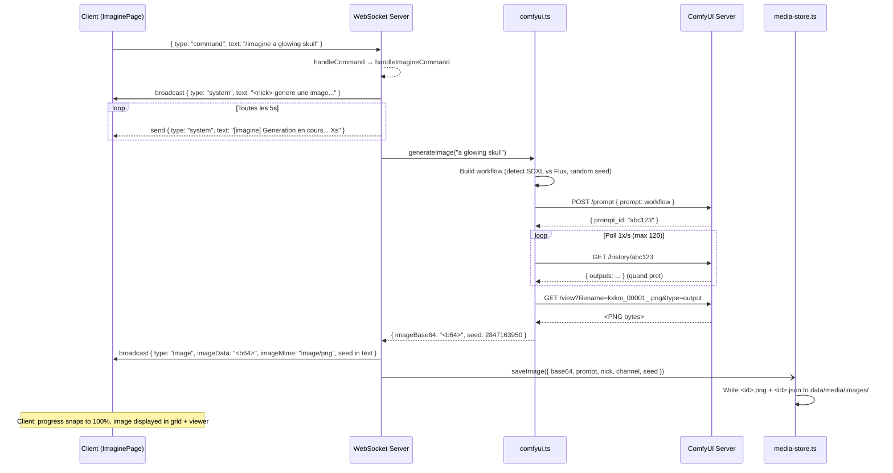

# SPEC: Imagine -- Module de generation d'images

> **Date**: 2026-03-20
> **Statut**: Implementation existante -- documentation de reference
> **Fichiers cles**:
> - `apps/api/src/ws-commands.ts` (handleImagineCommand)
> - `apps/api/src/comfyui.ts` (generateImage)
> - `apps/api/src/media-store.ts` (saveImage, listMedia, getMediaFilePath)
> - `apps/api/src/routes/media.ts` (REST endpoints)
> - `apps/web/src/components/ImaginePage.tsx` (UI)
> - `apps/web/src/hooks/useGenerationCommand.ts` (WS hook generique)

---

## 1. User Flow

### 1.1 ImaginePage UI

Le composant `ImaginePage` presente une interface Minitel/VIDEOTEX avec:

- **Champ prompt** : `<textarea>` (3 lignes, max 500 caracteres), placeholder en anglais
- **Bouton de generation** : `>>> Imaginer <<<`, desactive pendant la generation
- **Barre de progression** : simulee cote client (increment aleatoire toutes les 100ms, plafond 92%, snap a 100% a la reception du resultat)
- **Grille de resultats** : miniatures cliquables (max 20 resultats en memoire), du plus recent au plus ancien
- **Viewer plein ecran** : clic sur une miniature ouvre un overlay avec navigation prev/next et bouton fermer
- **Gestion d'erreur** : affichage inline des erreurs (match sur le mot "echoue" dans les messages systeme)

### 1.2 Commande `/imagine`

```
/imagine <description de l'image en anglais>
```

- Le prompt est tout le texte apres `/imagine ` (offset 9 caracteres)
- Si le prompt est vide, renvoie un message d'usage
- Le prompt est transmis tel quel a ComfyUI (pas de traduction, pas de truncation cote API)

### 1.3 WebSocket Command Dispatch

1. Le client envoie `{ type: "command", text: "/imagine a glowing skull" }`
2. `useGenerationCommand` ouvre (ou reutilise) une connexion WebSocket dediee
3. Le serveur WS detecte le prefix `/imagine` dans `handleCommand` (switch/case)
4. Delegation vers `handleImagineCommand` interne

---

## 2. Backend Pipeline

### 2.1 handleImagineCommand (`ws-commands.ts`)

```
handleImagineCommand({ ws, info, text, broadcast, send, logChatMessage })
```

Etapes:
1. Extraction du prompt (`text.slice(9).trim()`)
2. Broadcast systeme sur le canal : `"<nick> genere une image: \"<prompt>\"... (generation ~10-30s)"`
3. Demarrage d'un timer de progression (broadcast prive toutes les 5s)
4. Appel `generateImage(prompt)` (module `comfyui.ts`)
5. Si echec (`null`) : message systeme "Generation echouee -- verifiez ComfyUI"
6. Si succes : broadcast `type: "image"` avec `imageData` (base64), `imageMime`, `seed`
7. Persistence asynchrone via `saveImage()` (fire-and-forget, `.catch(() => {})`)
8. Log de l'evenement dans le chat log

### 2.2 ComfyUI Integration (`comfyui.ts`)

#### Variables d'environnement

| Variable | Default | Description |
|---|---|---|
| `COMFYUI_URL` | `https://stable2.kxkm.net` | URL du serveur ComfyUI |
| `COMFYUI_CHECKPOINT` | `sdxl_lightning_4step.safetensors` | Fichier checkpoint du modele |

#### Modeles supportes

La detection du modele se fait par inspection du nom du checkpoint (`checkpoint.toLowerCase().includes("flux")`).

| Parametre | SDXL Lightning | Flux 2 |
|---|---|---|
| `steps` | 4 | 20 |
| `cfg` | 1.5 | 3.5 |
| `sampler_name` | `dpmpp_sde` | `euler` |
| `scheduler` | `karras` | `normal` |

Parametres communs:
- **Resolution** : 1024x1024 (fixe)
- **Batch size** : 1
- **Denoise** : 1 (generation complete, pas d'img2img)
- **Negative prompt** : `"ugly, blurry, low quality, deformed"` (hard-code)
- **Seed** : aleatoire (`Math.floor(Math.random() * 2 ** 32)`)

#### Workflow ComfyUI (API format)

Le workflow est un graphe de 7 noeuds:

| Node ID | Class | Role |
|---|---|---|
| `3` | `KSampler` | Echantillonnage (seed, steps, cfg, sampler, scheduler) |
| `4` | `CheckpointLoaderSimple` | Chargement du modele |
| `5` | `EmptyLatentImage` | Image latente vide 1024x1024 |
| `6` | `CLIPTextEncode` | Encodage du prompt positif |
| `7` | `CLIPTextEncode` | Encodage du prompt negatif |
| `8` | `VAEDecode` | Decodage latent vers pixel |
| `9` | `SaveImage` | Sauvegarde (prefix `kxkm`) |

#### Sequence de generation

1. **Queue** : `POST ${COMFYUI_URL}/prompt` avec le workflow JSON
   - Timeout: 120s (`AbortSignal.timeout`)
   - Reponse : `{ prompt_id: string }`
2. **Poll** : boucle `GET ${COMFYUI_URL}/history/${promptId}` (1 req/s, max 120 iterations)
   - Attend que `entry.outputs` existe
   - Cherche un noeud avec `output.images[0]`
3. **Retrieve** : `GET ${COMFYUI_URL}/view?filename=...&subfolder=...&type=output`
   - Recuperation du PNG brut
   - Conversion en base64

Si aucune image n'est recue apres 120 polls, retourne `null`.

---

## 3. Response Flow

### 3.1 Progress Broadcast

Pendant la generation, le serveur envoie un message prive (au seul demandeur) toutes les 5 secondes:

```json
{ "type": "system", "text": "[imagine] Generation en cours... 15s" }
```

Cote client, `useGenerationCommand` gere une barre de progression simulee (fausse) avec:
- Increment aleatoire : `step * (0.5 + Math.random())` ou `step = 4`
- Intervalle : 100ms
- Plafond : 92% (ne depasse jamais tant que la generation n'est pas terminee)
- A la reception du resultat : snap a 100%, puis reset a 0% apres 700ms

### 3.2 Broadcast de l'image

```json
{
  "type": "image",
  "nick": "Alice",
  "text": "[Image generee: \"a glowing skull\" seed:2847163950]",
  "imageData": "<base64 PNG>",
  "imageMime": "image/png"
}
```

Ce message est envoye a **tous les clients du canal** (broadcast), pas seulement au demandeur.

### 3.3 Seed Tracking

Le seed est:
- Genere aleatoirement (`Math.random() * 2^32`, entier)
- Inclus dans le texte du message broadcast (`seed:<number>`)
- Passe a `saveImage()` mais **non persiste dans le JSON metadata** (le champ `seed` n'est pas dans l'interface `MediaMeta`)

> **Note**: le seed est perdu apres broadcast. Si la reproductibilite est requise, ajouter `seed` a `MediaMeta`.

---

## 4. Media Store

### 4.1 Storage Layout

```
data/
  media/
    images/
      1710936000000-a1b2c3d4.png     # Image binaire
      1710936000000-a1b2c3d4.json    # Metadata JSON
```

**ID format** : `${Date.now()}-${crypto.randomBytes(4).toString("hex")}`

**Metadata JSON** (`MediaMeta`):
```json
{
  "id": "1710936000000-a1b2c3d4",
  "type": "image",
  "prompt": "a glowing skull",
  "nick": "Alice",
  "channel": "#general",
  "createdAt": "2026-03-20T14:30:00.000Z",
  "mime": "image/png",
  "filename": "1710936000000-a1b2c3d4.png"
}
```

Les repertoires sont crees au demarrage (`fs.mkdirSync` avec `recursive: true`). Le chemin racine est configurable via `DATA_DIR` (defaut: `${cwd}/data`).

### 4.2 REST API

| Methode | Endpoint | Description |
|---|---|---|
| `GET` | `/api/v2/media/images` | Liste les metadata de toutes les images |
| `GET` | `/api/v2/media/images/:filename` | Sert le fichier image binaire |

#### GET /api/v2/media/images

Reponse:
```json
{
  "ok": true,
  "data": [ { "id": "...", "type": "image", "prompt": "...", ... } ]
}
```

- Tri : par nom de fichier JSON, ordre inverse (plus recent en premier)
- Pagination : **hard-limit a 200 entrees** (les fichiers JSON au-dela sont ignores)
- Erreur : `{ "error": "Failed to list images" }` (HTTP 500)

#### GET /api/v2/media/images/:filename

- Sert le fichier via `res.sendFile()` (Express gere le Content-Type)
- **Directory traversal prevention** : `path.basename(filename)` est applique avant resolution du chemin
- 404 si le fichier n'existe pas

---

## 5. Diagramme de sequence



---

## 6. Limites connues et pistes d'evolution

| Limitation | Impact | Piste |
|---|---|---|
| Seed non persiste dans MediaMeta | Impossible de reproduire une image | Ajouter `seed: number` a `MediaMeta` |
| Negative prompt hard-code | Pas de controle utilisateur | Parametre optionnel `/imagine --neg "..." prompt` |
| Resolution fixe 1024x1024 | Pas de format paysage/portrait | Ajouter `--size 768x1344` |
| Pas de pagination REST reelle | Max 200 images listees | Query params `?offset=&limit=` |
| Base64 en broadcast WS | Poids reseau eleve (~1.5MB/image) | Sauver d'abord, broadcaster une URL |
| Pas de queue/rate-limit | Un utilisateur peut saturer le GPU | Semaphore ou queue FIFO |
| Pas de timeout cote client | Le hook WS attend indefiniment | Ajouter un timeout cote `useGenerationCommand` |
