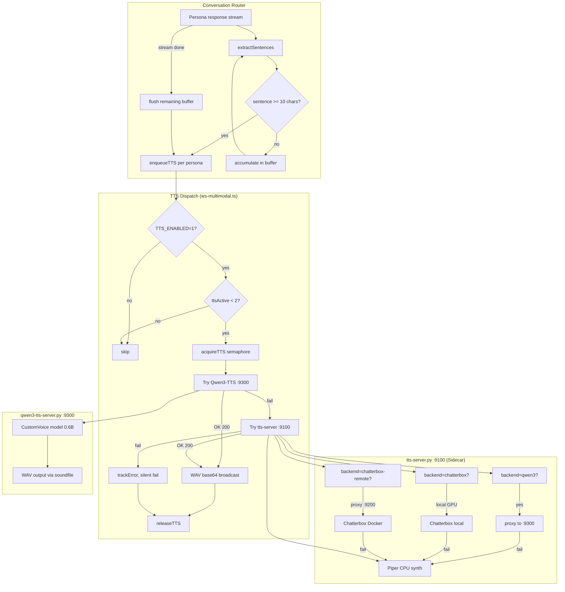
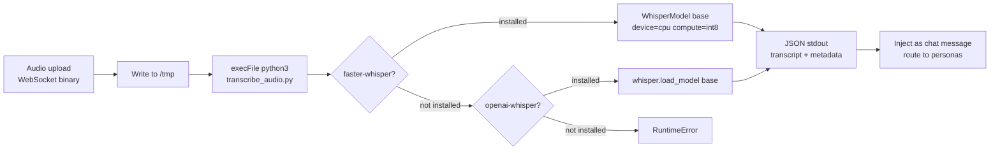
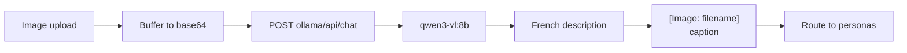
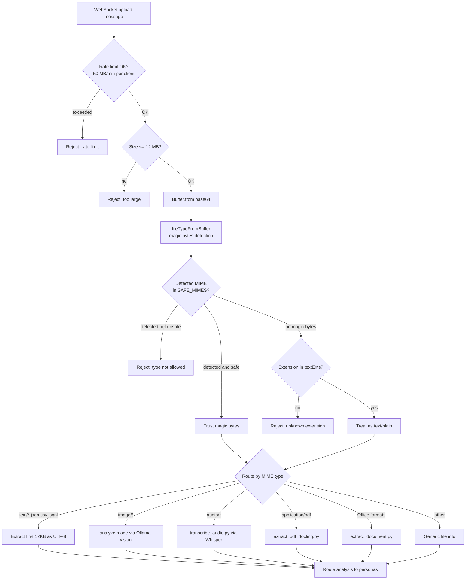
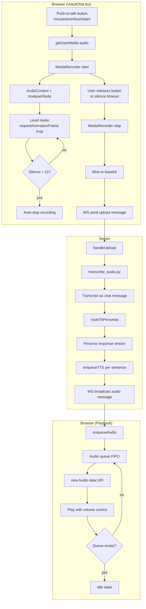
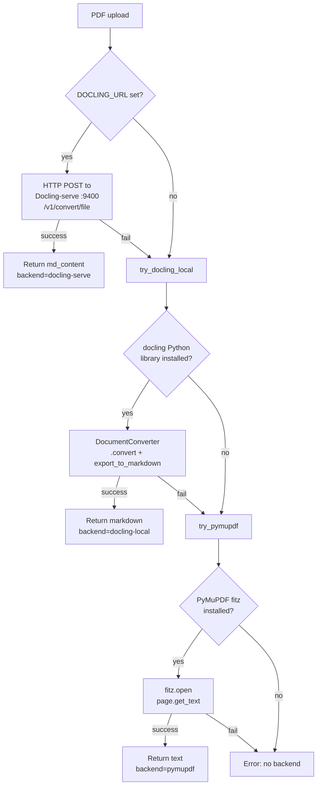

# SPEC_MULTIMODAL -- TTS, Voice, and Multimodal Pipeline

> 3615-KXKM / kxkm_clown -- Specification document
> Last updated: 2026-03-20

---

## Table of Contents

1. [TTS Pipeline](#1-tts-pipeline)
2. [STT (Speech-to-Text)](#2-stt-speech-to-text)
3. [Vision (Image Analysis)](#3-vision-image-analysis)
4. [File Upload Pipeline](#4-file-upload-pipeline)
5. [VoiceChat (Push-to-Talk)](#5-voicechat-push-to-talk)
6. [Docling Integration](#6-docling-integration)

---

## 1. TTS Pipeline

### 1.1 Architecture Overview

The TTS subsystem converts persona text responses into audio, broadcast to clients as base64 WAV over WebSocket. Four backends are available, organized in a fallback chain.



### 1.2 Backends

| Backend | Port | Hardware | Latency | Quality | Model |
|---------|------|----------|---------|---------|-------|
| **Qwen3-TTS** | `:9300` | GPU (~2 GB VRAM) | ~2-5s | High (voice design + cloning) | `Qwen/Qwen3-TTS-12Hz-0.6B-CustomVoice` |
| **Chatterbox** | `:9200` (Docker) or local GPU | GPU | ~3-8s | High (zero-shot cloning) | `chatterbox-mtl-tts` |
| **Piper** | via `:9100` | CPU only | <1s | Medium (predefined voices) | ONNX models (`fr_FR-siwis-medium`, etc.) |
| **Remote proxy** | `:9100` | varies | varies | varies | Routes to configured backend |

### 1.3 Fallback Chain

The API server (`ws-multimodal.ts`) implements a two-tier fallback:

1. **Primary**: Qwen3-TTS at `QWEN3_TTS_URL` (default `http://127.0.0.1:9300`)
   - Sends `{ text, persona, speaker, instruct, language }` to `/synthesize`
   - 30s timeout via `AbortSignal.timeout`
   - On success: returns WAV audio
2. **Secondary**: tts-server sidecar at `TTS_URL` (default `http://127.0.0.1:9100`)
   - Sends `{ text, persona }` to `/synthesize`
   - 60s timeout
   - tts-server itself has its own internal fallback: configured backend -> Piper

The sidecar (`tts-server.py`) adds a third tier depending on its `--backend` flag:
- `qwen3` -> proxy to `:9300` -> Piper fallback
- `chatterbox-remote` -> proxy to `:9200` -> Piper fallback
- `chatterbox` -> local GPU inference -> Piper fallback
- `piper` -> direct Piper synthesis (no fallback needed)

### 1.4 TTS Toggle

- **`TTS_ENABLED` env var**: when `!= "1"`, `enqueueTTS` is a no-op. Default is disabled (`TTS_ENABLED=0`).
- TTS remains available via direct HTTP calls to `/synthesize` on `:9100` or `:9300` (used by `/compose` endpoint and VoiceChat widget).
- The `/compose` endpoint on tts-server delegates to `compose_music.py` for music generation (AudioCraft), separate from speech TTS.

### 1.5 Sentence-Boundary Chunking

The conversation router streams tokens from Ollama and feeds them into a sentence-boundary detector for incremental TTS:

**`extractSentences(buffer)`** splits on the regex `/[.!?;:]\s/`:
- Accumulates tokens in `sentenceBuffer`
- When a sentence boundary is found and the sentence is >= 10 chars, it is dispatched to `enqueueTTS`
- On stream completion, the remaining buffer is flushed
- If no sentences were detected during streaming (e.g., short response), the full text is sent as a single TTS request

**Per-persona TTS queues** (`ttsQueues: Map<string, Promise<void>>`):
- Each persona has its own serial queue
- Prevents overlapping audio from the same persona
- Different personas can synthesize concurrently (up to `MAX_TTS_CONCURRENT = 2`)

### 1.6 Concurrency Control

- `MAX_TTS_CONCURRENT = 2`: global semaphore via `ttsActive` counter
- `acquireTTS()` / `releaseTTS()` bracket each synthesis call
- `isTTSAvailable()` checked before enqueuing; if at capacity, TTS is silently skipped

### 1.7 Persona Voice Mappings (33 personas)

Defined in `apps/api/src/persona-voices.ts`. Each persona maps to a Qwen3-TTS `speaker` preset (one of 9 available speakers) and a style `instruct` string.

**Available speakers**: Aiden, Aria, Bella, Claire, David, Eric, Ryan, Serena, Taylor

| Category | Persona | Speaker | Language | Style Summary |
|----------|---------|---------|----------|---------------|
| Musique/Son | Schaeffer | David | French | Academic authority, measured |
| | Radigue | Serena | French | Very slow, meditative, whisper |
| | Oliveros | Claire | French | Warm, gentle, contemplative |
| | Eno | Ryan | French | Calm, ambient, understated |
| | Cage | Eric | French | Playful, philosophical, pauses |
| | Merzbow | Aiden | French | Intense, raw, aggressive |
| | Oram | Bella | French | Precise, pioneering, electronic |
| | Bjork | Aria | French | Ethereal, expressive, unpredictable |
| Philosophie | Batty | Ryan | French | Melancholic, existential |
| | Foucault | David | French | Sharp, analytical, subversive |
| | Deleuze | Eric | French | Fast, enthusiastic, rhizomatic |
| Science | Hypatia | Claire | French | Ancient wisdom, mathematical |
| | Curie | Bella | French | Determined, passionate |
| | Turing | Aiden | French | Logical, precise, awkward |
| Politique | Swartz | Taylor | French | Young, urgent, activist |
| | Bookchin | David | French | Gruff, ecological |
| | LeGuin | Serena | French | Wise storyteller, feminist |
| Arts/Tech | Picasso | Eric | French | Bold, provocative |
| | Ikeda | Aiden | French | Minimal, data-driven |
| | TeamLab | Aria | French | Collective, immersive |
| | Demoscene | Taylor | French | Excited, technical, demo party |
| Scene/Corps | RoyalDeLuxe | Ryan | French | Grand, theatrical |
| | Decroux | David | French | Physical, mime master |
| | Mnouchkine | Claire | French | Passionate, collective creation |
| | Pina | Bella | French | Emotional, dance-like |
| | Grotowski | Eric | French | Intense, ritual |
| | Fratellini | Taylor | French | Playful, clownesque |
| Transversal | Pharmacius | Ryan | French | Authoritative router |
| | Haraway | Serena | French | Intellectual, cyborg feminist |
| | SunRa | Aiden | French | Cosmic, prophetic |
| | Fuller | David | French | Visionary, systems thinking |
| | Tarkovski | Eric | French | Poetic, slow, cinematic |
| | Moorcock | Ryan | **English** | British fantasy, punk edge |
| | Sherlock | Aiden | French | Analytical, detective |

**Fallback voice**: `{ speaker: "Ryan", instruct: "Speak naturally in French", language: "French" }` for any unrecognized nick.

The Piper backend uses a separate, smaller voice map (5 entries) in `tts-server.py`:
- `default` / `schaeffer`: `fr_FR-siwis-medium`
- `batty`: `fr_FR-upmc-medium`
- `radigue`: `fr_FR-siwis-low`
- `pharmacius`: `fr_FR-gilles-low`
- `moorcock`: `en_GB-alan-medium`

### 1.8 Qwen3-TTS Server Detail

`scripts/qwen3-tts-server.py` exposes two endpoints:

**`POST /synthesize`** -- CustomVoice preset synthesis:
- Input: `{ text, persona, speaker?, instruct?, language? }`
- Resolves speaker/instruct from `PERSONA_MAP` if not explicit
- Uses `Qwen3TTSModel.generate_custom_voice(text, language, speaker, instruct)`
- Output: `audio/wav`

**`POST /clone`** -- Voice cloning from reference audio:
- Input: `{ text, reference_audio (base64 WAV), reference_text?, language? }`
- Uses `Qwen3TTSModel.generate_voice_clone(text, language, ref_audio, ref_text)`
- Loads a separate Base model (~2 GB VRAM, lazy-loaded on first clone request)
- Output: `audio/wav`

**`GET /health`** -- returns model status:
- `{ ok, model, size, custom_loaded, clone_loaded }`

Model options: `0.6b` (default, lower VRAM) or `1.7b` (higher quality).
Uses `flash_attention_2` when `flash_attn` is installed, `bfloat16` precision, CUDA device.

---

## 2. STT (Speech-to-Text)

### 2.1 Architecture

Audio transcription uses a Python script (`scripts/transcribe_audio.py`) invoked as a subprocess by the Node.js API server.



### 2.2 Configuration

| Parameter | Value | Notes |
|-----------|-------|-------|
| Model | `base` | Configurable via `--model` (tiny/base/small/medium/large) |
| Language | `fr` (French) | Hardcoded in upload handler |
| Device | CPU | `compute_type="int8"` for faster-whisper |
| Timeout | 120 seconds | `execFileAsync` timeout in upload handler |
| Concurrency | Max 2 file processors | Shared semaphore with other file processing |

### 2.3 Backend Priority

1. **faster-whisper** (CTranslate2-based): preferred, significantly faster on CPU
2. **openai-whisper**: fallback if faster-whisper not installed
3. Error if neither is available

### 2.4 Output Format

JSON on stdout (last line parsed):
```json
{
  "status": "completed",
  "transcript": "transcribed text here",
  "language": "fr",
  "model": "base",
  "duration": 2.34
}
```

On error: `{ "status": "failed", "transcript": "", "error": "message" }`

### 2.5 Integration Flow

1. Audio file arrives via WebSocket upload
2. Buffer written to `/tmp/kxkm-audio-{timestamp}.{ext}`
3. File processor semaphore acquired
4. Python subprocess runs transcription
5. Transcript injected as chat context: `[Audio: filename]\nTranscription: text`
6. Routed to personas via `routeToPersonas`
7. Temp file cleaned up

---

## 3. Vision (Image Analysis)

### 3.1 Architecture

Image analysis uses Ollama's vision-capable model to generate French descriptions of uploaded images.



### 3.2 Configuration

| Parameter | Value | Notes |
|-----------|-------|-------|
| Model | `qwen3-vl:8b` | Configurable via `VISION_MODEL` env var |
| Ollama endpoint | `OLLAMA_URL/api/chat` | Non-streaming (`stream: false`) |
| Timeout | 5 minutes | AbortController with `setTimeout` |
| Prompt | French | "Analyse cette image en detail..." |

### 3.3 Request Payload

```json
{
  "model": "qwen3-vl:8b",
  "messages": [{
    "role": "user",
    "content": "Analyse cette image en detail. Decris ce que tu vois, le contexte, et tout element notable. Reponds en francais.",
    "images": ["<base64>"]
  }],
  "stream": false
}
```

### 3.4 Error Handling

- HTTP errors: tracked via `trackError("vision", ...)`, returns fallback string `[Image: filename -- analyse echouee: ...]`
- Timeouts: AbortController-based, 5-minute limit
- Missing content: returns `"Pas de description disponible"`

---

## 4. File Upload Pipeline

### 4.1 Architecture



### 4.2 MIME Validation (SEC-03)

**Magic bytes detection** via `file-type` library (npm). The declared MIME type from the client is never trusted; magic bytes take precedence.

**SAFE_MIMES allowlist**:
- Text: `text/plain`, `text/markdown`, `text/csv`
- Data: `application/json`, `application/pdf`
- Images: `image/png`, `image/jpeg`, `image/webp`, `image/gif`
- Audio: `audio/wav`, `audio/mpeg`, `audio/ogg`, `audio/mp4`, `audio/flac`, `audio/x-wav`, `audio/x-flac`
- Office: `application/vnd.openxmlformats-officedocument.{wordprocessingml,spreadsheetml,presentationml}.*`

**Text extensions allowlist** (when no magic bytes detected):
`txt`, `md`, `csv`, `json`, `jsonl`, `xml`, `html`, `yml`, `yaml`, `toml`

### 4.3 Rate Limiting

- **50 MB per minute per client**
- Tracked via `info.uploadBytesWindow` and `info.lastUploadReset`
- Window resets every 60 seconds
- Cumulative within the window

### 4.4 File Size Limit

- Maximum **12 MB** per upload
- Empty uploads rejected

### 4.5 Processing Concurrency

- `MAX_FILE_PROCESSORS = 2`: shared semaphore for all file processing (audio, PDF, documents)
- Busy-wait with 100ms polling: `while (fileProcessActive >= MAX_FILE_PROCESSORS) await sleep(100)`

### 4.6 Routing by Type

| MIME Pattern | Handler | Timeout | Details |
|-------------|---------|---------|---------|
| `text/*`, `application/json`, `.csv`, `.jsonl` | UTF-8 extract | instant | First 12,000 bytes |
| `image/*` | `analyzeImage()` | 5 min | Ollama vision model |
| `audio/*` | `transcribe_audio.py` | 120s | faster-whisper / whisper |
| `application/pdf` | `extract_pdf_docling.py` | 60s | 3-tier Docling fallback |
| Office formats (docx, xlsx, pptx, odt, etc.) | `extract_document.py` | 60s | Python extraction libraries |
| Other | Generic info string | instant | Filename + type + size |

### 4.7 Post-Processing

All extracted content is wrapped in a context message and routed to personas:
```
[L'utilisateur {nick} a partage un fichier: {filename}]
{analysis}

Analyse ce fichier et donne ton avis.
```

---

## 5. VoiceChat (Push-to-Talk)

### 5.1 Architecture



### 5.2 Recording

- **API**: `navigator.mediaDevices.getUserMedia({ audio: true })`
- **Format**: `audio/webm` preferred (falls back to `audio/wav`)
- **Interaction**: Push-to-talk via `mousedown`/`mouseup` + `touchstart`/`touchend`
- **Minimum size**: recordings under 1000 bytes are discarded (too short)

### 5.3 Level Meter Visualization

- `AudioContext` + `AnalyserNode` with `fftSize = 256`
- `getByteFrequencyData` sampled via `requestAnimationFrame`
- Average frequency normalized to 0-1 range (`avg / 80`, clamped)
- Displayed as block characters: `U+2588` (full block) and `U+2591` (light shade)
- 20-character bar width

### 5.4 Silence Detection and Auto-Cutoff

- Silence threshold: `normalized > 0.05` counts as sound
- After 500ms of continuous silence, a 2-second timer starts (`SILENCE_TIMEOUT_MS = 2000`)
- If silence persists for the full 2s, `MediaRecorder.stop()` is called automatically
- Any sound resets the timer

### 5.5 Memory Leak Prevention

Cleanup on unmount and on recording stop:
- `stream.getTracks().forEach(t => t.stop())` -- release microphone
- `cancelAnimationFrame(levelAnimRef.current)` -- stop level monitoring
- `audioCtxRef.current.close()` -- close AudioContext
- `clearTimeout(silenceTimerRef.current)` -- clear silence timer
- `clearInterval(recordingTimerRef.current)` -- clear duration timer
- `currentAudioRef.current.pause()` -- stop any playing audio
- `audioQueueRef.current.length = 0` -- clear audio queue

`mountedRef` guards against state updates after unmount.

### 5.6 Audio Playback Queue

- FIFO queue via `audioQueueRef`
- `isPlayingRef` prevents concurrent playback
- Each audio item plays via `new Audio(data:${mime};base64,${data})`
- Volume controlled by slider (0-100%, persisted in `localStorage`)
- On `ended` or `error`, advances to next item
- Max 30 entries in voice history (`MAX_VOICE_HISTORY`)
- History entries support replay via click on music note icon

### 5.7 WebSocket Message Types Handled

| Type | Handling |
|------|----------|
| `persona` | Register persona color for display |
| `audio` | Add to history + enqueue for playback |
| `message` | Add to history (text-only, no audio) |
| `system` | Detect "est en train d'ecrire" typing indicators; detect transcription results |

---

## 6. Docling Integration

### 6.1 Architecture

PDF extraction uses a 3-tier fallback strategy in `scripts/extract_pdf_docling.py`.



### 6.2 Docling-Serve (Docker)

- **Image**: `ghcr.io/docling-project/docling-serve:latest`
- **Port**: `:9400` externally, `:5001` internally
- **Endpoint**: `POST /v1/convert/file` (multipart form data)
- **UI**: Available at `http://localhost:9400/ui` when `DOCLING_SERVE_ENABLE_UI=1`
- **Health check**: `GET /health` every 30s
- **Docker profile**: `v2` (only starts with `--profile v2`)

### 6.3 Supported Input Formats

Docling-serve supports 16+ document formats including:

| Format | Extension(s) |
|--------|-------------|
| PDF | `.pdf` |
| Word | `.docx`, `.doc` |
| Excel | `.xlsx`, `.xls` |
| PowerPoint | `.pptx`, `.ppt` |
| LibreOffice | `.odt`, `.ods`, `.odp` |
| RTF | `.rtf` |
| EPUB | `.epub` |
| HTML | `.html` |
| Markdown | `.md` |
| Images (OCR) | `.png`, `.jpg`, `.tiff` |
| AsciiDoc | `.adoc` |

For non-PDF Office formats, a separate handler (`extract_document.py`) provides native Python extraction using `python-docx`, `openpyxl`, `python-pptx`, `odfpy`, `striprtf`, and `EbookLib`.

### 6.4 Fallback Chain Detail

| Tier | Backend | Dependency | Quality | Speed |
|------|---------|-----------|---------|-------|
| 1 | Docling HTTP | `DOCLING_URL` env + running container | Highest (layout-aware, tables, figures) | ~5-15s |
| 2 | Docling local | `pip install docling` | High (same engine, no Docker) | ~5-15s |
| 3 | PyMuPDF | `pip install PyMuPDF` | Basic (text only, no layout) | <1s |

### 6.5 Configuration

| Parameter | Value | Source |
|-----------|-------|--------|
| `DOCLING_URL` | `http://localhost:9400` | docker-compose env |
| Max chars | 12,000 | `--max-chars` default |
| Timeout (HTTP) | 60s | `urllib.request.urlopen` timeout |
| Timeout (subprocess) | 60s | `execFileAsync` in upload handler |

### 6.6 HTTP Multipart Upload

The Docling HTTP client builds multipart form data manually (no `requests` dependency):
- Boundary: `----DoclingBoundary{timestamp_ms}`
- Content-Disposition: `form-data; name="files"; filename="{name}"`
- Content-Type: `application/pdf`

Response parsing extracts text from: `document.md_content` > `document.text_content` > `text` > `markdown` > raw JSON dump.

---

## Appendix: Environment Variables

| Variable | Default | Description |
|----------|---------|-------------|
| `TTS_ENABLED` | `0` | Enable TTS in chat (`1` to enable) |
| `TTS_URL` | `http://127.0.0.1:9100` | tts-server sidecar URL |
| `QWEN3_TTS_URL` | `http://127.0.0.1:9300` | Qwen3-TTS server URL |
| `TTS_BACKEND` | `piper` | tts-server backend: `piper`, `chatterbox`, `chatterbox-remote`, `qwen3` |
| `CHATTERBOX_URL` | `http://127.0.0.1:9200` | Chatterbox Docker server URL |
| `VISION_MODEL` | `qwen3-vl:8b` | Ollama vision model for image analysis |
| `DOCLING_URL` | `http://localhost:9400` | Docling-serve HTTP API URL |
| `PYTHON_BIN` | `python3` | Python binary for subprocess calls |
| `SCRIPTS_DIR` | `scripts/` | Path to Python scripts directory |
| `PIPER_VOICE_DIR` | `data/piper-voices` | Piper ONNX voice model directory |
| `KXKM_VOICE_SAMPLES_DIR` | `data/voice-samples` | Voice sample WAV files for Chatterbox cloning |

## Appendix: Port Map

| Port | Service | Protocol |
|------|---------|----------|
| `:9100` | tts-server.py (sidecar proxy) | HTTP |
| `:9200` | Chatterbox Docker | HTTP |
| `:9300` | qwen3-tts-server.py | HTTP |
| `:9400` | Docling-serve (Docker) | HTTP |
