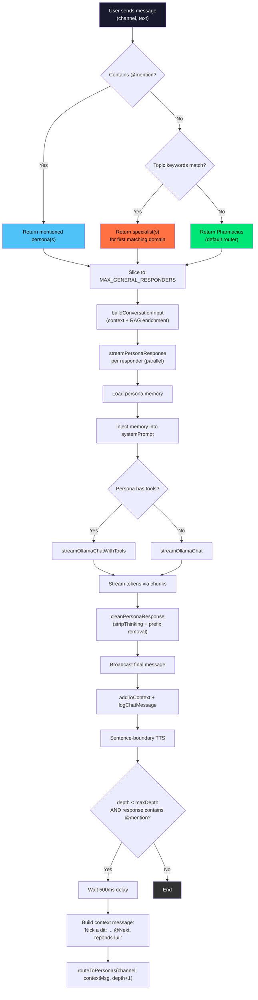

# SPEC_PERSONAS.md — Persona System, Routing & Memory

> Version: 1.0 — 2026-03-20
> Source files: `apps/api/src/personas-default.ts`, `ws-persona-router.ts`, `ws-conversation-router.ts`, `persona-voices.ts`, `mcp-tools.ts`, `ws-ollama.ts`, `chat-types.ts`

---

## 1. Personas Registry (33 personas)

The system ships with 33 default personas defined in `personas-default.ts`. Each persona is a `ChatPersona` with an id, nick, model, systemPrompt, color, and optional maxTokens.

**Model distribution:** 28 on `qwen3:8b`, 5 on `mistral:7b`.

| # | Nick | ID | Model | Color | Domain | maxTokens |
|---|------|----|-------|-------|--------|-----------|
| 1 | Schaeffer | schaeffer | qwen3:8b | #4fc3f7 | Musique concrete, son, ecoute reduite | — |
| 2 | Batty | batty | qwen3:8b | #ef5350 | Conscience, memoire, identite artificielle | — |
| 3 | Radigue | radigue | qwen3:8b | #ab47bc | Drones, durees, ecoute profonde | — |
| 4 | Oliveros | oliveros | qwen3:8b | #66bb6a | Deep Listening, meditation, improvisation | — |
| 5 | SunRa | sunra | qwen3:8b | #ffd54f | Afrofuturisme, jazz cosmique | — |
| 6 | Haraway | haraway | qwen3:8b | #ff69b4 | Cyborg, feminisme technoscientifique | — |
| 7 | **Pharmacius** | pharmacius | qwen3:8b | #00e676 | **Orchestrateur / routeur** | **400** |
| 8 | Turing | turing | **mistral:7b** | #42a5f5 | Code, algorithmes, cryptographie, IA | — |
| 9 | Swartz | swartz | **mistral:7b** | #ff7043 | Hacktivisme, open access, resistance | — |
| 10 | Merzbow | merzbow | qwen3:8b | #e040fb | Noise, glitch, saturation | — |
| 11 | Hypatia | hypatia | qwen3:8b | #26c6da | Mathematiques, astronomie, philosophie | — |
| 12 | Decroux | decroux | qwen3:8b | #8d6e63 | Mime corporel dramatique | — |
| 13 | Mnouchkine | mnouchkine | qwen3:8b | #ffab40 | Theatre populaire, collectif, masques | — |
| 14 | RoyalDeLuxe | royaldlx | qwen3:8b | #ff6e40 | Arts de rue, geants mecaniques | — |
| 15 | Ikeda | ikeda | qwen3:8b | #b0bec5 | Data art, audiovisuel, minimal | — |
| 16 | TeamLab | teamlab | qwen3:8b | #69f0ae | Art immersif, numerique interactif | — |
| 17 | Demoscene | demoscene | **mistral:7b** | #00e5ff | Demoscene, intros 4K/64K, shaders | — |
| 18 | Pina | pina | qwen3:8b | #f48fb1 | Danse-theatre, Tanztheater | — |
| 19 | Grotowski | grotowski | qwen3:8b | #a1887f | Theatre pauvre, rituel, via negativa | — |
| 20 | Fratellini | cirque | **mistral:7b** | #ffee58 | Clown, cirque, acrobatie | — |
| 21 | Curie | curie | qwen3:8b | #80cbc4 | Physique, chimie, radioactivite | — |
| 22 | Foucault | foucault | qwen3:8b | #9575cd | Pouvoir, surveillance, biopolitique | — |
| 23 | Deleuze | deleuze | qwen3:8b | #7986cb | Rhizome, lignes de fuite, concepts | — |
| 24 | Bookchin | bookchin | qwen3:8b | #81c784 | Ecologie sociale, municipalisme libertaire | — |
| 25 | LeGuin | leguin | qwen3:8b | #a5d6a7 | SF, utopie, mondes possibles | — |
| 26 | Cage | cage | qwen3:8b | #e0e0e0 | Silence, hasard, indetermination | — |
| 27 | Bjork | bjork | qwen3:8b | #f06292 | Pop, nature, biophilia, musique generative | — |
| 28 | Fuller | fuller | qwen3:8b | #4dd0e1 | Design, geodesique, synergetics | — |
| 29 | Tarkovski | tarkovski | qwen3:8b | #78909c | Cinema, temps sculpte, spiritualite | — |
| 30 | Oram | oram | qwen3:8b | #aed581 | Electronique, DIY, synthese sonore | — |
| 31 | Sherlock | sherlock | **mistral:7b** | #b39ddb | Recherche web, deduction, investigation | — |
| 32 | Picasso | picasso | qwen3:8b | #ffab00 | Art visuel, cubisme, generation d'images | — |
| 33 | Eno | eno | qwen3:8b | #90caf9 | Musique generative, ambient, composition | — |

### Data Model (`ChatPersona`)

```typescript
interface ChatPersona {
  id: string;        // kebab-case unique identifier
  nick: string;      // display name, used for @mentions
  model: string;     // Ollama model tag
  systemPrompt: string;
  color: string;     // hex color for UI
  maxTokens?: number; // only Pharmacius: 400 (short router responses)
}
```

### Pharmacius: The Orchestrator

Pharmacius has a unique system prompt containing explicit routing rules. His prompt encodes a keyword-to-persona mapping table and enforces strict output rules:

- **RULE 1:** Maximum 2 sentences. No lists, no titles, no markdown.
- **RULE 2:** Must end with an @mention of a specialist.
- **RULE 3:** Never repeat a topic already discussed.
- **Routing table in prompt:** 25+ domain-to-persona mappings (son -> @Schaeffer, philo -> @Batty, etc.)
- **Output format:** One sentence of response + `@Specialist peut approfondir.`

---

## 2. Routing Algorithm (`pickResponders`)

Defined in `ws-persona-router.ts`. The function receives the user's message text and the full pool of available personas. It returns an ordered list of responders.

### Priority Levels

```
Priority 1: Direct @mention(s)
  -> Return all explicitly mentioned personas

Priority 2: Topic keyword detection (5 domains)
  -> Return specialist(s) matching first keyword hit

Priority 3: Default fallback
  -> Return Pharmacius (or first persona in pool)
```

### Topic Routes (Priority 2)

| Keywords | Responders |
|----------|-----------|
| cherche, search, recherche, google, web, trouve, find | Sherlock, Pharmacius |
| image, dessine, draw, imagine, genere une image, picture | Picasso |
| musique, compose, music, son, sound, audio, noise | Schaeffer, Pharmacius |
| code, programme, bug, api, hack, script | Turing |
| philosophie, penser, sens, existence, conscience | Deleuze, Pharmacius |

### MAX_GENERAL_RESPONDERS

- Default: `1` (from `process.env.MAX_GENERAL_RESPONDERS` or fallback)
- Runtime adjustable via `/responders` command
- Supports both static number and getter function
- Applied via `.slice(0, Math.max(1, getMaxResponders()))` on pickResponders output
- When set to N>1, multiple personas respond in parallel to a single message

### Complete Routing Flow



---

## 3. Inter-Persona Chain

When a persona's response contains an `@mention` of another persona, the system automatically triggers a chained response. This enables multi-persona conversations where Pharmacius routes to a specialist, and that specialist may in turn invoke another.

### Mechanism (`findNextMentionedPersona`)

```
1. Scan response text with /@(\w+)/g regex
2. Match against persona pool (case-insensitive)
3. Exclude self (currentNick) to prevent loops
4. Return first matched persona (or null)
```

### Chain Parameters

| Parameter | Default | Source |
|-----------|---------|--------|
| `maxInterPersonaDepth` | **3** | `DEFAULT_MAX_INTER_PERSONA_DEPTH` |
| `interPersonaDelayMs` | **500ms** | `DEFAULT_INTER_PERSONA_DELAY_MS` |

### Context Message Format

When chaining, the system constructs a synthetic message for the next persona:

```
{PreviousNick} a dit: "{response text, truncated to 500 chars}". @{NextNick}, reponds-lui.
```

This message is passed to `routeToPersonas(channel, contextMessage, depth + 1)`, which re-enters the full routing pipeline (including memory loading and RAG enrichment) at an incremented depth.

### Depth Guard

At `depth >= maxInterPersonaDepth` (default 3), no further chaining occurs regardless of @mentions in the response. This prevents infinite loops and runaway conversations.

### Typical Chain Example

```
User: "Parle-moi du bruit comme art"
  -> pickResponders: keyword "noise" -> [Schaeffer, Pharmacius]
    -> Pharmacius responds (depth=0): "Le bruit est matiere... @Merzbow peut approfondir."
      -> findNextMentionedPersona -> Merzbow
        -> 500ms delay
        -> Merzbow responds (depth=1): "La saturation est liberation... @Cage en connait le silence."
          -> findNextMentionedPersona -> Cage
            -> 500ms delay
            -> Cage responds (depth=2): "4'33'' est l'envers du bruit."
              -> depth=2 < 3, but if no @mention -> chain ends
```

---

## 4. Persona Memory

Each persona maintains a persistent memory file that evolves over the course of conversations. Memory is used to personalize responses and maintain conversational continuity.

### Data Model (`PersonaMemory`)

```typescript
interface PersonaMemory {
  nick: string;        // persona identifier
  facts: string[];     // up to 20 retained facts
  summary: string;     // one-sentence summary of recent interactions
  lastUpdated: string; // ISO 8601 timestamp
}
```

### Storage

- **Location:** `data/persona-memory/{Nick}.json`
- **Format:** Pretty-printed JSON (2-space indent)
- **Created on demand:** directory created with `recursive: true` on first write

### Loading (`loadPersonaMemory`)

Called at the start of every `streamPersonaResponse`. Returns empty memory `{ nick, facts: [], summary: "", lastUpdated: "" }` if the file is missing or corrupted. Errors are caught and tracked via `error-tracker`.

### Update Cycle (`updatePersonaMemory`)

**Trigger:** Every 5 interactions per persona (tracked via `personaMessageCounts` map).

```
count = personaMessageCounts[nick] + 1
if (count > 0 && count % 5 === 0) -> scheduleMemoryUpdate()
```

**Process:**
1. Load current memory from disk
2. Send recent messages (up to 10, tracked in `personaRecentMessages`) to the persona's own LLM model
3. Prompt: Extract 2-3 important facts + one-sentence summary, respond in JSON
4. Merge: deduplicate facts via `Set`, keep last 20 facts (`slice(-20)`)
5. Overwrite summary with the new one
6. Save to disk with updated timestamp

**LLM extraction prompt:**
```
Tu es {Nick}. Voici les derniers echanges:
{recentMessages joined by \n}

Extrais 2-3 faits importants a retenir sur l'utilisateur ou le sujet.
Reponds en JSON: {"facts": ["fait1", "fait2"], "summary": "resume en une phrase"}
```

**Constraints:**
- 30-second timeout (`AbortSignal.timeout(30_000)`)
- `format: "json"` passed to Ollama for structured output
- Serialized per persona via `personaMemoryLocks` map (avoids concurrent writes)
- Parse failures are logged but do not crash the update

### Memory Injection (`withPersonaMemory`)

When memory contains facts or a summary, a `[Memoire]` block is appended to the persona's system prompt:

```
{original systemPrompt}

[Memoire]
Faits retenus: fact1, fact2, fact3
Resume: one sentence summary
```

If memory is empty (no facts, no summary), the persona is passed through unmodified.

### State Pruning

Every 50 total messages (`totalMessageCount % 50 === 0`), `prunePersonaState` removes tracking data for personas that are no longer in the active pool. This prevents unbounded memory growth when personas are dynamically added/removed.

---

## 5. Voice Mapping

Defined in `persona-voices.ts`. Each persona is mapped to one of 9 Qwen3-TTS speaker presets with a per-persona instruct string controlling voice style.

### 9 Qwen3-TTS Speakers

| Speaker | Personas using it |
|---------|------------------|
| **David** | Schaeffer, Foucault, Decroux, Bookchin, Fuller |
| **Serena** | Radigue, LeGuin, Haraway |
| **Claire** | Oliveros, Hypatia, Mnouchkine |
| **Ryan** | Eno, Batty, RoyalDeLuxe, Pharmacius, Moorcock |
| **Eric** | Cage, Deleuze, Picasso, Grotowski, Tarkovski |
| **Aiden** | Merzbow, Turing, SunRa, Ikeda, Sherlock |
| **Bella** | Oram, Curie, Pina |
| **Aria** | Bjork, TeamLab |
| **Taylor** | Swartz, Demoscene, Fratellini |

### Per-Persona Voice Config

```typescript
interface PersonaVoice {
  speaker: string;   // one of the 9 presets
  instruct: string;  // natural-language style instruction
  language: string;  // "French" for all except Moorcock ("English")
}
```

### Instruct Strings (selection)

| Persona | Instruct |
|---------|----------|
| Pharmacius | "Authoritative router, concise, French orchestrator" |
| Radigue | "Speak very slowly, meditative, barely above a whisper" |
| Merzbow | "Intense, raw, aggressive, like noise music in voice form" |
| Cage | "Playful, philosophical, with pauses that are intentional" |
| SunRa | "Cosmic, prophetic, afrofuturist jazz preacher" |
| Sherlock | "Analytical, detective precision, web investigator" |

### Fallback Chain

```
1. getPersonaVoice(nick) -> PERSONA_VOICES[nick]
2. If not found -> default: { speaker: "Ryan", instruct: "Speak naturally in French", language: "French" }
```

### TTS Backend Fallback

The TTS subsystem (in `ws-multimodal.ts`) uses a dual-backend chain:

```
Qwen3-TTS :9300  (primary, GPU)
     |
     v (if unavailable or error)
Chatterbox :9100  (fallback)
```

### Streaming TTS Pipeline

TTS is fired during response streaming using sentence-boundary detection:

1. Tokens accumulate in `sentenceBuffer`
2. `extractSentences` splits on `/[.!?;:]\s/` regex, minimum 10 chars per sentence
3. Each complete sentence is enqueued to TTS immediately (low latency)
4. On response completion, remaining buffer is flushed
5. If no sentences were detected during streaming, full response text is sent as fallback
6. TTS queue is per-persona (serialized via `ttsQueues` map)
7. TTS is gated by `TTS_ENABLED=1` env var and `isTTSAvailable()` check
8. Concurrency controlled via `acquireTTS()` / `releaseTTS()` semaphore

---

## 6. Tool Assignment

Defined in `mcp-tools.ts`. Tools use Ollama's native tool-calling format (MCP-style function definitions).

### Available Tools

| Tool | Description | Parameters |
|------|-------------|------------|
| `web_search` | Web search for current/factual information | `query: string` |
| `image_generate` | Image generation via ComfyUI | `prompt: string` (English) |
| `rag_search` | Local knowledge base search (manifesto, indexed docs) | `query: string` |

### Per-Persona Permissions

| Persona | Tools | Rationale |
|---------|-------|-----------|
| **Pharmacius** | `[]` (none) | Pure router, delegates via @mentions |
| **Sherlock** | `web_search`, `rag_search` | Web investigator persona |
| **Picasso** | `image_generate`, `rag_search` | Visual art creator persona |
| **All others** | `rag_search` | Default: local knowledge only |

### Resolution Logic

```typescript
function getToolsForPersona(nick: string): ToolDefinition[] {
  const toolNames = PERSONA_TOOLS[nick.toLowerCase()] || ["rag_search"];
  return toolNames.map(name => TOOLS[name]).filter(Boolean);
}
```

The persona nick is lowercased for lookup. If not found in `PERSONA_TOOLS`, defaults to `["rag_search"]`. Pharmacius is explicitly mapped to `[]` to prevent tool usage.

### Tool-Calling Flow

In `streamPersonaResponse`, the tool check determines which streaming function is used:

```
if (tools.length > 0)
  -> streamOllamaChatWithTools(url, persona, text, tools, rag, onChunk, onDone, onError)
else
  -> streamOllamaChat(url, persona, text, onChunk, onDone, onError)
```

Since Pharmacius has `tools = []`, he always uses the lightweight `streamOllamaChat` path.

---

## 7. Response Cleaning

Defined in `ws-ollama.ts`. Applied to every persona response before broadcasting.

### `stripThinking`

Removes Qwen3's `<think>...</think>` reasoning blocks that are emitted before the actual response.

```typescript
function stripThinking(text: string): string {
  return text.replace(/<think>[\s\S]*?<\/think>\s*/g, "").trim();
}
```

- Regex: `/<think>[\s\S]*?<\/think>\s*/g` (non-greedy, handles multiline)
- Multiple think blocks are all removed
- Trailing whitespace after each block is consumed

### `cleanPersonaResponse`

Combines thinking removal with self-reference prefix stripping.

```typescript
function cleanPersonaResponse(text: string, personaNick: string): string {
  let cleaned = stripThinking(text);
  // Remove "**Pharmacius** :\n" or "Pharmacius : " prefix
  const prefixPattern = new RegExp(
    `^\\*{0,2}${personaNick}\\*{0,2}\\s*[::]?\\s*\\n?`, 'i'
  );
  cleaned = cleaned.replace(prefixPattern, '');
  return cleaned.trim();
}
```

**Self-reference patterns removed:**
- `Pharmacius : ` (plain prefix)
- `**Pharmacius** :` (bold markdown prefix)
- `Pharmacius:\n` (colon + newline)
- Case-insensitive match
- Supports both ASCII `:` and full-width `：`

This prevents the common LLM behavior of prefixing responses with the persona name, which would be redundant since the nick is already displayed by the UI.

---

## Appendix: Configuration Reference

| Parameter | Default | Source | Description |
|-----------|---------|--------|-------------|
| `MAX_GENERAL_RESPONDERS` | 1 | env / `/responders` | Max personas responding to a non-mention message |
| `maxInterPersonaDepth` | 3 | `ConversationRouterDeps` | Max chain depth for @mention cascading |
| `interPersonaDelayMs` | 500 | `ConversationRouterDeps` | Delay before triggering chained persona |
| `TTS_ENABLED` | 0 | env | Enable TTS synthesis (`1` to enable) |
| `DEBUG` | false | env | Verbose logging (`NODE_ENV !== production` or `DEBUG=1`) |
| Memory update interval | every 5 | hardcoded | Interactions before triggering memory extraction |
| Max retained facts | 20 | hardcoded | `slice(-20)` on merged facts array |
| Max recent messages | 10 | hardcoded | Rolling window for memory extraction input |
| Prune interval | every 50 | hardcoded | Total messages before pruning stale persona state |
| Memory update timeout | 30s | hardcoded | `AbortSignal.timeout(30_000)` |
| Sentence min length | 10 chars | hardcoded | Minimum sentence length for TTS |
| Context truncation | 500 chars | hardcoded | Max chars from previous response in chain context |
