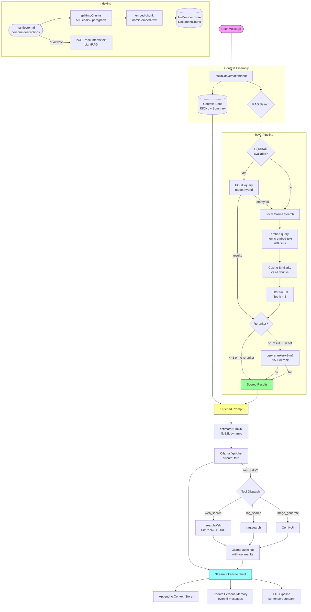

# SPEC_RAG -- RAG, Search & Context Store

> 3615-KXKM / kxkm_clown -- Specification document
> Date: 2026-03-20
> Status: **living document** -- follows the implementation in `apps/api/src/`

---

## Table of Contents

1. [Local RAG Pipeline](#1-local-rag-pipeline)
2. [LightRAG Integration](#2-lightrag-integration)
3. [Reranker (bge-reranker-v2-m3)](#3-reranker-bge-reranker-v2-m3)
4. [Context Store](#4-context-store)
5. [Conversation Input Assembly](#5-conversation-input-assembly)
6. [Web Search](#6-web-search)
7. [Pipeline Diagram](#7-pipeline-diagram)

---

## 1. Local RAG Pipeline

**Source:** `apps/api/src/rag.ts` -- class `LocalRAG`

### 1.1 Embedding Model

| Parameter | Default | Env override |
|-----------|---------|--------------|
| Model | `nomic-embed-text` | `RAG_EMBEDDING_MODEL` |
| Dimensions | 768 | -- (model intrinsic) |
| API endpoint | `{OLLAMA_URL}/api/embed` | -- |

On startup (`init()`), the system checks whether the embedding model is available on the Ollama instance (`/api/tags`). If missing, it automatically pulls it (`/api/pull`, 5 min timeout).

### 1.2 Chunk Configuration

| Parameter | Default | Env override |
|-----------|---------|--------------|
| Chunk size (chars) | 500 | `RAG_CHUNK_SIZE` |
| Min cosine similarity | 0.3 | `RAG_MIN_SIMILARITY` |
| Max results returned | 3 | `RAG_MAX_RESULTS` |

### 1.3 Indexing Flow

```
Document (e.g. manifeste.md, persona description)
  │
  ▼
splitIntoChunks(text, RAG_CHUNK_SIZE)
  │  Splits on double-newline (\n\n+) paragraph boundaries
  │  Merges consecutive short paragraphs until maxChars reached
  │
  ▼
For each chunk:
  embed(chunk)  →  POST /api/embed { model, input }
  │
  ▼
Store in-memory: { id: "{source}_{idx}", text, source, embedding: number[768] }
```

The `source` field identifies origin (e.g. `"manifeste"`, `"persona:Schaeffer"`). Each chunk ID is formed as `{source}_{global_index}`.

When LightRAG is configured, `addDocument()` performs a **dual write**: the full text is also POSTed to `{LIGHTRAG_URL}/documents/text`. Local indexing always proceeds regardless of LightRAG success.

### 1.4 Search Flow

```
User query
  │
  ▼
embed(query)  →  768-dim vector
  │
  ▼
Score all chunks via cosineSimilarity(queryVec, chunkVec)
  │
  ▼
Filter: score >= RAG_MIN_SIMILARITY (default 0.3)
  │
  ▼
Sort descending, take top-k (RAG_MAX_RESULTS, default 3)
  │
  ▼
Optional reranker pass (see section 3)
  │
  ▼
Return: Array<{ text, source, score }>
```

### 1.5 Cosine Similarity

Implemented inline with guard clauses:
- Returns 0 if vectors have different lengths or are empty.
- Returns 0 if denominator is zero (all-zero vector).
- No external dependency -- pure arithmetic loop.

---

## 2. LightRAG Integration

**Config:** `RAGOptions.lightragUrl` (e.g. `http://localhost:9621`)

### 2.1 Graph-Based Search

LightRAG provides knowledge-graph-augmented retrieval. When configured, the search pipeline queries it **before** local cosine search:

```
POST {lightragUrl}/query
Body: { "query": "<user text>", "mode": "hybrid" }
```

The response may contain:
- `references[]` -- structured chunks with `content` or `text` fields.
- `response` -- a synthesized answer (used as a single chunk if no structured references).

LightRAG results are assigned `source: "lightrag"` and `score: 1.0` (highest confidence, since they come from graph reasoning).

### 2.2 Fallback Behavior

The pipeline follows a strict fallback chain:

1. **LightRAG available and returns results** -- use those, pass to reranker, return.
2. **LightRAG available but returns empty** -- fall through to local cosine search.
3. **LightRAG request fails** (network error, non-200 status) -- log warning via `trackError("rag_lightrag_search")`, fall through to local cosine search.
4. **LightRAG not configured** (`lightragUrl` undefined) -- skip entirely, use local.

This guarantees that RAG always returns results when matching documents exist, regardless of LightRAG availability.

### 2.3 Dual Write

On `addDocument()`, when LightRAG is configured:
- Full text is POSTed to `{lightragUrl}/documents/text`.
- Failure is logged but does **not** prevent local indexing.
- No retry logic -- single attempt with default timeout.

---

## 3. Reranker (bge-reranker-v2-m3)

**Config:** `RAGOptions.rerankerUrl` or `RERANKER_URL` env (e.g. `http://localhost:9500`)

### 3.1 Cross-Encoder Scoring

The reranker is a BGE-reranker-v2-m3 model exposed as an HTTP service on port 9500. It performs cross-encoder scoring: given a query-document pair, it produces a single relevance score that is more accurate than the initial bi-encoder cosine similarity.

### 3.2 When Triggered

The reranker is invoked **after** the initial search (either LightRAG or local cosine) under these conditions:

- `rerankerUrl` is configured (via constructor option or `RERANKER_URL` env).
- The result set contains **more than 1 result** (`results.length > 1`).

If only 0 or 1 results exist, the reranker is skipped (no value in reranking a single result).

### 3.3 API Contract

```
POST {rerankerUrl}/rerank
Body: {
  "query": "<user query>",
  "documents": ["<chunk text 1>", "<chunk text 2>", ...],
  "top_k": <maxResults>
}
Timeout: 5000 ms

Response: {
  "results": [
    { "text": "<chunk text>", "score": <float> },
    ...
  ]
}
```

### 3.4 Score Normalization

Scores returned by the reranker **replace** the original cosine similarity scores. The `source` metadata is preserved by maintaining a `text -> source` map from the original results.

### 3.5 Failure Handling

If the reranker is unreachable or returns a non-200 status:
- Error is tracked via `trackError("rag_rerank")`.
- Original result ordering is preserved (graceful degradation).
- No retry.

---

## 4. Context Store

**Source:** `apps/api/src/context-store.ts` -- class `ContextStore`

### 4.1 JSONL Persistence

Each channel's conversation history is stored as a JSONL file:

```
data/context/{channel_safe}.jsonl       -- raw entries, one JSON per line
data/context/{channel_safe}.summary.json -- compacted summary
```

Channel names are sanitized: non-alphanumeric characters (except `_` and `-`) are replaced with `_`.

Each entry has the shape:

```typescript
interface ContextEntry {
  ts: string;      // ISO 8601 timestamp
  nick: string;    // speaker nickname
  text: string;    // message text (capped at 2000 chars per entry)
  type: "message" | "upload" | "system";
}
```

Write operations use per-channel locks (promise chains) to prevent concurrent writes during compaction.

### 4.2 Compaction via LLM Summarization

Compaction triggers when **both** conditions are met:
- File size >= 1 MB.
- Entry count >= `maxEntriesBeforeCompact` threshold.

Compaction process:

1. Split entries: **80% oldest** go to summarization, **20% most recent** are kept raw.
2. Build text from the oldest entries (`nick: text` format, capped at 30,000 chars for LLM context).
3. If a previous summary exists, the LLM is asked to **consolidate** the old summary with new entries.
4. If no previous summary, the LLM creates a fresh summary.
5. Summary is saved to `{channel}.summary.json` with metadata:
   - `entriesCompacted` -- cumulative count of compacted entries.
   - `totalCompactions` -- number of compaction passes performed.
   - `lastCompactedAt` -- ISO timestamp.
6. The JSONL file is **rewritten** with only the recent 20% of entries.

**Compaction model:** `qwen3.5:9b` (configurable via `compactionModel`), called via `POST {ollamaUrl}/api/chat` with 120s timeout.

### 4.3 RAM-Aware Limits

Defaults scale automatically based on `os.totalmem()`:

| Total RAM | maxEntries | maxFile (MB) | maxTotal (MB) | maxContext (chars) | maxSummary (chars) |
|-----------|-----------|-------------|--------------|-------------------|-------------------|
| <= 8 GB | 300 | 40 | 256 | 8,000 | 10,000 |
| <= 16 GB | 400 | 75 | 512 | 12,000 | 15,000 |
| <= 32 GB | 600 | 120 | 900 | 12,000 | 24,000 |
| > 32 GB (64 GB) | 900 | 180 | 1,400 | 20,000 | 32,000 |

Additionally, a **memory pressure factor** is applied at runtime based on `os.freemem() / os.totalmem()`:

| Free memory ratio | Pressure factor | Effect |
|-------------------|----------------|--------|
| < 8% | 0.35 | Aggressively reduce limits |
| < 15% | 0.60 | Moderately reduce limits |
| >= 15% | 1.00 | Use configured limits |

Effective limits: `max(floor, configured * pressureFactor)` where floors are 16 MB per file and 128 MB total.

### 4.4 Global Limit Enforcement

When total storage exceeds `effectiveMaxTotalMB`:
1. The **current** channel is compacted first (if over per-channel cap).
2. Then **other** channels are trimmed, oldest-modified first, keeping 50% of their entries.
3. The current/preferred channel is preserved as long as possible.

### 4.5 `getContext()` Budget Allocation

The `getContext(channel, maxChars?)` method assembles context for prompt injection with a two-part budget:

```
Total budget: maxContextChars (e.g. 12,000 chars)
  │
  ├── Summary budget: min(summaryLength, totalBudget - 256)
  │     Prefixed with "[Resume des conversations precedentes]"
  │
  └── Recent budget: totalBudget - actualSummaryLength
        Reads JSONL from end, adds entries until budget exhausted
        Prefixed with "[Echanges recents]"
```

The 256-char minimum reserved for recent entries ensures at least a few recent messages are always included, even when the summary is large.

---

## 5. Conversation Input Assembly

**Source:** `apps/api/src/ws-conversation-router.ts` -- function `buildConversationInput()`

### 5.1 Enriched Prompt Structure

```
{user message}

[Contexte conversationnel]
{context store output -- summary + recent entries}

[Contexte pertinent]
{RAG result 1}
---
{RAG result 2}
---
{RAG result 3}
```

Assembly logic:

1. Start with the raw user message.
2. Call `getContextString(channel)` -- appends conversation context if non-empty.
3. If RAG is available and has indexed documents (`rag.size > 0`), call `rag.search(text)`. Results are joined with `\n---\n` separator.
4. RAG errors are silently caught -- the user message always flows through.

### 5.2 Token Budget Management with Dynamic `num_ctx`

**Source:** `apps/api/src/ws-ollama.ts` -- function `estimateNumCtx()`

The enriched prompt (system prompt + assembled user message) is measured to dynamically size the Ollama context window:

```
promptTokens = ceil((systemPrompt.length + userMessage.length) / 4)
  (heuristic: ~4 chars per token for French text)

needed = promptTokens + 2048  (minimum response headroom)

num_ctx = ceil(needed / 2048) * 2048  (round up to nearest 2k)
num_ctx = clamp(num_ctx, 4096, 32768)  (hard bounds: 4k to 32k)
```

This ensures:
- Small prompts do not waste VRAM with unnecessarily large context windows.
- Large enriched prompts (heavy context + RAG results) get adequate room.
- The 32k ceiling prevents OOM on consumer GPUs (RTX 4090 with large models).

The `num_ctx` value is passed in `options` for every Ollama `/api/chat` call (streaming, non-streaming, and tool-probe calls).

### 5.3 Persona Memory Enrichment

Before the Ollama call, persona-specific memory (facts and summary from `ws-persona-router.ts`) is appended to the system prompt as a `[Memoire]` block. This is separate from the conversation context and RAG results.

---

## 6. Web Search

**Source:** `apps/api/src/web-search.ts` -- function `searchWeb()`

### 6.1 Search Provider Chain

```
SearXNG (self-hosted, primary)
  │ fail/unavailable
  ▼
Custom Search API (if WEB_SEARCH_API_BASE set)
  │ fail/no results
  ▼
DuckDuckGo JSON API (instant answers)
  │ no results
  ▼
DuckDuckGo Lite HTML (scraping fallback)
  │ no results
  ▼
"(Aucun resultat trouve)"
```

### 6.2 SearXNG (Primary)

| Parameter | Value |
|-----------|-------|
| URL | `SEARXNG_URL` env, default `http://localhost:8080` |
| Engines | `google,bing,duckduckgo` |
| Format | JSON |
| Timeout | 10,000 ms |
| Max results | 5 |
| User-Agent | `KXKM_Clown/2.0` |

### 6.3 DuckDuckGo (Fallback)

Two-stage fallback:

1. **DuckDuckGo JSON API** (`api.duckduckgo.com`): extracts `Abstract` (main result) and `RelatedTopics` (up to 5 total). 10s timeout.
2. **DuckDuckGo Lite HTML**: regex-based link extraction from HTML as a last resort. Filters out `duckduckgo.com` internal links.

### 6.4 Result Format

All providers normalize to the same output format:

```
1. {title}
   {snippet/content}
   {url}

2. {title}
   {snippet/content}
   {url}
```

Maximum 5 results, consistent across all providers.

### 6.5 Auto-Search When Model Ignores Tools

Web search is exposed as a tool (`web_search`) via `mcp-tools.ts`. The tool-calling flow in `streamOllamaChatWithTools()` works as follows:

1. A **non-streaming probe call** is made to Ollama with tools declared.
2. If the model returns `tool_calls` including `web_search`, `executeToolCall()` invokes `searchWeb()`.
3. Tool results are injected as `role: "tool"` messages, then the final response is streamed.
4. If the model does **not** return any tool calls, the probe response content is used directly.

The search tool is assigned to specific personas via `mcp-tools.ts` (e.g. `sherlock` gets `["web_search", "rag_search"]`). The `/search <query>` slash command in `ws-commands.ts` also calls `searchWeb()` directly, bypassing the tool-calling flow.

---

## 7. Pipeline Diagram



---

## Environment Variables Reference

| Variable | Default | Description |
|----------|---------|-------------|
| `RAG_CHUNK_SIZE` | `500` | Max chars per chunk |
| `RAG_MIN_SIMILARITY` | `0.3` | Cosine similarity threshold |
| `RAG_MAX_RESULTS` | `3` | Max search results |
| `RAG_EMBEDDING_MODEL` | `nomic-embed-text` | Ollama embedding model |
| `RERANKER_URL` | -- | BGE reranker endpoint (e.g. `http://localhost:9500`) |
| `SEARXNG_URL` | `http://localhost:8080` | SearXNG instance URL |
| `WEB_SEARCH_API_BASE` | -- | Custom search API base URL |
| `MAX_OLLAMA_CONCURRENT` | `3` | Max parallel Ollama requests |
